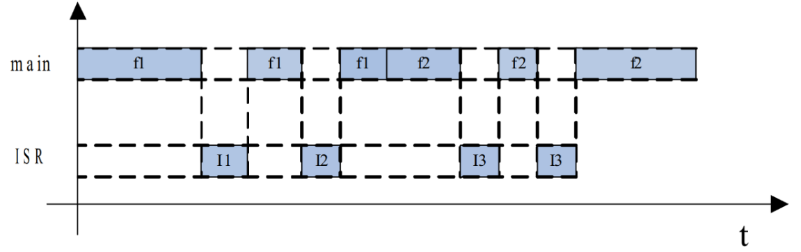
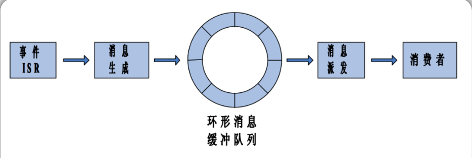
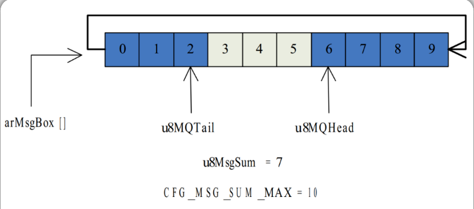
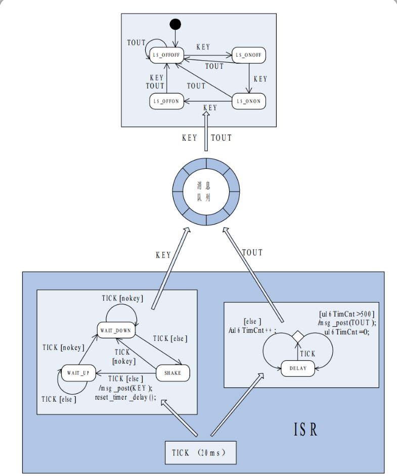
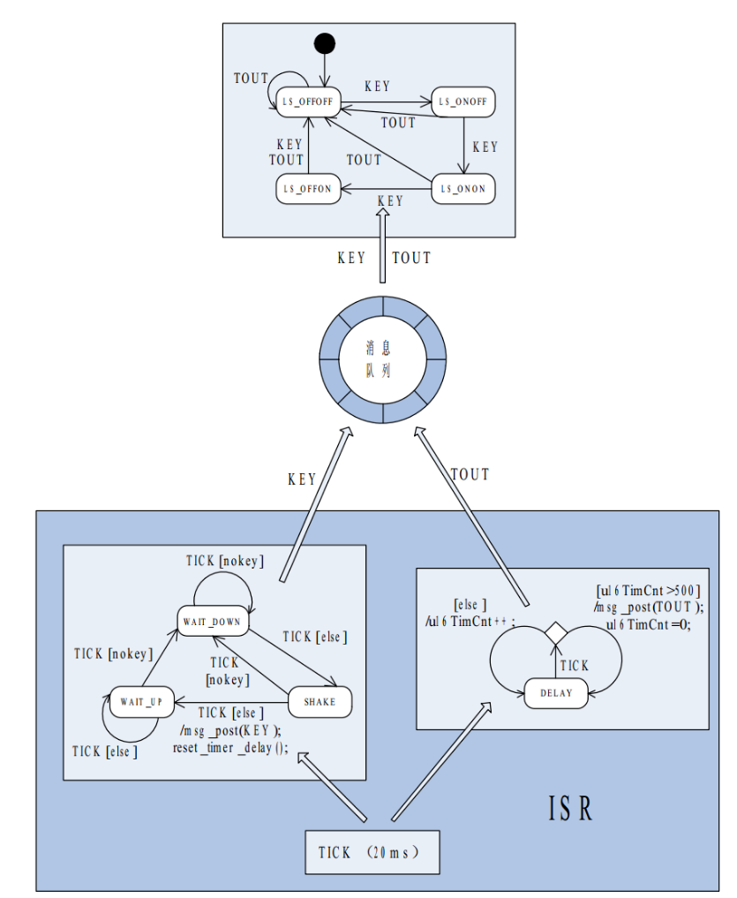
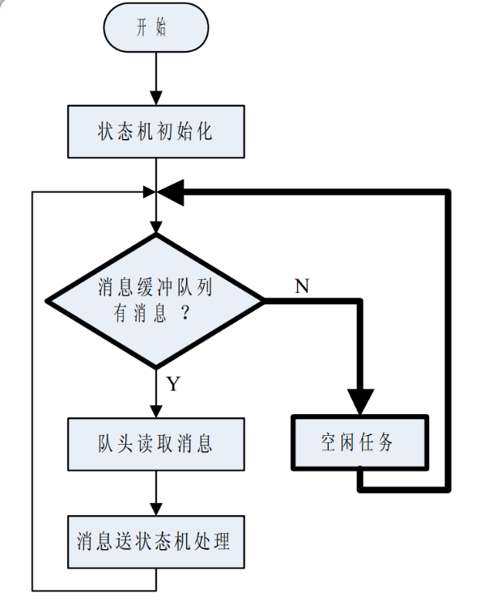
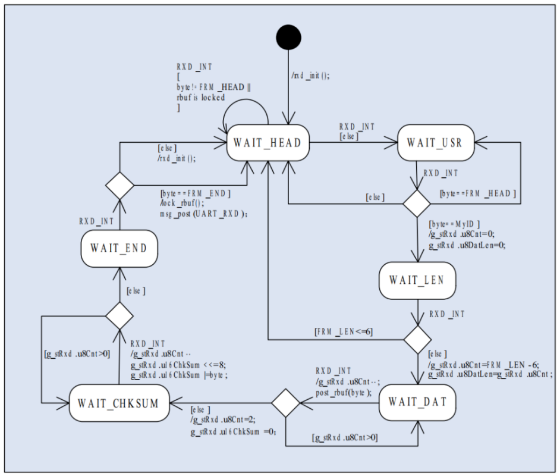
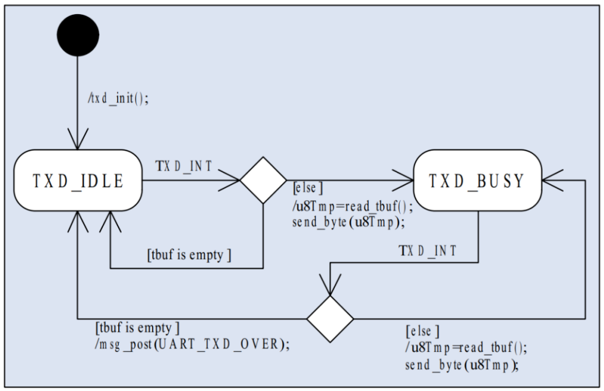
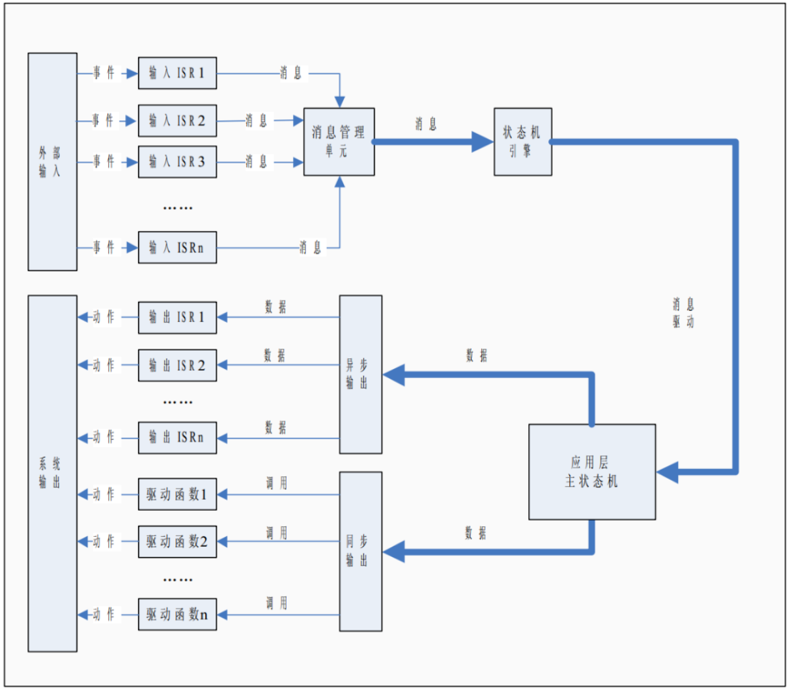
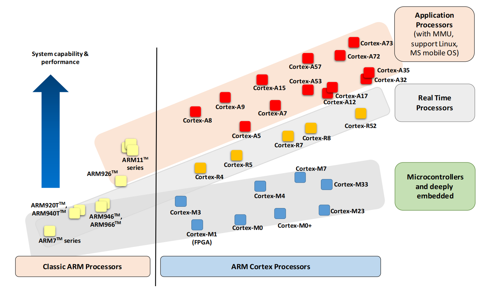

ARM Cortex-M学习笔记。

<!-- more -->

首先是ARM Cortex-M的学习资源汇总，这里包含书籍和学习参考资源。

## 嵌入式学习资源汇总
我们学习架构知识，应当是希望深刻理解计算机本质原理的，所以“直击主干，暂时舍弃旁支末节”，是我们首先要明确的。

一块主控板上最核心的是SOC，一片SOC中最核心的是各处理器核心（Core）。

处理器有其指令集和结构，ARM是当前嵌入式领域使用最广泛的处理器架构。

ARM最新的架构为ARMv9，当前典型应用处理器核心则为ARMv8架构下的A5x/A7x，他们都属于Cortex-A系列处理器。


### 官方资源和手册参考
读ARM的官方文档，包括但不限于：

- 介绍架构特性和约束的架构手册，如 armv8 architecture reference guide
- 介绍架构模型的编程指南 armv8-a programmer guide
- 介绍具体core实现的技术参考手册 coretext-a53 technical reference guide

我们应该着重关注什么？
- 架构图景
- 异常机制
- 中断机制
- 内存管理
- 高速缓存
- 运算加速

#### 中文参考手册

| 类别                                   | 资源                                                                     | 版本                                                   | 短评                                                          
|--------------------------------------|------------------------------------------------------------------------|------------------------------------------------------|--------------------------------------------------------------|
| 官方汇总                                 | cortex-m-resources                                                     | /                                                    | ARM公司专家Joseph Yiu收集整理的所有对开发者有用的官方Cortex-M资料链接（也包含极少资源链接）  |
| 概念科普                                 | Cortex-M ARM官方主页                                                       | /                                                    | 最权威的Cortex-M资源来源，最新的Cortex-M技术应该从这里去找                        
| ARM_Cortex-M维基百科                     | /                                                                      | 对于技术名词的解释，Wikipedia是非常专业的，wiki最后还给出Cortex-M相关资源下载链接  | /                                                        
| ARM Cortex-M for Beginners           | /                                                                      | /                                                    | /                                                            |   
| ARM Cortex-M处理器入门                    | v3                                                                     | /                                                    | /                                                           
| 2017 March                           | ARM公司专家Joseph Yiu写的白皮书，可以说一篇文章让你看懂Cortex-M0/M0+/M1/M3/M4/M7/M23/M33差异  | /                                                    | /                                            | 
| 内核手册                                 | ARMv6/v7/v8-M Architecture Reference Manual                            | /                                                    | ARM Cortex-M内核架构参考手册，还有比这个更权威的资料么？              
| Cortex-Mx Technical Reference Manual | /                                                                      | ARM Cortex-M处理器技术参考手册，还有比这个更权威的资料么？                  | /                                     |  
| Cortex-Mx Devices Generic User Guide | /                                                                      | ARM Cortex-M芯片使用指南，还有比这个更权威的资料么？                     | /                                       |  

#### 英文参考手册
Arm Helium Technology M-Profile Vector Extension (MVE) for Arm Cortex-M Processor (reference book)
Available here: https://www.arm.com/resources/education/books/mve-reference-book。
https://community.arm.com/developer/ip-products/processors/b/processors-ip-blog/posts/cortex-m-resources。
### 书籍推荐
1. ARM Cortex-M0 全可编程SoC原理及实现
2. 嵌入式微控制器与处理器设计
3. Cortex-M4，M3，M0权威指南（中英文版）

## 嵌入式C语言汇总
### 嵌入式C常见用法
#### 关键词

关键字是C语言中具有特殊功能的保留标示符，按照功能可分为

1). 数据类型(常用char, short, int, long, unsigned, float, double)

2). 运算和表达式( =, +, -, *, while, do-while, if, goto, switch-case)

3). 数据存储(auto， static， extern，const， register，volatile，restricted)，

4). 结构(struct, enum, union,typedef),

5). 位操作和逻辑运算(<<, >>, \&, \|, \~，\^, \&\&)，

6). 预处理(#define, #include, #error，#if...#elif...#else...#endif等)，

7). 平台扩展关键字(__asm, __inline，__syscall)

这些关键字共同构成了嵌入式平台的C语法。

嵌入式的应用从逻辑上可以抽象为三个部分：

1). 数据的输入(如传感器，信号，接口输入),

2). 数据的处理(如协议的解码和封包，AD采样值的转换等)

3). 数据的输出(GUI的显示，输出的引脚状态，DA的输出控制电压，PWM波的占空比等)，
对于数据的管理就贯穿着整个嵌入式应用的开发，它包含数据类型，存储空间管理，位和逻辑操作，以及数据结构，C语言从语法上支撑上述功能的实现，并提供相应的优化机制，以应对嵌入式下更受限的资源环境。

#### 数据类型

C语言支持常用的字符型，整型，浮点型变量，有些编译器如keil还扩展支持bit(位)和sfr(寄存器)等数据类型来满足特殊的地址操作。C语言只规定了每种基本数据类型的最小取值范围，因此在不同芯片平台上相同类型可能占用不同长度的存储空间，这就需要在代码实现时考虑后续移植的兼容性，而C语言提供的typedef就是用于处理这种情况的关键字，在大部分支持跨平台的软件项目中被采用，典型的如下:

```c
typedef unsigned char uint8_t;
typedef unsigned short uint16_t;
typedef unsigned int uint32_t;
......
typedef signed int int32_t;
```

既然不同平台的基本数据宽度不同，那么如何确定当前平台的基础数据类型如int的宽度，这就需要C语言提供的接口sizeof，实现如下。

```c
printf("int size:%d, short size:%d, char size:%d\n", sizeof(int), sizeof(char), sizeof(short));
```

这里还有重要的知识点，就是指针的宽度，如
```c
char *p；
printf("point p size:%d\n", sizeof(p));
```
其实这就和芯片的可寻址宽度有关，如32位MCU的宽度就是4，64位MCU的宽度就是8，在有些时候这也是查看MCU位宽比较简单的方式。

#### 内存管理和存储架构

C语言允许程序变量在定义时就确定内存地址，通过作用域，以及关键字extern，static，实现了精细的处理机制，按照在硬件的区域不同，内存分配有三种方式(节选自C++高质量编程)：

1). 从静态存储区域分配。内存在程序编译的时候就已经分配好，这块内存在程序的整个运行期间都存在。例如全局变量，static 变量。

2). 在栈上创建。在执行函数时，函数内局部变量的存储单元都可以在栈上创建，函数执行结束时这些存储单元自动被释放。栈内存分配运算内置于处理器的指令集中 ，效率很高，但是分配的内存容量有限。

3). 从堆上分配，亦称动态内存分配。程序在运行的时候用 malloc 或 new 申请任意多少的内存，程序员自己负责在何时用 free 或 delete 释放内存。动态内存的生存期由程序员决定，使用非常灵活，但同时遇到问题也最多。
这里先看个简单的C语言实例。

```c
//main.c#include <stdio.h>#include <stdlib.h>

static int st_val;                   //静态全局变量 -- 静态存储区
int ex_val;                           //全局变量 -- 静态存储区int main(void)
{
   int a = 0;                         //局部变量 -- 栈上申请
   int *ptr = NULL;                   //指针变量
   static int local_st_val = 0;       //静态变量
   local_st_val += 1;
   a = local_st_val;
   ptr = (int *)malloc(sizeof(int)); //从堆上申请空间
   if(ptr != NULL)
   {      
    printf("*p value:%d", *ptr);
    free(ptr);      
    ptr = NULL;      
    //free后需要将ptr置空，否则会导致后续ptr的校验失效，出现野指针   
    }            
}
```

C语言的作用域不仅描述了标识符的可访问的区域，其实也规定了变量的存储区域，在文件作用域的变量st_val和ex_val被分配到静态存储区，其中static关键字主要限定变量能否被其它文件访问，而代码块作用域中的变量a, ptr和local_st_val则要根据类型的不同，分配到不同的区域，其中a是局部变量，被分配到栈中，ptr作为指针，由malloc分配空间，因此定义在堆中，而local_st_val则被关键字限定，表示分配到静态存储区，这里就涉及到重要知识点，static在文件作用域和代码块作用域的意义是不同的：在文件作用域用于限定函数和变量的外部链接性(能否被其它文件访问), 在代码块作用域则用于将变量分配到静态存储区。

对于C语言，如果理解上述知识对于内存管理基本就足够，但对于嵌入式C来说，定义一个变量，它不一定在内存(SRAM)中，也有可能在FLASH空间，或直接由寄存器存储(register定义变量或者高优化等级下的部分局部变量)，如定义为const的全局变量定义在FLASH中，定义为register的局部变量会被优化到直接放在通用寄存器中，在优化运行速度，或者存储受限时，理解这部分知识对于代码的维护就很有意义。此外，嵌入式C语言的编译器中会扩展内存管理机制，如支持分散加载机制和__attribute__((section("用户定义区域")))，允许指定变量存储在特殊的区域如(SDRAM, SQI FLASH), 这强化了对内存的管理，以适应复杂的应用环境场景和需求。

```c
LD_ROM 0x00800000 0x10000 { ;load region size_region
    EX_ROM 0x00800000 0x10000 { ;load address = execution address
  *.o (RESET, +First)
  *(InRoot$$Sections)
  .ANY (+RO)
  }
  EX_RAM 0x20000000 0xC000 { ;rw Data
    .ANY (+RW +ZI)
  }
  EX_RAM1 0x2000C000 0x2000 {
    .ANY(MySection)
   }
  EX_RAM2 0x40000000 0x20000{
    .ANY(Sdram)
  }
}

int a[10] __attribute__((section("Mysection")));
int b[100] __attribute__((section("Sdram")));
```

采用这种方式，我们就可以将变量指定到需要的区域，这在某些情况下必须的，如做GUI或者网页时因为要存储大量图片和文档，内部FLASH空间可能不足，这时就可以将变量声明到外部区域，另外内存中某些部分的数据比较重要，为了避免被其它内容覆盖，可能需要单独划分SRAM区域，避免被误修改导致致命性的错误，这些经验在实际的产品开发中是常用且重要，不过因为篇幅原因，这里只简略的提供例子，如果工作中遇到这种需求，建议详细去了解下。

至于堆的使用，对于嵌入式Linux来说，使用起来和标准C语言一致，注意malloc后的检查，释放后记得置空，避免"野指针“，不过对于资源受限的单片机来说，使用malloc的场景一般较少，如果需要频繁申请内存块的场景，都会构建基于静态存储区和内存块分割的一套内存管理机制，一方面效率会更高(用固定大小的块提前分割，在使用时直接查找编号处理)，另一方面对于内存块的使用可控，可以有效避免内存碎片的问题，常见的如RTOS和网络LWIP都是采用这种机制，我个人习惯也采用这种方式，所以关于堆的细节不在描述，如果希望了解，可以参考<C Primer Plus>中关于存储相关的说明。

#### 指针和数组

数组和指针往往是引起程序bug的主要原因，如数组越界，指针越界，非法地址访问，非对齐访问，这些问题背后往往都有指针和数组的影子，因此理解和掌握指针和数组，是成为合格C语言开发者的必经之路。

数组是由相同类型元素构成，当它被声明时，编译器就根据内部元素的特性在内存中分配一段空间，另外C语言也提供多维数组，以应对特殊场景的需求，而指针则是提供使用地址的符号方法，只有指向具体的地址才有意义，C语言的指针具有最大的灵活性，在被访问前，可以指向任何地址，这大大方便了对硬件的操作，但同时也对开发者有了更高的要求。参考如下代码。

```c
int main(void)
{
  char cval[] = "hello";
  int i;
  int ival[] = {1, 2, 3, 4};
  int arr_val[][2] = \{\{1, 2\}, \{3, 4\}\};
  const char *pconst = "hello";
  char *p;
  int *pi;
  int *pa;
  int **par;

  p = cval;
  p++;            //addr增加1
  pi = ival;
  pi+=1;          //addr增加4
  pa = arr_val[0];
  pa+=1;          //addr增加4
  par = arr_val;
  par++;         //addr增加8
  for(i=0; i<sizeof(cval); i++)
  {
      printf("%d ", cval[i]);
  }
  printf("\n");
  printf("pconst:%s\n", pconst);
  printf("addr:%d, %d\n", cval, p);
  printf("addr:%d, %d\n", icval, pi);
  printf("addr:%d, %d\n", arr_val, pa);
  printf("addr:%d, %d\n", arr_val, par);
}

/* PC端64位系统下运行结果
0x68 0x65 0x6c 0x6c 0x6f 0x0
pconst:hello
addr:6421994, 6421995
addr:6421968, 6421972
addr:6421936, 6421940
addr:6421936, 6421944 */
```

对于数组来说，一般从0开始获取值，以length-1作为结束，通过[0, length)半开半闭区间访问，这一般不会出问题，但是某些时候，我们需要倒着读取数组时，有可能错误的将length作为起始点，从而导致访问越界，另外在操作数组时，有时为了节省空间，将访问的下标变量i定义为unsigned char类型，而C语言中unsigned char类型的范围是0~255，如果数组较大，会导致数组超过时无法截止，从而陷入死循环，这种在最初代码构建时很容易避免，但后期如果更改需求，在加大数组后，在使用数组的其它地方都会有隐患，需要特别注意。

在前面提到过，指针占有的空间与芯片的寻址宽度有关，32位平台为4字节，64位为8字节，而指针的加减运算中的长度又与它的类型相关，如char类型为1，int类型为4，如果你仔细观察上面的代码就会发现par的值增加了8，这是因为指向指针的指针，对应的变量是指针，也就是长度就是指针类型的长度，在64位平台下为8，如果在32位平台则为4，这些知识理解起来并不困难，但是这些特性在工程运用中稍有不慎，就会埋下不易察觉的问题。另外指针还支持强制转换，这在某些情况下相当有用，参考如下代码：
```c
#include <stdio.h>

typedef struct
{
  int b;
  int a;
}STRUCT_VAL;
static __align(4) char arr[8] = {0x12, 0x23, 0x34, 0x45, 0x56, 0x12, 0x24, 0x53};
int main(void)
{
    STRUCT_VAL *pval;
    int *ptr;
    pval = (STRUCT_VAL *)arr;
    ptr = (int *)&arr[4];
    printf("val:%d, %d", pval->a, pval->b);
    printf("val:%d,", *ptr);
}
//0x45342312 0x53241256
//0x53241256
```

基于指针的强制转换，在协议解析，数据存储管理中高效快捷的解决了数据解析的问题，但是在处理过程中涉及的数据对齐，大小端，是常见且十分易错的问题，如上面arr字符数组，通过__align(4)强制定义为4字节对齐是必要的，这里可以保证后续转换成int指针访问时，不会触发非对齐访问异常，如果没有强制定义，char默认是1字节对齐的，当然这并不就是一定触发异常(由整个内存的布局决定arr的地址，也与实际使用的空间是否支持非对齐访问有关，如部分SDRAM使用非对齐访问时，会触发异常), 这就导致可能增减其它变量，就可能触发这种异常，而出异常的地方往往和添加的变量毫无关系，而且代码在某些平台运行正常，切换平台后触发异常，这种隐蔽的现象是嵌入式中很难查找解决的问题。另外，C语言指针还有特殊的用法就是通过强制转换给特定的物理地址访问，通过函数指针实现回调，如下：

```c
#include <stdio.h>

typedef int (*pfunc)(int, int);
int func_add(int a, int b){
 return a+b;
}
int main(void)
{
    pfunc *func_ptr;
    *（volatile uint32_t *）0x20001000 = 0x01a23131;
    func_ptr = func_add;
    printf("%d\n", func_ptr(1, 2));
}
```

这里说明下，volatile易变的，可变的，一般用于以下几种状况：

1）并行设备的硬件寄存器（如：状态寄存器）

2）一个中断服务子程序中会访问到的非自动变量（Non-automatic variables)

3）多线程应用中被几个任务共享的变量

volatile可以解决用户模式和异常中断访问同一个变量时，出现的不同步问题，另外在访问硬件地址时，volatile也阻止对地址访问的优化，从而确保访问的实际的地址，精通volatile的运用，在嵌入式底层中十分重要，也是嵌入式C从业者的基本要求之一。函数指针在一般嵌入式软件的开发中并不常见，但对许多重要的实现如异步回调，驱动模块，使用函数指针就可以利用简单的方式实现很多应用，当然我这里只能说是抛砖引玉，许多细节知识是值得详细去了解掌握的。

#### 结构类型和对齐

C语言提供自定义数据类型来描述一类具有相同特征点的事务，主要支持的有结构体，枚举和联合体。其中枚举通过别名限制数据的访问，可以让数据更直观，易读，实现如下：
```c
typedef enum {spring=1, summer, autumn, winter }season;

season s1 = summer;
```

联合体的是能在同一个存储空间里存储不同类型数据的数据类型，对于联合体的占用空间，则是以其中占用空间最大的变量为准，如下：

```c
typedef union{     
  char c;     
  short s;     
  int i; 
}UNION_VAL;
 
UNION_VAL val; 
int main(void) 
{     
  printf("addr:0x%x, 0x%x, 0x%x\n",            
         (int)(&(val.c)), (int)(&(val.s)), (int)(&(val.i)));     
  val.i = 0x12345678;     
  if(val.s == 0x5678)         
    printf("小端模式\n");       
  else         
    printf("大端模式\n");     
} 
/*
addr:0x407970, 0x407970, 0x407970 
小端模式
*/

```

联合体的用途主要通过共享内存地址的方式，实现对数据内部段的访问，这在解析某些变量时，提供了更为简便的方式，此外测试芯片的大小端模式也是联合体的常见应用，当然利用指针强制转换，也能实现该目的,实现如下：

```c
int data = 0x12345678; 
short *pdata = (short *)&data; 
if(*pdata = 0x5678)     
  printf("%s\n", "小端模式"); 
else   
  printf("%s\n", "大端模式");
```

可以看出使用联合体在某些情况下可以避免对指针的滥用。

结构体则是将具有共通特征的变量组成的集合，比起C++的类来说，它没有安全访问的限制，不支持直接内部带函数，但通过自定义数据类型，函数指针，仍然能够实现很多类似于类的操作，对于大部分嵌入式项目来说，结构化处理数据对于优化整体架构以及后期维护大有便利，下面举例说明：
```c

typedef int (*pfunc)(int, int); 
typedef struct{     
  int num;     
  int profit;     
  pfunc get_total; 
}STRUCT_VAL;
  
int GetTotalProfit(int a, int b)
{     
  return a*b; 
}  

int main(void){     
  STRUCT_VAL Val;     
  STRUCT_VAL *pVal;      
  Val.get_total = GetTotalProfit;     
  Val.num = 1;     
  Val.profit = 10;     
  printf("Total:%d\n",  Val.get_total(Val.num, Val.profit));  //变量访问    
  pVal = &Val;     
  printf("Total:%d\n",  pVal->get_total(pVal->num, pVal->profit)); //指针访问 
} 
/* 
Total:10 
Total:10 
*/
```

C语言的结构体支持指针和变量的方式访问，通过转换可以解析任意内存的数据(如我们之前提到的通过指针强制转换解析协议)，另外通过将数据和函数指针打包，在通过指针传递，是实现驱动层实接口切换的重要基础，有着重要的实践意义，另外基于位域，联合体，结构体，可以实现另一种位操作，这对于封装底层硬件寄存器具有重要意义，实践如下：

```c

typedef unsigned char uint8_t; 
  union reg{     
    struct{         
    uint8_t bit0:1;         
    uint8_t bit1:1;         
    uint8_t bit2_6:5;         
    uint8_t bit7:1;     
  }bit;     
  uint8_t all; 
}; 

int main(void)
{     
  union reg RegData;     
  RegData.all = 0;      
  RegData.bit.bit0 = 1;     
  RegData.bit.bit7 = 1;     
  printf("0x%x\n", RegData.all);      
  RegData.bit.bit2_6 = 0x3;     
  printf("0x%x\n", RegData.all); 
} 
/* 
0x81 
0x8d
*/
```

通过联合体和位域操作，可以实现对数据内bit的访问，这在寄存器以及内存受限的平台，提供了简便且直观的处理方式，另外对于结构体的另一个重要知识点就是对齐了，通过对齐访问，可以大幅度提高运行效率，但是因为对齐引入的存储长度问题，也是容易出错的问题，对于对齐的理解，可以分类为如下说明。
基础数据类型：以默认的的长度对齐，如char以1字节对齐，short以2字节对齐等。

数组 ：按照基本数据类型对齐，第一个对齐了后面的自然也就对齐了。

联合体 ：按其包含的长度最大的数据类型对齐。

结构体：结构体中每个数据类型都要对齐，结构体本身以内部最大数据类型长度对齐

```c
union DATA{     
  int a;     
  char b; 
};  
struct BUFFER0{     
  union DATA data;     
  char a;     
  //reserved[3]     
  int b;     
  short s;     
  //reserved[2] 
}; //16字节  
struct BUFFER1{     
  char a;              
  //reserved[0]     
  short s;    
  union DATA data;     
  int b; 
};//12字节  

int main(void) 
{     
  struct BUFFER0 buf0;     
  struct BUFFER1 buf1;          
  printf("size:%d, %d\n", sizeof(buf0), sizeof(buf1));     
  printf("addr:0x%x, 0x%x, 0x%x, 0x%x\n",              
       (int)&(buf0.data), (int)&(buf0.a), (int)&(buf0.b), (int)&(buf0.s));          
  printf("addr:0x%x, 0x%x, 0x%x, 0x%x\n",              
       (int)&(buf1.a), (int)&(buf1.s), (int)&(buf1.data), (int)&(buf1.b)); 
} 
/* 
size:16, 12 
addr:0x61fe10, 0x61fe14, 0x61fe18, 0x61fe1c 
addr:0x61fe04, 0x61fe06, 0x61fe08, 0x61fe0c 
*/
```

其中union联合体的大小与内部最大的变量int一致，为4字节，根据读取的值，就知道实际内存布局和填充的位置是一致，事实上学会通过填充来理解C语言的对齐机制，是有效且快捷的方式。

#### 预处理机制

C语言提供了丰富的预处理机制，方便了跨平台的代码的实现，此外C语言通过宏机制实现的数据和代码块替换，字符串格式化，代码段切换，对于工程应用具有重要意义，下面按照功能需求，描述在C语言运用中的常用预处理机制。

#include 包含文件命令，在C语言中，它执行的效果是将包含文件中的所有内容插入到当前位置，这不只包含头文件，一些参数文件，配置文件，也可以使用该文件插入到当前代码的指定位置。其中<>和""分别表示从标准库路径还是用户自定义路径开始检索。

#define宏定义，常见的用法包含定义常量或者代码段别名，当然某些情况下配合##格式化字符串，可以实现接口的统一化处理，实例如下：
```c
#define MAX_SIZE  10
#define MODULE_ON  1
#define ERROR_LOOP() do{\
                     printf("error loop\n");\
                   }while(0);
#define global(val) g_##val
int global(v) = 10;
int global(add)(int a, int b)
{
    return a+b;
｝
```

#if..#elif...#else...#endif， #ifdef..#endif, #ifndef...#endif条件选择判断，条件选择主要用于切换代码块，这种综合性项目和跨平台项目中为了满足多种情况下的需求往往会被使用。

#undef 取消定义的参数，避免重定义问题。

#error，#warning用于用户自定义的告警信息，配合#if，#ifdef使用，可以限制错误的预定义配置。

#pragma 带参数的预定义处理，常见的#pragma pack(1), 不过使用后会导致后续的整个文件都以设置的字节对齐，配合push和pop可以解决这种问题，代码如下：

```c
#pragma pack(push)
#pragma pack(1)
struct TestA
{
   char i;
   int b;
}A;
#pragma pack(pop); //注意要调用pop，否则会导致后续文件都以pack定义值对齐，执行不符合预期
等同于
 struct _TestB{  
   char i;
   int b;
 }__attribute__((packed))A;
```
#### 总结

如果你看到了这里，那么应该对C语言有了比较清晰的认识，嵌入式C语言在处理硬件物理地址，位操作，内存访问，都给予开发者了充分的自由，通过数组，指针以及强制转换的技巧，可以有效减少数据处理中的复制过程，这对于底层是必要的，也方便了整个架构的开发。但是由这种自由带来的非法访问，溢出，越界，以及不同硬件平台对齐，数据宽度，大小端问题，在功能设计人员手里一般还能够处理，对于后续接手项目的人来说，如果本身的设计没有考虑清楚这些问题，往往代表着问题和麻烦，所以对于任何嵌入式C的从业者，清晰的掌握这些基础的知识和必要的。

#### C语言链接脚本

链接脚本一般用于MCU，SOC应用开发很少要写链接脚本的，只需要编译脚本。kernel,uboot之类的需要链接脚本。

这个链接是基础教程，可以看一下：

https://github.com/iDalink/ld-linker-script

1. 查看RAM，PFlash的大小。
2. 看一下链接脚本的入口地址和入口标签。
3. 要一下项目的Memory Map表。这个真的非常重要。
4. 看一下text段，bss段，data段有多少个子标签，一般以bss.xxxx data.xxx，data.xxx存在。
5. 看一下Memmap.h文件。看：宏定义对应的段在核几，在链接脚本的哪个位置。
6. 变量还要知道它的对齐方式，注意这边有编译器差异，有时候编译器会帮你对齐，有时候链接脚本指定对齐方式。
7. 有没有不在链接脚本中的内存占用。这个属于特殊用法，大家可以在项目中实战。这个设计很有意思。
8. 查看链接脚本中的特殊标签。这些带有start，end的标签也是需要关注的，可以帮助自己理解链接划分的结果。
9. 特殊的段标签。bss和data段的区别在于bss未初始化，data初始化了。问题来了，谁在初始化，怎么初始化的。第六点的标签是可以在代码中使用的变量，根据标签可以初始化数据（拷贝，赋0等操作），用SDK的话在main函数之前仔初始化的。注意看一下保护段，非保护段，功能安全相关的段，栈，堆等相关的位置。
10. 查阅编译器手册，链接脚本怎么写，编译器手册会告诉你。就是有点厚，其他没啥。
11. 是否存在特别寻址的段，如果没记错的话，Ifx存在small  data寻址，可以上下寻址多少K（32K总计64K，还是上下寻址64K）。这种特殊段可以加快访问速度。用于特殊优化。
12. 代码编译的最后的结果可以查看xxx.map文件。

#### struct结构体和union联合体

struct即结构体，C程序中经常需要用相关的不同类型的数据来描述一个数据对象。例如，描述学生的综合信息时，需要使用学生的学号、姓名、性别等不同类型的数据时，像这种数据类型总是在一起出现，那么我们不如把这些变量装入同一个“文件夹”中，这时用的关键字struct声明的一种数据类型就是表示这个“文件夹”的使用。那么在说明和使用之前必须先定义它，也就是构造它。如同在说明和调用函数之前要先定义一样。

结构体是一种集合，它里面包含了多个变量或数组，它们的类型可以相同，也可以不同，每个这样的变量或数组都称为结构体的成员，结构体也是一种数据类型，它由程序员自己定义，可以包含多个其他类型的数据，成员又称为成员变量，它是结构体所包含的若干个基本的结构类型，必须用“{}”括起来，并且要以分号结束，每个成员应表明具体的数据类型，成员一般用名字访问。结构体和数组类似，也是一组数据的集合，整体使用没有太大的意义。数组使用下标[ ]获访问元素，结构体使用点号.访问单个成员。通过这种方式可以获取成员的值，也可以给成员赋值

数组：a[0]=10;  结构体：today.day  (指针结构体用->访问)结构体的成员可以包含其他结构体，也可以包含指向自己结构体类型的指针，而通常这种指针的应用是为了实现一些更高级的数据结构如链表和树等。

声明定义结构：

struct关键字+结构体的标志名+大括号里边是成员+}后面的声明此结构变量+末尾分号，一般有这些：

```c
struct week{定义一
  int x;
  char y;  
 };  
struct week p1,p2;  
//声明变量p1,p2,里边都是week的值          
//里边有x和y的值  
//用.访问 ：p1.x  p2.x// p1.y, p2.y

struct{定义二                     
int x;  
char y;            
}p1,p2;//在这里声明变量
//p1和p2都是一种无名结构，
// 里边有X和y  访问一样用.

struct week {定义三
   int x; 
   int y;
}p1,p2;
//常用的一种结构定义声明形式  

对于第一和第三种形式，都声明了结构名week，但是第二种没有声明结构名,只是定义了两个结构变量，
这种叫无名结构

无名结构： 可以定义无名结构体类型的变量。编译器对无名结构体的处理是随机生成一个不重复的变量名。
无名结构的定义方式就是定义无名结构体时必须定义该结构体类型的至少一个变量。

优点：无名结构体的妙用就是可以避免相同类型的结构体的重复定义，
这样可以对每一个具体类型的队列都可以定义一个结构体来管理该队列的头尾指针，
即使定义多个相同具体类型的队列也不会引发重复定义的编译错误。这样定义了两个队列，
其元素类型均为int类型，同时各得到了一个维护队列头尾指针的结构体

缺点：这里定义了一个无名的结构体，同时声明了三个此种类型的变量。
但是，因为没有名字，我们在这句之后，无法内再定义与那三种变量相同类型的变量了。
除非你再容次去定义一个这样的相同的结构体类型。
还有一个重要的原因就是没有办法在其他位置定义我们所需要的结构体变量，
每次需要新定义结构体变量的时候都必须要找到最开始结构体代码书写的位置才能定义新的结构体  
  
所以实际编程中无名结构并不常用

```

注意：

1、结构体本身并不会被作为数据而开辟内存，真正作为数据而在内存中存储的是这种结构体所定义的变量。

2、先声明结构体类型，再定义该类型的变量，声明结构体类型，不分配空间定义结构体类型变量，就要分配内存空间

3、量使用占为少的类型,如,在可能的时候使用short代替int，按数据类型本身占用的位置从大到小排

4、除了可以对成员进行逐一赋值，也可以在定义时整体赋值：p1={struct week}{5,10}; 相当于 p1.x=5,p1.y=10;

p1=p2 表示 p1.x=p2.x ,  p1.y=p2.y; 不过整体赋值仅限于定义结构体变量的时候，在使用过程中只能对成员逐一赋值

5、结构体变量不能相加，相减，也不能相互乘除，但结构体可以相互赋值，也就是说，可以将一个结构体变量赋值给另一个结构体变量。但是前提是这两个结构体变量的结构体类型必须相同

结构体的运算：要访问整个结构，直接用结构变量的名字，对于整个结构，可以做赋值，取地址，也可以传递给函数参数

结构体数值
嵌套的结构体：
```c

struct week{
int x;
int y;
strcut week at;//在结构体又定义了名为at的一个和week同样参数的结构体变量
        //其中可以用.运算符访问  see.at.x see.at.y
}see;
但是其实这样的方式是不建议（非法）的，因为这种声明实际上是一个无限循环，成员at是一个结构体，
at的内部还会有成员是结构体，依次下去，无线循环。在分配内存的时候，由于无限嵌套，
也无法确定这个结构体的长度，所以这种方式是非法的
正确的方式是使用《结构体指针》，因为指针的长度是确定的:

struct week{
int x;
int y;
strcut week *at;//在结构体内定义了一个指向和week一样类型的结构指针
}see;          但是注意用指针访问时要用->运算符   see.at->x
```

结构体相互引用：

一个结构体A中包含一个或多个与结构体B相关的成员, 且结构体B中也包含一个或多个与结构体A相关的成员称为结构体的互引用.

但是要注意： 如果已经定义了两个结构A和B ，在定义结构体A的成员b时，结构体B对A还未可见，故此时编译器会报数据类型B未定义

解决的办法是使用不完整声明：
```c

strcut A;//不完整声明
strcut B;//不完整声明
strcut _A{               strcut _B{
int x;          int x;
int y;                 int y;
struct _B a;        struct _A b;  //在结构B中定义了一个名为b的和A结构一样类型的结构变量
                 //其中可以用点访问 A.a.x   B.b.x
}A；                      }B；
//但是注意这种方式犯了一个和上面第一个嵌套结构的错误，就是结构体A和B都是直接包含了对方，
正确的用法还是使用指针：
strcut _A{               strcut _B{
int x;          int x;
int y;                 int y;
struct _B *a;      struct _A *b;  //在结构B中定义了一个名为b的和A结构一样类型的结构指针
                       //其中指针要用->访问 A.a->x   B.b->x
}A；                                 }B；  
//但是注意这种方式犯了一个和上面第一个嵌套结构的错误，就是结构体A和B都是直接包含了对方，正确的用法还是使用指针：
strcut _A{               strcut _B{
int x;              int x;
int y;                 int y;
struct _B *a;       struct _A *b;  //在结构B中定义了一个名为b的和A结构一样类型的结构指针
                 //其中指针要用->访问 A.a->x   B.b->x
}A；                                }B；
//所以使用互引用要注意：至少有一个结构必须在另一个结构体中以指针的形式被引用。
```

**结构体函数与函数参数**

结构体做函数形参：

整个结构可以作为参数的值传入函数，这时候是在函数内新建一个结构变量，并复制调用者结构的值，也可以返回一个值，这和数组完全不同

用结构体变量作实参时，采取的也是“值传递”方式，将  结构体变量所占的内存单元的内容（结构体变量成员列表）  全部顺序传递给形参，这里形参也得是结构体变量。

```c

#include<stdio.h>
typedef struct _node {

  int n;
  char a[100];

}NODE;

void add(NODE a);//这种形式只是用来做值的传递

int main(void) {
  //以传值方式传递结构需要对整个结构做一份拷贝
  NODE t;
  scanf("%d %d", &t.a[0], &t.n);//输入1  3

  printf("1-%d %d\n",t.a[0],t.n);//输出 1   3

  add(t);
  printf("3-%d %d\n", t.a[0], t.n);//输出1  3

//也就是说在add函数里边做修改根本就影响不了主函数这边的值
}

void add(NODE a) {

  a.a[0] = 100;//在这里能接受到NODE结构里边的成员
  a.n = 666;

  printf("2-%d %d\n", a.a[0], a.n);//输出100   666

}
  ****//解决办法是用指针（也是经常用的方式）：****
#include<stdio.h>
typedef struct _node {

  int n;
  char a[100];

}NODE;

int  add(NODE a);//这种形式只是用来做值的传递

int main(void) {
  //以传值方式传递结构需要对整个结构做一份拷贝
  NODE t;
  scanf("%d %d", &t.a[0], &t.n);//输入1  3

  printf("1-%d %d\n",t.a[0],t.n);//输出 1   3


  add(&t);//这里传进去的是t的地址
  printf("3-%d %d\n", t.a[0], t.n);//输出100  666
//传进去的是地址，所以就可以达到访问同一个变量的操作
}

int  add(NODE *) {//定义一个结构指针

  a.a[0] = 100;//在这里能接受到NODE结构里边的成员
  a.n = 666;

  printf("2-%d %d\n", a.a[0], a.n);//输出100   666
  return a;//这里返回的是指针  所以能达到访问主函数里边调用的值
  //使用指针才可以用返回值
}
//常用的方式

```

另一种做法

结构体做函数：

```c

/*上面的第一个的方案，把一个结构传入了函数，然后在函数中操作，但是没有返回回去
问题在于传入函数的是外面那个结构的克隆体，而不是指针，传入结构和传入数组是不同的，
解决办法是在这个输入函数中，在里边创建一个临时的结构变量，然后把这个结构返回给调用者*/
#include<stdio.h>
typedef struct _node {
  int x;
  int y;
}NODE;
struct _node add();//定义结构类型的函数
int main(void) {

  NODE a;
  a.x = 0;
  a.y = 0;
  printf("1-%d %d\n", a.x, a.y);//   0 0

  a = add();//函数调用   /把n的值又返回到a

  printf("3-%d %d\n", a.x, a.y);//所以在这里的时候值已经被改变
  return 0;
}

struct _node add() {

  NODE n;
  scanf("%d", &n.x);//输入1  3

  scanf("%d", &n.y);

  printf("2-%d %d\n", n.x, n.y);//在这里的时候赋值就成功了

  //return n;//把n的值带回出去
}
//这种方法也能达到“改变"的效果，但是往往开销内存较大，所以一般情况都是使用指针比较方便
```

用结构体变量名作参数，这种传递方式是单向的，如果在执行被调函数期间改变了形参（也是结构体变量）的值，该值不能返回主调函数，这往往造成使用上的不便，因此一般少用这种方法。

和本地变量一样。在函数内部声明的结构只能在函数内部使用，所以通常在函数外部声明一个结构类型的，这样就可以被多个函数所使用

```c

//结构做函数参数例子 （输入今天计算明天）
#include<stdio.h>
#include<stdbool.h>//利用布尔数据类型
struct date {
  int year;
  int month;
  int day;

};

bool If(struct date p);//判断是否是闰年
int number(struct date c);//判断是否是此月最后一天

int main(void) {

  struct date today,tomorrow;
  printf("年-月-日\n");
  scanf("%d %d %d", &today.year, &today.month, &today.day);

  //前面两个判断 是否此月最后一天  是否此年此月最后一天  
  if (today.day==number(today)&&today.month!=12) {//首月1号
    tomorrow.day = 1;
    tomorrow.month =today.month+1;
    tomorrow.year = today.year;
  }
  else if (today.day == number(today) && today.month == 12) {//下一年
    tomorrow.day = 1;
    tomorrow.month = 1;
    tomorrow.year =today.year+1;
  }
  else {
    tomorrow.day =today.day+1;
    tomorrow.month = today.month;
    tomorrow.year = today.year;
  }

  printf("明天是%d-%d-%d\n", tomorrow.year, tomorrow.month, tomorrow.day);
  return 0;
}

int number(struct date c)//这里的形参接收的today结构体数据
{
  int day;
  const int a[12] = { 31,28,31,30,31,30,31,31,30,31,30,31 };//这个月最大的天数

  if (c.month==22&&If(c)) {//查看是否是二月并且是润年
    day = 29;//是润年
  }
  else {

    day = a[c.month - 1];
  }

  return day;
}

bool If(struct date p) {//这里的形参接收的today结构体数据
  //润年的特点，能被4整除，但不能被100整数，能被100整除，但是不能被400整除
  if (p.year % 4 == 0 && p.year / 100 != 0 || p.year % 400 == 0) {
    return true;
  }
  else {
    return false;
  }
}
```

```c

//结构体做函数例子 （计算下一秒）
#include<stdio.h>
struct time {
  int hour;
  int minute;
  int second;
};

struct time times(struct time now);//利用结构做函数返回值，形参也是使用结构体做为传值

int main(void) {
  struct time nows[5] = {
    {11,50,20},{13,25,59},{12,59,59},{23,59,59},{00,00,00},
  };

  int i;
  for (i = 0; i < 5; i++) {
    printf("时间是 %d:%d:%d\n", nows[i].hour, nows[i].minute, nows[i].second);

    nows[i] = times(nows[i]);

    printf("下一秒是 %d:%d:%d\n", nows[i].hour, nows[i].minute, nows[i].second);
  }

  return 0;

}

struct time times(struct time now) {

  now.second++;
  if (now.second == 60) {//60秒
    now.minute++;
    now.second = 0;

    if (now.minute == 60)//60分
    {
      now.hour++;
      now.minute = 0;
      now.second = 0;

      if (now.hour == 24) {//零点
        now.hour=0;
        now.minute = 0;
        now.second = 0;
      }
    }
  }

  return now;//返回类型必须也函数类型一致，换句话说只有结构体类型才能返回结构体类型

}
```

**结构体数组**

结构体数组，是指数组中的每个元素都是一个结构体。在实际应用中，C语言结构体数组常被用来表示一个拥有相同数据结构的群体，比如一个班的学生、一个车间的职工等。结构体可以存储不同的数据类型，将他们互相联系起来。结构体数组可以连续存储多个结构体，和数组作用相似。比如想定义同一个最小外接矩形的四个坐标值，并给予这个矩形一个特征编号。当需要存储多个最小外接矩形的信息时，就需要动态申请一个结构体数组

定义结构体数组的方法很简单，同定义结构体变量是一样的，只不过将变量改成数组。或者说同前面介绍的普通数组的定义是一模一样的：struct student  tp[10]; 这就定义了一个结构体数组，共有 10 个元素，每个元素都是一个结构体变量，都包含所有的结构体成员。

结构体数组的初始化与前面讲的数值型数组的初始化也是一样的，数值型数组初始化的方法和需要注意的问题在结构体数组的初始化中同样适用，因为不管是数值型数组还是结构体数组都是数组。

```c
//例子：  //寻找学生中 学号最大的
# include <stdio.h>
# include <string.h>

struct STU
{
  char name[20];
  int age;
  char sex[20];
  char num[20];

};

void OutputSTU(struct STU stu[]);  //函数声明, 该函数的功能是输出成绩最大的学生信息

int main(void)
{
  int i;
  struct STU stu[5];

  for (i = 0; i < 2; ++i)
  {
    printf("请按照名字、年龄、性别、学号(1-9数字）输入第%d个学生的信息:", i + 1);

    scanf("%s %d %s %s", stu[i].name, &stu[i].age, stu[i].sex, stu[i].num);/*%c前面要加空格, 不然输入时会将空格赋给%c*/
  }

  OutputSTU(stu);

  return 0;
}

void OutputSTU(struct STU stu[])
{
  struct STU stumax = stu[0];//让临时结构stumax保存第一个学生的信息

  int j;
  for (j = 1; j < 2; ++j)//第一个学生依次和后面的学生比较
  {
    if (strcmp(stumax.num, stu[j].num) < 0)  //strcmp函数的使用  s1>s2:1   s1<s2:-1
    {
      stumax = stu[j];//让临时结构保存那个学生的信息
    }
  }

  printf("学生姓名：%s 学生年龄：%d 学生性别：%s 学生分数：%s\n", stumax.name, stumax.age, stumax.sex, stumax.num);

}

```

**结构体指针**

和数组不同，结构变量的名字并不是结构变量的地址，必须使用&运算符  strcut node *tp=&nb;  指针一般用->访问结构体里边的成员

指针变量非常灵活方便，可以指向任一类型的变量    ，若定义指针变量指向结构体类型变量，则可以通过指针来引用结构体类型变量。

```c

#include<stdio.h>
struct node{
int x;
int y;
}my;
int main(void) {
  struct node *p = &my;//定义了一个指针p指向了my的结构体

  p->x = 11;//这是一种访问方式（常用的方式）
  (*p).x = 12;//这是第二种方式，
  printf("%d", p->x);//输出是12

}
以下 2 种形式是等价的：
(*指针变量).成员名。
指针变量->成员名。
其中第 2 种方式很重要，通常都是使用这种方式，另外两种方式用得不多。
后面讲链表的时候用的也都是第 3 种方式。
```

这里说明：结构体和结构体变量是两个不同的概念：结构体是一种数据类型，是一种创建变量的模板，编译器不会为它分配内存空间，就像 int、float、char 这些关键字本身不占用内存一样；结构体变量才包含实实在在的数据，才需要内存来存储。所以用一个结构体去取一个结构体名的地址，这种写法是错误的，也不能将它赋值给其他变量。

```c

#include<stdio.h>
struct point {
  int x;
  int y;
};
struct point *gt(struct point*p);//结构指针函数

void  print(const struct point *p);//结构指针

void out(struct point p);//普通的结构体做函数参数

int main(void) {
  struct point y = { 0,0 };//以point结构定义一个y的结构变量

  //以下三种调用  等价
  //注意gt是一个结构体的指针函数
  gt(&y); //这是一个函数的返回结果函数  //取y结构的地址传入函数
  out(y);
  out(*gt(&y));   // （里边）的都是做为参数  *gt(&y)做为指针返回值  这个函数它的返回用指针表示
  print(gt(&y));  //gt(&y)是一个返回值   这样表示的是利用gt函数的返回值在print函数里边操作

  //*get(&y) = (struct point){ 1,2 };  //这也可以做的
}

struct point* gt(struct point*p) {// *p要的是&y的地址
  
  scanf("%d", &p->x);
  scanf("%d", &p->y);
  printf("a=%d,%d \n", p->x, p->y);//用->来访问指针结构里边的成员

  return p;// 用完指针后 返回指针
}
void out(struct point p) {
  printf("b=%d,%d\n", p.x, p.y);
}

void print(const struct point *p) {//加上const表示不再改动参数
  printf("c=%d,%d\n", p->x, p->y);
}
```

指向结构体数组的指针：

在之前讲数值型数组的时候可以将数组名赋给一个指针变量，从而使该指针变量指向数组的首地址，然后用指针访问数组的元素。结构体数组也是数组，所以同样可以这么做。

我们知道，结构体数组的每一个元素都是一个结构体变量。如果定义一个结构体指针变量并把结构体数组的数组名赋给这个指针变量的话，就意味着将结构体数组的第一个元素，即第一个结构体变量的地址，也即第一个结构变量中的第一个成员的地址赋给了这个指针变量

```c

# include <stdio.h>
struct qt
{
  char name[5];
  int age;
  char sex[5];
  double scroe;
};
int main(void)
{    //定义了一个student的结构数组
  struct qt student[5] = { {"李青", 20, "男", 99}, {"黄欢", 20,  "女", 80}, {"七七", 23, "男", 95} };
  struct qt *p = student;
  int i;
  for (i = 0; i < 5; i++) {

    printf("%s ", p->name);//利用->可访问成员（访问意味着可以读写）
    printf("%d ", p->age);
    printf("%s ", p->sex);
    printf("%f ", p->scroe);
  }
  return 0;
}
当结构体指针变量指向一个结构体变量数组的时候，此时指针变量的值就是结构体数组的首地址,
此时指针变量 p 就指向了结构体数组的第一个元素，即指向 student[0]。我们知道，
当一个指针指向一个数组后，指针就可以通过移动的方式指向数组的其他元素。
这个原则对结构体数组和结构体指针同样适用，所以 p + 1 就指向 student[1] 的首地址；p + 2 就指向 
student[2] 的首地址……所以只要利用 for 循环，指针就能一个个地指向结构体数组元素。

同样需要注意的是，要将一个结构体数组名赋给一个结构体指针变量，那么它们的结构体类型必须相同。
```

**typedef 别名**

typedef是在编程语言中用来为复杂的声明定义简单的别名，新的名字是某种类型的别名，这样做改善了程序的可读性，它与宏定义有些差异。它本身是一种存储类的关键字，与auto、extern、mutable、static、register等关键字不能出现在同一个表达式中。

typedef为C语言的关键字，功能是用来声明一个已有的数据类型的新名字，比如 typedef int last ;  这就使得last成为 int 类型的别名  这样last这个名字就可以代替int出现在变量定义和参数声明的地方了

typedef也有一个特别的长处：它符合范围规则，使用typedef定义的变量类型其作用范围限制在所定义的函数或者文件内（取决于此变量定义的位置），而宏定义则没有这种特性。

```

typedef & 复杂的变量声明
理解复杂声明可用的“右左法则”：
　　从变量名看起，先往右，再往左，碰到一个圆括号就调转阅读的方向；括号内分析完就跳出括号，
还是按先右后左的顺序，如此循环，直到整个声明分析完。举例：
　　int (*func)(int *p);
　　首 先找到变量名func，外面有一对圆括号，而且左边是一个*号，这说明func是一个指针；
然后跳出这个圆括号，先看右边，又遇到圆括号（只有函数后面才跟形参圆括号），
这说明 (*func)是一个函数，所以func是一个指向这类函数的指针，即函数指针，
这类函数具有int*类型的形参，返回值类型是int，此处就是声明函数。
　　int (*func[5])(int *);
　　func 右边是一个[]运算符，说明func是具有5个元素的数组；func的左边有一个*，
说明func的元素是指针（注意这里的*不是修饰func，而是修饰 func[5]的，原因是[]运算符优先级比*高，
func先跟[]结合）。跳出这个括号，看右边，又遇到圆括号，说明func数组的元素是函数类型的指 针，
它指向的函数具有int*类型的形参，返回值类型为int。

也可以记住2个模式：
type (*)(....)函数指针
type (*)[]数组指针
```

**结构体的内存对齐方式（存储空间）**

结构体内存对齐：一个结构体变量定义完之后，其在内存中的存储并不等于其所包含元素的宽度之和，元素是按照定义顺序一个一个放到内存中去的，但并不是紧密排列的。从结构体存储的首地址开始，每个元素放置到内存中时，它都会认为内存是按照自己的大小来划分的，因此元素放置的位置一定会在自己宽度的整数倍上开始。

内存对齐可以大大提升内存访问速度，是一种用空间换时间的方法。内存不对齐会导致每次读取数据都会读取两次，使得内存读取速度减慢。

cpu把内存当成是一块一块的，块的大小可以是2,4,8,16 个字节，因此CPU在读取内存的时候是一块一块进行读取的，块的大小称为内存读取粒度。

```c
//　内存对齐原则：
//　　　1、第一个成员的首地址为0.
//　　　2、每个成员的首地址是自身大小的整数倍
//　　  3、结构体的总大小，为其成员中所含最大类型的整数倍。

#include<stdio.h>
typedef struct _node {
  //char t;//1
  //int p; //4
  //float y;//8
//char t 要存放的偏移量为0，满足对齐方式，t占用一个字节，
int p要存储在下一个可用的地址的偏移量为1.不是sizeof(int)=4的倍数，
需要补足3个字节才能使偏移量变为4(使其满足对齐方式)，因此系统自动填充3个字节使偏移量增加到4，
int p放到此位置，占用4个字节，下一可用的偏移量为8，满足sizeof(float）=4的对齐，
所以float y直接存放在偏移量为8的位置上，它占用4个字节  总共就是  //1+3+4+4=12

  double a;//8
  char b;//1
  int c;//4
//double a的要存放的偏移量为0，满足对齐方式直接存储，占用8个字节，
char b要存储在下一的可用的地址的偏移量为9，
直接存储，占用字节为1；int c要存储在下一个可用的地址的偏移量为9，
9不满足sizeof（int）=4;所以系统会自动分配3的字节增加到12，12满足对齐方式，
存储下去c占用4个字节。总共就是   //8+1+3+4=16

}NODE;

int main(void) {
  printf("%d ", sizeof(NODE));
}
```

如果结构体内存在长度大于处理器位数的元素，那么就以处理器的倍数为对齐单位；否则，如果结构体内的元素的长度都小于处理器的倍数的时候，便以结构体里面最长的数据元素为对齐单位。

另外  结构体的内存地址就是它第一个成员变量的地址  isa永远都是结构体中的第一个成员变量  所以结构体的地址也就是其isa指针的地址

内存对齐简介
由于内存的读取时间远远小于CPU的存储速度，这里用设定数据结构的对齐系数，即牺牲空间来换取时间的思想来提高CPU的存储效率。

内存对齐”应该是编译器的“管辖范围”。编译器为程序中的每个“数据单元”安排在适当的位置上。但是C语言的一个特点就是太灵活，太强大，它允许你干预“内存对齐”。如果你想了解更加底层的秘密，“内存对齐”对你就不应该再模糊了。这也是一个大小端模式的问题

每个特定平台上的编译器都有自己的默认“对齐系数”(也叫对齐模数)。程序员可以通过预编译命令#pragma pack(n)来改变这一系数，其中的n就是你要指定的“对齐系数”。

规则：

1、数据成员对齐规则：结构(struct)(或联合(union))的数据成员，第一个数据成员放在offset为0的地方，以后每个数据成员的对齐按照#pragma pack指定的数值和这个数据成员自身长度中，比较小的那个进行。

2、结构(或联合)的整体对齐规则：在数据成员完成各自对齐之后，结构(或联合)本身也要进行对齐，对齐将按照#pragma pack 指定的数值和结构(或联合) 最大数据成员长度中，比较小的那个进行对齐。

3、结合1、2可推断：当#pragma pack的n值等于或超过所有数据成员长度的时候，这个n值的大小将不产生任何效果。

#pragmapack(n)  设定变量以n字节为对齐方式：

作用：指定结构体、联合以及类成员

语法：#pragmapack( [show] | [push | pop] [, identifier], n )

1，pack提供数据声明级别的控制，对定义不起作用；

2，调用pack时不指定参数，n将被设成默认值；

n：可选参数；指定packing的数值，以字节为单位；缺省数值是8，合法的数值分别是1、2、4、8、16。

其他参数都是可选的可先不了解

```c

#include<stdio.h>
#pragma pack(2)// 值只能填1 2 4 8 16  这里最好是看结构里边最小的成员 这里是char 所以最好是填1    //但是当#pragma pack指定的值等于或者超过所有数据成员长度的时候，这个指定值的大小将不产生任何效果
typedef struct _A {

  double x;//4
  int y;//4
  char p;//1
  
}NODE;

//8+4+1+1=14按n为2

//8+4+1+3=16按n为4以上或者使用系统自动对齐

#pragma pack(8)//设定为4字节对齐
typedef struct test
{
  char m1;
  double m4;
  int m3;

}NODE2;

//1+1+4+8=14//按n为2
//1+7+8+4=20 不满足8的倍数  加4等于24满足  总：1+7+8+4+4=24


int main(void) {

  printf("%d\n", sizeof(NODE));
  printf("%d", sizeof(NODE2));

}
结构、联合或者类的数据成员，第一个放在偏移为0的地方；以后每个数据成员的对齐，
按照#pragma pack指定的数值和这个数据成员自身长度两个中比较小的那个进行；
也就是说，当#pragma pack指定的值等于或者超过所有数据成员长度的时候，
这个指定值的大小将不产生任何效果；
```

每个成员分别对齐，即每个成员按自己的方式对齐，并最小化长度；规则就是每个成员按其类型的对齐参数（通常是这个类型的大小）和指定对齐参数中较小的一个对齐。

大小端：

```

如：int 11 22 33 44
在存储的时候
大端：11 22 33 44
   0  1   2  3
   低地址----> 高地址

小端：44 33 22 11
   0  1   2  3
   低地址----> 高地址
大小端的差异在于存放顺序不同
常见的操作系统是小端，通讯协议是大端。
```

```c

//结构体例子：使用尾插法创建链表
#include<stdio.h>//单链表的创建

typedef struct _node {

  int nb;//数值
  struct _node *nxte;//定义一个指向下一个的节点的指针

}NODE;

typedef struct _link{//利用这个结构体 封装 首尾节点

  NODE *head;
  NODE *qt;

}link;

void  add(link *phead, link *qt, int n);//定义函数将 首尾指针传入

int main(void) {

  link head, q;//定义一个结构，连指针都不是的
  head.head = q.qt = NULL;//初始化

  int n;

  for (scanf("%d", &n); n != -1; scanf("%d", &n)) {
    add(&head, &q, n);//将地址 值传入
  }

  NODE *t;
  t = head.head;//利用临时结构将链表输出
  for (; t; t = t->nxte) {
    printf("%d ", t->nb);
  }

  return 0;
}

//尾插法
void  add(link *phead, link *qt, int n) {

  NODE *p = (NODE*)malloc(sizeof(NODE));//为新结点开辟空间
  p->nb = n;
  p->nxte = NULL;

  if (phead->head == NULL) {//判断首结点是否为空
    phead->head = p;//是空的就让首结点等于新结点
  }
  else {//不为空时，让尾结点依次跑到后面去
    qt->qt->nxte = p;
  }

  qt->qt = p;
}
```

**union 共用体（联合体）**

在进行某些算法的C语言编程的时候，需要使几种不同类型的变量存放到同一段内存单元中。也就是使用覆盖技术，几个变量互相覆盖。这种几个不同的变量共同占用一段内存的结构，在C语言中 以关键字union声明的一种数据结构，这种被称作“共用体”类型结构，也叫联合体。

“联合”与“结构”有一些相似之处。但两者有本质上的不同。在结构中各成员有各自的内存空间，一个结构体变量的总长度大于等于各成员长度之和。而在“联合”中，各成员共享一段内存空间，一个联合变量的长度等于各成员中最长的长度。注意这里所谓的共享不是指把多个成员同时装入一个联合变量内，而是指该联合变量可被赋予任一成员值，但每次只能赋一种值，赋入新值则冲去旧值，共用体变量中起作用的成员是最后一次存放的成员，在存入一个新成员后，原有成员就失去作用，共用体变量的地址和它的各成员的地址都是同一地址

一个联合类型必须经过定义之后，才能把变量说明为该联合类型:
```

联合的定义:
定义一个联合类型的一般形式为：
union [name](联合名)   name是可选的
{
成员表
};
成员表中含有若干成员，成员的一般形式为： 类型说明符 成员名
成员名的命名应符合标识符的规定。

union Data
{
   int i;
   double f;
   char  str[20];
} data;


现在 Data所有的成员共享一个空间，同一时间只有一个成员是的值有效的，Data 类型的变量可以存储一个整数、
一个浮点数，或者一个字符串。这意味着一个变量（相同的内存位置）可以存储多个多种类型的数据。
您可以根据需要在一个共用体内使用任何内置的或者用户自定义的数据类型。
共用体占用的内存应足够存储共用体中最大的成员。例如，在上面的实例中，
Data 将占用 20 个字节的内存空间，因为在各个成员中，字符串所占用的空间是最大的。
```

注意：1、不能把共用体变量作为函数参数，也不能是函数带回共用体变量，但可以使专用指向共用体变量的指针

2、所有成员占用同一段内存，修改一制个成员会影响其余所有成员。

共用体的访问：

共用体访问成员的值时一般使用.运算符，指针时用->运算符（和结构体是一样的）

```c

typedef union _node {
  int a;
  double b;
  char c;
  union _node *p;

}NODE;

int main(void) {

  NODE a;//定义变量
  NODE t;
  a.b;//用.访问
  t.p->a;//指针用->访问


}
联合的使用规则几乎和结构体strtct的规则用法一样，只不过是内部表示的不同。

补充：
还有一个是无名联合体，它是和无名结构体的工作原理是相同的

```

```c
#include<stdio.h>//简单的例子
#include<string.h>

typedef union _node{
  int a;
  double b;
  char c[20];

}NODE;

int main(void) {

  NODE a;//这里只定义一个变量

  a.a = 666;
  printf("%d\n", a.a);

  a.b = 9.99;
  printf("%f\n", a.b);

  strcpy(a.c, "hello world!");
  printf("%s\n", a.c);

  //我们看到，三个都被完整的输出了，因为在同一时刻，只有一个成员是有效的

}

输出：
666
9.990000
hellow world!
```

共用体的作用：

1、节省内存，有两个很长的数据结构，不会同时使用，比如一个表示老师，一个表示学生，如果要统计教师和学生的情况用结构体的话就有点浪费了！用结构体的话，只占用最长的那个数据结构所占用的空间，就足够了！

2、实现不同类型数据之间的类型转换，遇到各种类型的数据共用存储空间，很方便的实现了不同数据类型之间的转换，不需要显示的强制类型转换。

其他：

1、确定CPU的模式：大端、小端模式确定

大小端不同，则存储的方式也存在差别，比如int需要4个字节，而char只需要1个字节，根据1个字节所在的具体位置即可判定CPU的模式

2、寄存器的定义，实现整体的访问和单项的访问

```c
//共用体综合例子：根据输入的数据类型输出需要的相应的数据
#include<stdio.h>
#include<string.h>//数据类型输出   5*4  m n     n的第几个x 

union node {
  int a;
  double b;
  char c[30];

}add[10000];

char p[10000][30]; //保存的字符串数组

int main(void) {
  int n, m;
  scanf("%d %d", &n, &m);
  int x;
  double y;
  char t[50];
  int i, j;

  for (i = 0; i < n; i++) {//输入
    scanf("%s", &p[i]);//作为字符串数组，需要取地址

    if (strcmp("INT", p[i]) == 0) {//整形
      scanf("%d", &x);
      add[i].a = x;
    }
    else if(strcmp("DOUBLE",p[i])==0){//浮点
      scanf("%lf", &y);
      add[i].b = y;
    }
    else if (strcmp("STRCING", p[i]) == 0) {//字符串
      scanf("%s", t);
      strcpy(add[i].c, t);
    }

  }

  for (i = 0; i < m; i++) {//输出
    scanf("%d", &j);

    if (strcmp("INT", p[j]) == 0) {
      printf("%d\n", add[j].a);
    }
    else if (strcmp("DOUBLE", p[j]) == 0)
    {
      printf("%f\n", add[j].b);
    }else if(strcmp("STRING",p[j])==0)
    {
      printf("%s\n", add[j].c);

    }

  }

  return 0;

}

//输入：
/*
5 4
INT 456
DOUBLE 123.56
DOUBLE 0.476
STRING welcomeToC
STRING LemonTree
0
1
2
4
*/

//输出：
/*
456
123.56
0.48
LemonTree

*/
```

#### Union封装网络字节流

**union 在数据传输中的应用**

背景：现在有两个小车需要进行通信，分别是小车 A 和小车 B ，有些时候，小车 A 需要向小车 B 发送它当前的速度，有些时候，小车 A 需要向小车 B 发送它当前的位置，而有些时候小车 A 需要向小车 B 发送它当前的状态。

分析：在上面的背景当中，我们得知发送的消息的时候并不是同时要发送速度，状态，位置，而是这三个参数分开来的，并不是同时需要，那这个时候，我们就可以采用 union 的特性来构造一个数据结构，这样做的好处是能够缩减变量占用的内存，比如说我们不采用 union 来构造的话，通常我们会采用结构体的方式，比如这样：
```c
struct buffer
{
uint8_t power;
/*当前电池容量*/
uint8_t op_mode;
/*操作模式*/
uint8_t temp ;
/*当前的温度*/
uint16_t x_pos;
uint16_t y_pos;
uint16_t vel;
/*小车当前的速度*/
}
my_buff
;
```

采用上述的结构的话，我们可以计算一下（不考虑内存对齐的情况，内存对齐的话要对结构体内存进行填充，笔者打算后面单写一篇文章记录内存对齐的问题），结构体占用的存储空间是 9 个字节，为了优化我们的代码，我们可以采用如下的方式来构造我们要传输的数据。

```c
union
{
struct   
{
uint8_t power;
uint8_t op_mode ;
uint8_t temp ;  
} status;
struct   
{
uint16_t x_pos ;
uint16_t y_pos; 
}
position
;  
uint16_t vel;
}
msg_union;
```

这样一来，从存储空间来讲，这个 union 所占的空间只有 4 个字节。如果要将发送的数据封装成一个数据帧，那上面所定义的 union 就存在问题了，因为接收方就不知道发送方发过去的是哪个参数，因此，需要在里面加入参数类型这个变量，于是就有了如下的代码：

```c
struct
{
   uint8_t msg_type;
union
{   
struct       
{      
   uint8_t power;
   uint8_t op_mode;    
   uint8_t temp;
}status;
     
struct  
{      
   uint16_t x_pos;
   uint16_t y_pos;
}position;
   uint16_t vel;  
} msg_union;
} message;
```
有了 msg_type 的加入，我们就可以在接收端对数据进行解析了。

小结

通过上述的这个例子，我们现在来回顾一下，如果不使用 union 的话，在进行数据传输的时候，直接将由 struct 构造的数据形成数据帧发送过去，发送的数据包要比使用 union 构造的数据大不少，使用 union 构造数据，既能够帮助我们节省了存储空间，还节省了通信时的带宽。

解析数据那里还可以和位域同时用，用来定义一些寄存器的不同位
```c
typedef union {	
    uint32_t d32;
    struct {	
        unsigned prediv:6;
        unsigned postdiv:6;
        unsigned outen:1;
        unsigned pola:1;
        unsigned phase:6;
        unsigned reserver:12;
    }b;
} clk_ctrl_t;
```

未来开发时不仅可以在CAN通信时封装为组包的协议，还可以protobuf-c进行组包封装。

#### protobuf-c 组包协议封装

Protocol Buffers，是Google公司开发的一种数据格式，类似于XML能够将结构化数据序列化，可用于数据存储、通信协议等方面。protobuf支持一些主流的语言，唯独没有支持C，所以诞生了第三方的protobuf-c。

##### protobuf-c实例演示

我们自定义一个.proto来创建我们的协议数据，然后使用protoc-c工具编译生成C代码，有两个文件：一个头文件、一个源文件。

例如我们创建一个student.proto文件：
```c
syntax = "proto2";
 
message Student
{
    required string name    = 1;
    required uint32 num     = 2;
    required uint32 c_score = 3;
}
```

使用protoc-c工具工具编译student.proto文件：

```
protoc --c_out=. student.proto
```

编写我们的student.c测试demo：

```c
#include <stdio.h>
#include <stdlib.h>
#include <string.h>
#include "student.pb-c.h"
 
int main(void)
{
    Student pack_stu = {0};
    uint8_t buffer[512] = {0};
    Student *unpack_stu = NULL;
    size_t len = 0;
 
    student__init(&pack_stu);
 
    /* 组包 */
    pack_stu.name = "ZhengN";
    pack_stu.num = 88;
    pack_stu.c_score = 90;
    len = student__pack(&pack_stu, buffer);
    printf("len = %ld\n",len);
 
    /* 解包 */
    unpack_stu = student__unpack(NULL, len, buffer);
    printf("unpack_stu.name = %s\n", unpack_stu->name);
    printf("unpack_stu.num = %d\n", unpack_stu->num);
    printf("unpack_stu.c_score = %d\n", unpack_stu->c_score);
 
    student__free_unpacked(unpack_stu, NULL);
    return 0;
}
```

demo很简单，组包就是构造一个协议数据结构体，调用pack组包接口往buffer中扔数据；解包正好是反过来，从buffer中拿数据放到结构体里。


#### C语言进行json的序列化和反序列
##### 前言
json是目前最为流行的文本数据传输格式，特别是在网络通信上广泛应用，随着物联网的兴起，在嵌入式设备上，也需要开始使用json进行数据传输，那么，如何快速简洁地用C语言进行json的序列化和反序列化呢？

当前，应用最广泛的C语言json解析库当属cJSON，但是，使用cJSON读json进行序列化和反序列化，需要根据key一个一个进行处理，会导致代码冗余，逻辑性不强，哪有没有更好的方法呢？

思路在Android平台，一般会使用gson等工具解析json，这些工具将json直接映射成对象，在C语言上使用对象的概念，我们需要借助结构体，然而，最大的问题在于，C语言没有高级语言具有的反射机制，直接从json映射到结构体对象几乎是不可能的。
怎么解决呢，既然C语言没有反射机制，那么我们可以自己定义一套类似于反射的机制，这里我将其称之为结构体数据模型，在数据模型中，我们需要准确地描述结构体的特征，包括结构体各成员的名称，类型，在结构体中的偏移。
有了这些，我们可以在解析josn的时候，将解析得到的数据直接写入到对应的内存里面去，或者是在序列化的时候，直接从对应的内存中读取数据，进行处理。

实现CSON正是采用上面说到的思路，使用数据模型对结构体进行描述，然后基于cJSON，根据数据模型进行解析，将解析得到的数据直接写入到对应的内存区域，从而实现从json到结构体对象的映射。
CSON最基本的数据模型定义如下：
```c
typedef struct cson_model
{
    CsonType type;                      /**< 数据类型 */
    char *key;                          /**< 元素键值 */
    short offset;                       /**< 元素偏移 */
} CsonModel;
```
通过type描述结构体成员的数据类型，key描述该成员在json中对应的字段，offset描述该结构体成员在结构体中的偏移，CSON在解析json的时候，根据type调用相应的cJSON API并传递key作为参数，得到解析出的数据，然后根据offset将数据写入到对应的内存空间。
比如说这样一个结构体：
```c
struct project
{
    int id;
    char *name;
}
```
该结构体包含两个成员，对于成员id，我们使用数据模型对其进行描述
```c
{.type=CSON_TYPE_CHAR, key="id", offset=0}
```

对于结构体的每个成员，都进行数据模型的定义，就可以得到一个完整的结构体数据模型，CSON会根据这个模型，进行解析。
因为是通过直接写内存的方式，所以在写不同类型的量到内存中时，会多次用到强制转型，导致CSON中赋值的代码都类似于：
```c
*(int *)((int)obj + model[i].offset) = (int)csonDecodeNumber(json, model[i].key);
```

当然，上面说到的数据模型，只适用于基本数据类型的数据，对于子结构体，链表，数组等，需要对数据模型的定义进行扩充，有兴趣的朋友可以直接阅读CSON源码。
CSON使用实例
```c
声明结构体：
/** 项目结构体 */
struct project
{
    int id;
    char *name;
};

/** 仓库结构体 */
struct hub
{
    int id;
    char *user;
    struct project *cson;
};
```

定义数据模型：
对每一个需要使用cson的结构体，都需要定义相对应的数据模型

```c
/** 项目结构体数据模型 */
CsonModel projectModel[] =
{
    CSON_MODEL_OBJ(struct project),
    CSON_MODEL_INT(struct project, id),
    CSON_MODEL_STRING(struct project, name),
};

/** 仓库结构体数据模型 */
CsonModel hubModel[] =
{
    CSON_MODEL_OBJ(struct hub),
    CSON_MODEL_INT(struct hub, id),
    CSON_MODEL_STRING(struct hub, user),
    CSON_MODEL_STRUCT(struct hub, cson, projectModel, sizeof(projectModel)/sizeof(CsonModel))
};
```

使用CSON解析：
只需要定义好数据模型，就可以使用CSON读json进行序列化和反序列化

```c
void csonDemo(void)
{
    char *jsonDemo = "{\"id\": 1, \"user\": \"Letter\", \"cson\": {\"id\": 2, \"name\": \"cson\"}}";

    /** 解析json */
    struct hub *pHub = csonDecode(jsonDemo, hubModel, sizeof(hubModel)/sizeof(CsonModel));
    printf("hub: id: %d, user: %s, project id: %d, project name: %s\r\n",
        pHub->id, pHub->user, pHub->cson->id, pHub->cson->name);

    /** 序列化对象 */
    char *formatJson = csonEncodeFormatted(pHub, hubModel, sizeof(hubModel)/sizeof(CsonModel));
    printf("format json: %s\r\n", formatJson);

    /** 释放结构体对象 */
    csonFree(pHub, hubModel, sizeof(hubModel)/sizeof(CsonModel));

    /** 释放序列化生成的json字符串 */
    csonFreeJson(formatJson);
}
```

运行结果：
```c
hub: id: 1, user: Letter, project id: 2, project name: cson
format json: {
        "id":   1,
        "user": "Letter",
        "cson": {
                "id":   2,
                "name": "cson"
        }
}
```

可以看到，无论是解析json，还是序列化结构体到json，在使用CSON的情况下，都只需要一行代码就可以解决，同样的操作，在使用原生cJSON的情况下，你可能需要多次判断，解析元素。
CSON地址:https://github.com/NevermindZZT/cson。

### 浅谈嵌入式MCU软件开发之框架思想；
#### 数据结构优化

数据结构是程序设计的基础。在设计程序之前，应该先考虑好所需要的数据结构。

前微软首席架构师Charles Simonyi：编程的第一步是想象。就是要在脑海中对来龙去脉有极为清晰的把握。在这个初始阶段，我会使用纸和铅笔。我只是信手涂鸦，并不写代码。

我也许会画些方框或箭头，但基本上只是涂鸦，因为真正的想法在我脑海里。我喜欢想象那些有待维护的结构，那些结构代表着我想编码的真实世界。一旦这个结构考虑得相当严谨和明确，我便开始写代码。

我会坐到终端前，或者换在以前的话，就会拿张白纸，开始写代码。这相当容易。我只要把头脑中的想法变换成代码写下来，我知道结果应该是什么样的。大部分代码会水到渠成，不过我维护的那些数据结构才是关键。我会先想好数据结构，并在整个编码过程中将它们牢记于心。

开发过以太网和操作系统SDS 940的Butler Lampson：（程序员）最重要的素质是能够把问题的解决方案组织成容易操控的结构。

开发CP/M操作系统的Gary.A：如果不能确认数据结构是正确的，我是决不会开始编码的。我会先画数据结构，然后花很长时间思考数据结构。在确定数据结构之后我就开始写一些小段的代码，并不断地改善和监测。在编码过程中进行测试可以确保所做的修改是局部的，并且如果有什么问题的话，能够马上发现。

微软创始人比尔**·**盖茨：编写程序最重要的部分是设计数据结构。接下来重要的部分是分解各种代码块。

编写世界上第一个电子表格软件的Dan Bricklin：在我看来，写程序最重要的部分是设计数据结构，此外，你还必须知道人机界面会是什么样的。

我们举个例子来说明。在介绍防御性编程的时候，提到公司使用的LCD显示屏抗干扰能力一般，为了提高LCD的稳定性，需要定期读出LCD内部的关键寄存器值，然后跟存在Flash中的初始值相比较。需要读出的LCD寄存器有十多个，从每个寄存器读出的值也不尽相同，从1个到8个字节都有可能。如果不考虑数据结构，编写出的程序将会很冗长。

```c
void lcd_redu(void) {
    读第一个寄存器值;
    if (第一个寄存器值 == Flash存储值) {
        读第二个寄存器值;
        if (第二个寄存器值 == Flash存储值) {
            ...
            读第十个寄存器值;
            if (第十个寄存器值 == Flash存储值) {
                返回;
            } else {
                重新初始化LCD;
            }
        } else {
            重新初始化LCD;
        }
    } else {
        重新初始化LCD;
    }
}
```

我们分析这个过程，发现能提取出很多相同的元素，比如每次读LCD寄存器都需要该寄存器的命令号，都会经过读寄存器、判断值是否相同、处理异常情况这一过程。所以我们可以提取一些相同的元素，组织成数据结构，用统一的方法去处理这些数据，将数据与处理过程分开来。

我们可以先提取相同的元素，将之组织成数据结构：
```c
typedef struct {
    uint8_t lcd_command; // LCD寄存器
    uint8_t lcd_get_value[8]; // 初始化时写入寄存器的值
    uint8_t lcd_value_num; // 初始化时写入寄存器值的数目
}lcd_redu_list_struct;
```

这里lcd_command表示的是LCD寄存器命令号；lcd_get_value是一个数组，表示寄存器要初始化的值，这是因为对于一个LCD寄存器，可能要初始化多个字节，这是硬件特性决定的；lcd_value_num是指一个寄存器要多少个字节的初值，这是因为每一个寄存器的初值数目是不同的，我们用同一个方法处理数据时，是需要这个信息的。

就本例而言，我们将要处理的数据都是事先固定的，所以定义好数据结构后，我们可以将这些数据组织成表格：
```c

 /*LCD部分寄存器设置值列表*/  
 lcd_redu_list_struct const lcd_redu_list_str[]=
 {
   {SSD1963_Get_Address_Mode,{0x20}                                   ,1}, /*1*/ 
   {SSD1963_Get_Pll_Mn      ,{0x3b,0x02,0x04}                         ,3}, /*2*/ 
   {SSD1963_Get_Pll_Status  ,{0x04}                                   ,1}, /*3*  
   {SSD1963_Get_Lcd_Mode    ,{0x24,0x20,0x01,0xdf,0x01,0x0f,0x00}     ,7}, /*4*/ 
   {SSD1963_Get_Hori_Period ,{0x02,0x0c,0x00,0x2a,0x07,0x00,0x00,0x00},8}, /*5*/ 
   {SSD1963_Get_Vert_Period ,{0x01,0x1d,0x00,0x0b,0x09,0x00,0x00}     ,7}, /*6*/ 
   {SSD1963_Get_Power_Mode  ,{0x1c}                                   ,1}, /*7*/ 
   {SSD1963_Get_Display_Mode,{0x03}                                   ,1}, /*8*/ 
   {SSD1963_Get_Gpio_Conf   ,{0x0F,0x01}                              ,2}, /*9*/ 
   {SSD1963_Get_Lshift_Freq ,{0x00,0xb8}                              ,2}, /*10* 
 };
```
至此，我们就可以用一个处理过程来完成数十个LCD寄存器的读取、判断和异常处理了：
```c
 /** 
 * lcd 显示冗余 
 * 每隔一段时间调用该程序一次 
 */  
 void lcd_redu(void)  
     uint8_t  tmp[8];
     uint32_t i,j;
     uint32_t lcd_init_flag;
     lcd_init_flag =0;
     for(i=0;i<sizeof(lcd_redu_list_str)/sizeof(lcd_redu_list_str[0]);i++)
     {
         LCD_SendCommand(lcd_redu_list_str[i].lcd_command);
         uyDelay(10);
         for(j=0;j<lcd_redu_list_str[i].lcd_value_num;j++)
         {
             tmp[j]=LCD_ReadData();
             if(tmp[j]!=lcd_redu_list_str[i].lcd_get_value[j])
             {
                 lcd_init_flag=0x55;
                 //一些调试语句，打印出错的具体信息
                 goto handle_lcd_init;
             }
         }
     }
     handle_lcd_init:
     if(lcd_init_flag==0x55)
     {
         //重新初始化LCD  
         //一些必要的恢复措施  
     }
 }
```

通过合理的数据结构，我们可以将数据和处理过程分开，LCD冗余判断过程可以用很简洁的代码来实现。更重要的是，将数据和处理过程分开更有利于代码的维护。

比如，通过实验发现，我们还需要增加一个LCD寄存器的值进行判断，这时候只需要将新增加的寄存器信息按照数据结构格式，放到LCD寄存器设置值列表中的任意位置即可，不用增加任何处理代码即可实现！这仅仅是数据结构的优势之一，使用数据结构还能简化编程，使复杂过程变的简单，这个只有实际编程后才会有更深的理解。

#### 编程框架事件状态机模型

玩单片机还可以，各个外设也都会驱动，但是如果让你完整的写一套代码时，却无逻辑与框架可言。这说明编程还处于比较低的水平，你需要学会一种好的编程框架或者一种编程思想！比如模块化编程、状态机编程、分层思想等。

本文来说一下状态机编程。

##### 什么是状态机？

状态机(state machine)有5个要素：
- 状态(state)
- 迁移(transition)
- 事件(event)
- 动作(action)
- 条件(guard)

**状态**：一个系统在某一时刻所存在的稳定的工作情况，系统在整个工作周期中可能有多个状态。例如一部电动机共有正转、反转、停转这 3 种状态。一个状态机需要在状态集合中选取一个状态作为初始状态。

**迁移**：系统从一个状态转移到另一个状态的过程称作迁移，迁移不是自动发生的，需要外界对系统施加影响。停转的电动机自己不会转起来，让它转起来必须上电。

**事件**：某一时刻发生的对系统有意义的事情，状态机之所以发生状态迁移，就是因为出现了事件。对电动机来讲，加正电压、加负电压、断电就是事件。

**动作**：在状态机的迁移过程中，状态机会做出一些其它的行为，这些行为就是动作，动作是状态机对事件的响应。给停转的电动机加正电压，电动机由停转状态迁移到正转状态，同时会启动电机，这个启动过程可以看做是动作，也就是对上电事件的响应。

**条件**：状态机对事件并不是有求必应的，有了事件，状态机还要满足一定的条件才能发生状态迁移。还是以停转状态的电动机为例，虽然合闸上电了，但是如果供电线路有问题的话，电动机还是不能转起来。


**举个例子**
要解决的问题

器件包括单片机MCU、一按键K0、LED灯L1和L2。

实现功能描述：

- L1L2状态转换顺序：

OFF/OFF--->ON/OFF--->ON/ON--->OFF/ON--->OFF/OFF

- 通过按键控制L1L2的状态，每次状态转换需连续按键5次

L1L2的初始状态OFF/OFF

**状态转换图**

在状态机编程中，正确的顺序应该是先有状态转换图，后有程序，程序应该是根据设计好的状态图写出来的。

```c
void main(void)
{
sys_init();
led_off(LED1);
led_off(LED2);
g_stFSM.u8LedStat = LS_OFFOFF;
g_stFSM.u8KeyCnt = 0;
while(1) {
   if(test_key()==TRUE) {
      fsm_active();
   }

else {
   ; /*idle code*/
}
}
}
```

```c
void fsm_active(void) {

if(g_stFSM.u8KeyCnt > 3) /*击键是否满 5 次*/ {

switch(g_stFSM.u8LedStat) {

   case LS_OFFOFF:
      led_on(LED1); /*输出动作*/
      g_stFSM.u8KeyCnt = 0;
      g_stFSM.u8LedStat = LS_ONOFF; /*状态迁移*/
   break;

   case LS_ONOFF:
      led_on(LED2); /*输出动作*/
      g_stFSM.u8KeyCnt = 0;
      g_stFSM.u8LedStat = LS_ONON; /*状态迁移*/
   break;

   case LS_ONON:
      led_off(LED1); /*输出动作*/
      g_stFSM.u8KeyCnt = 0;
      g_stFSM.u8LedStat = LS_OFFON; /*状态迁移*/
   break;

   case LS_OFFON:
      led_off(LED2); /*输出动作*/
      g_stFSM.u8KeyCnt = 0;
      g_stFSM.u8LedStat = LS_OFFOFF; /*状态迁移*/
   break;

   default: /*非法状态*/
   led_off(LED1);
   led_off(LED2);
   g_stFSM.u8KeyCnt = 0;
   g_stFSM.u8LedStat = LS_OFFOFF; /*恢复初始状态*/
   break;
}
}
else {
   g_stFSM.u8KeyCnt++; /*状态不迁移，仅记录击键次数*/
}
}

```

先看一下fsm_active()这个函数，g_stFSM.u8KeyCnt = 0;这个语句在switch—case里共出现了 5 次，前 4 次是作为各个状态迁移的动作出现的。从代码简化提高效率的角度来看，我们完全可以把这 5 次合并为 1 次放在 switch—case 语句之前，两者的效果是完全一样的，代码里之所以这样啰嗦，是为了清晰地表明每次状态迁移中所有的动作细节，这种方式和上面状态转换图所要表达的意图是完全一致的。

再看一下g_stFSM这个状态机结构体变量，它有两个成员：u8LedStat和 u8KeyCnt。用这个结构体来做状态机好像有点儿啰嗦，我们能不能只用一个像 u8LedStat 这样的整型变量来做状态机呢？

当然可以！我们把上图中的这 4 个状态各自拆分成 5 个小状态，这样用 20 个状态同样能实现这个状态机，而且只需要一个 unsigned char 型的变量就足够了，每次击键都会引发状态迁移， 每迁移 5 次就能改变一次 LED 灯的状态，从外面看两种方法的效果完全一样。

假设我把功能要求改一下，把连续击键5次改变L1L2的状态改为连续击键100次才能改变L1L2的状态。这样的话第二种方法需要4X100=400个状态！而且函数fsm_active()中的switch—case语句里要有400个case，这样的程序还有法儿写么？！

同样的功能改动，如果用g_stFSM这个结构体来实现状态机的话，函数fsm_active()只需要将if(g_stFSM.u8KeyCnt>3)改为if(g_stFSM.u8KeyCnt > 98)就可以了！

g_stFSM结构体的两个成员中，u8LedStat可以看作是质变因子，相当于主变量；u8KeyCnt可以看作是量变因子，相当于辅助变量。量变因子的逐步积累会引发质变因子的变化。像g_stFSM这样的状态机被称作Extended State Machine。

上面代码还不太好，更进一步改进是采用“基于事件”的状态机模型。
#### 嵌入式状态机+事件驱动框架

状态机是一种思想，事件驱动也是一种思想。

##### 事件驱动的概念
生活中有很多事件驱动的例子，上自习瞒着老师偷睡觉就是很生动的一个。

我们都是从高中时代走过来的，高中的学生苦啊，觉得睡觉是世界上最奢侈的东西， 有时候站着都能睡着啊！老师看的严，上课睡觉不允许
啊，要挨批啊！有木有！相比而言，晚自习是比较宽松的，老师只是不定时来巡视，还是有机会偷偷睡一会儿的。

现在的问题是，怎么睡才能既睡得好又不会让老师发现呢？ 晚自习是比较宽松的，老师只是不定时来巡视，还是有机会偷偷睡一会儿的。现在的问题是，怎么睡才能既睡得好又不会让老师发现呢？

我们现在有三种睡觉方案：

- 方案 A：倒头就睡，管你三七二十一，睡够了再说，要知道有时候老师可能一整晚上都不来的。
- 方案 B：间歇着睡，先定上闹钟， 5 分钟响一次，响了就醒，看看老师来没来，没来的话定上闹钟再睡，如此往复。
- 方案 C：睡之前让同桌给放哨，然后自己睡觉，什么也不用管，什么时候老师来了，就让同桌戳醒你。

不管你们选择的是哪种方案，我高中那会儿用的可是方案 C，安全又舒服。

方案 C 是很有特点的：本来自习课偷睡觉是你自己的事儿， 有没有被老师抓着也是你自己的事儿，这些和同桌是毫无利害关系的，但是同桌这个环节对方案 C 的重要性是不言而喻的，他肩负着监控老师巡视和叫醒睡觉者两项重要任务，是事件驱动机制实现的重要组成部分 。

在事件驱动机制中，对象对于外部事件总是处于“休眠” 状态的，而把对外部事件的检测和监控交给了第三方组件。

一旦第三方检测到外部事件发生， 它就会启动某种机制， 将对象从“休眠” 状态中唤醒， 并将事件告知对象。对象接到通知后， 做出一系列动作， 完成对本次事件响应，然后再次进入“休眠” 状态，如此周而复始。

有没有发现，**事件驱动机制和单片机的中断原理上很相似** 。

##### 事件驱动与单片机编程

在我们再回到单片机系统中来，看看事件驱动思想在单片机程序设计中的应用。当我还是一个单片机菜鸟的时候(当然，我至今也没有成为单片机高手)，网络上的大虾们就谆谆教导：一个好的单片机程序是要分层的。曾经很长一段时间， 我对分层这个概念完全没有感觉。

- 什么是程序分层？
- 程序为什么要分层？
- 应该怎么给程序分层？

随着手里的代码量越来越多，实现的功能也越来越多，软件分层这个概念在我脑子里逐渐地清晰起来，我越来越佩服大虾们的高瞻远瞩。

单片机的软件确实要分层的，最起码要分两层：驱动层和应用层。应用是单片机系统的核心，与应用相关的代码担负着系统关键的逻辑和运算功能，是单片机程序的灵魂。

硬件是程序感知外界并与外界打交道的物质基础，硬件的种类是多种多样的，各类硬件的操作方式也各不相同，这些操作要求严格、精确、琐细、繁杂。

与硬件打交道的代码只钟情于时序和寄存器，我们可以称之为驱动相关代码；与应用相关的代码却只专注于逻辑和运算， 我们可称之为应用相关代码。

这种客观存在的情况是单片机软件分层最直接的依据，所以说，将软件划分为驱动层和应用层是程序功能分工的结果。那么驱动层和应用层之间是如何衔接的呢？

在单片机系统中，信息的流动是双向的，由内向外是应用层代码主动发起的，实现信息向外流动很简单， 应用层代码只需要调用驱动层代码提供的 API 接口函数即可， 而由外向内则是外界主动发起的， 这时候应用层代码对于外界输入需要被动的接收， 这里就涉及到一个接收机制的问题，事件驱动机制足可胜任这个接收机制。

外界输入可以理解为发生了事件，在单片机内部直接的表现就是硬件生成了新的数据，这些数据包含了事件的全部信息， 事件驱动机制的任务就是将这些数据初步处理(也可能不处理)，然后告知应用层代码， 应用代码接到通知后把这些数据取走， 做最终的处理， 这样一次事件的响应就完成了。

说到这里，可能很多人突然会发现，这种处理方法自己编程的时候早就用过了，只不过没有使用“事件驱动” 这个文绉绉的名词罢了。其实事件驱动机制本来就不神秘， 生活中数不胜数的例子足以说明它应用的普遍性。下面的这个小例子是事件驱动机制在单片机程序中最常见的实现方法，假设某单片机系统用到了以下资源：

- 一个串口外设 Uart0，用来接收串口数据；
- 一个定时器外设 Tmr0，用来提供周期性定时中断；
- 一个外部中断管脚 Exi0，用来检测某种外部突发事件；
- 一个 I/O 端口 Port0，连接独立式键盘，管理方式为定时扫描法，挂载到 Tmr0 的 ISR；

这样，系统中可以提取出 4 类事件，分别是 UART、 TMR、 EXI、 KEY ，其中 UART 和KEY 事件发生后必须开辟缓存存储事件相关的数据。所有事件的检测都在各自的 ISR 中完成，然后 ISR 再通过事件驱动机制通知主函数处理。

为了实现 ISR 和主函数通信， 我们定义一个数据类型为INT8U的全局变量 g_u8EvntFlgGrp，称为事件标志组，里面的每一个 bit 位代表一类事件，如果该 bit 值为 0，表示此类事件没有发生，如果该 bit 值为 1，则表示发生了此类事件，主函数必须及时地处理该事件。下表 所示为g_u8EvntFlgGrp 各个 bit 位的作用 。
| 0    | 1   | 2   | 3   | 4   | 5   | 6   | 7   |
| ---- | --- | --- | --- | --- | --- | --- | --- |
| UART | TMR | EXI | KEY | N/A | N/A | N/A | N/A |

程序清单 List1所示就是按上面的规划写成的示例性代码 。

程序清单List1：

```c
#define FLG_UART 0x01
#define FLG_TMR 0x02
#define FLG_EXI 0x04
#define FLG_KEY 0x08
volatile INT8U g_u8EvntFlgGrp = 0; /*事件标志组*/
INT8U read_envt_flg_grp(void);
/***************************************
*FuncName : main
*Description : 主函数
*Arguments : void
*Return : void
*****************************************/
void main(void)
{
 INT8U u8FlgTmp = 0;
 sys_init();
 while(1)
 {
  u8FlgTmp = read_envt_flg_grp(); /*读取事件标志组*/
  if(u8FlgTmp ) /*是否有事件发生？ */
  {
   if(u8FlgTmp & FLG_UART)
   {
    action_uart(); /*处理串口事件*/
   }
   if(u8FlgTmp & FLG_TMR)
   {
    action_tmr(); /*处理定时中断事件*/
   }
   if(u8FlgTmp & FLG_EXI)
   {
    action_exi(); /*处理外部中断事件*/
   }
   if(u8FlgTmp & FLG_KEY)
   {
    action_key(); /*处理击键事件*/
   }
  }
  else
  {
   ;/*idle code*/
  }
 }
}
/*********************************************
*FuncName : read_envt_flg_grp
*Description : 读取事件标志组 g_u8EvntFlgGrp ，
* 读取完毕后将其清零。
*Arguments : void
*Return : void
*********************************************/
INT8U read_envt_flg_grp(void)
{
 INT8U u8FlgTmp = 0;
 gbl_int_disable();
 u8FlgTmp = g_u8EvntFlgGrp; /*读取标志组*/
 g_u8EvntFlgGrp = 0; /*清零标志组*/
 gbl_int_enable();
 return u8FlgTmp;
}
/*********************************************
*FuncName : uart0_isr
*Description : uart0 中断服务函数
*Arguments : void
*Return : void
*********************************************/
void uart0_isr(void)
{
 ......
 push_uart_rcv_buf(new_rcvd_byte); /*新接收的字节存入缓冲区*/
 gbl_int_disable();
 g_u8EvntFlgGrp |= FLG_UART; /*设置 UART 事件标志*/
 gbl_int_enable();
 ......
}
/*********************************************
*FuncName : tmr0_isr
*Description : timer0 中断服务函数
*Arguments : void
*Return : void
*********************************************/
void tmr0_isr(void)
{
 INT8U u8KeyCode = 0;
 ......
 gbl_int_disable();
 g_u8EvntFlgGrp |= FLG_TMR; /*设置 TMR 事件标志*/
 gbl_int_enable();
 ......
 u8KeyCode = read_key(); /*读键盘*/
 if(u8KeyCode) /*有击键操作？ */
 {
  push_key_buf(u8KeyCode); /*新键值存入缓冲区*/
  gbl_int_disable();
  g_u8EvntFlgGrp |= FLG_KEY; /*设置 TMR 事件标志*/
  gbl_int_enable();
 }
 ......
}
/*********************************************
*FuncName : exit0_isr
*Description : exit0 中断服务函数
*Arguments : void
*Return : void
*********************************************/
void exit0_isr(void)
{
 ......
 gbl_int_disable();
 g_u8EvntFlgGrp |= FLG_EXI; /*设置 EXI 事件标志*/
 gbl_int_enable();
 ......
}
```

看一下程序清单 List1 这样的程序结构，是不是和自己写过的某些程序相似？对于事件驱动机制的这种实现方式， 我们还可以做得更绝一些， 形成一个标准的代码模板，做一个包含位段和函数指针数组的结构体，位段里的每一个元素作为表1那样的事件标志位，然后在函数指针数组中放置各个事件处理函数的函数地址， 每个处理函数对应位段里的每个标志位。

这样， main()函数中的事件处理代码就可以做成标准的框架代码。应该说，这样的实现方式是很好的，足以轻松地应对实际应用中绝大多数的情况。但是，事件驱动机制用这样的方式实现真的是完美的么？在我看来，这种实现方式至少存在两个问题：
- 不同事件集中爆发时，无法记录事件发生的前后顺序。
- 同一事件集中爆发时，容易遗漏后面发生的那次事件。
下图为某一时段单片机程序的执行情况，某些特殊情况下，会出现上面提到的两个问题。


图中， f1 为某事件的处理函数， f2 为另一事件的处理函数， I1、 I2、 I3 为 3 个不同事件触发的 ISR，假定 I1、 I2、 I3 分别对应事件 E1、 E2、 E3。从图中可以看出，主函数在调用事件处理函数 f1 的时候，发生了 2 次事件，主函数被 I1和 I2 中断了 2 次， I1 和 I2 执行的时候各自置位了相应的事件标志位。

函数 f1 返回后， 主函数又调用了另一个事件处理函数 f2， f2 执行期间先后发生了 2 次同样的事件， f2 被 I3 中断了 2次，对应的事件标志位被连续置位了 2 次。

在图中我们当然可以看出 I1 先于 I2 执行，即事件 E1 发生在事件 E2 之前，但是主函数再次读取事件标志组 g_u8EvntFlgGrp 的时候， 看到的是两个“同时” 被置位的标志位， 无法判断出事件 E1 和 E2 发生的先后顺序， 也就是说有关事件发生先后顺序的信息丢失了， 这就是前面说的第 1 个问题：不同事件集中爆发时，无法记录事件发生的前后顺序。

在程序清单 List1 中， 主函数在处理事件时， 按照程序预先设定好的顺序， 一个一个地处理发生的事件， 如果不同事件某时段集中爆发， 可能会出现事件的发生顺序和事件的处理顺序不一致的情况。倘若系统功能对事件的发生顺序敏感，那么程序清单 List1 中的程序就不能满足要求了。

同样的道理，如果 I3 对应的事件 E3 是程序清单 List1 中 EXI 那样的事件(这种事件没有缓冲机制)， 事件 E3 第 2 次的发生就被遗漏了， 这就是前面所说的第 2 个问题：同一事件集中爆发时，容易遗漏后后面发生的事件。

如果系统功能对事件 E3 的发生次数敏感，程序清单 List1 中的程序也是不能满足要求的。既然事件驱动机制这样的实现方式存在缺陷， 那么有没有一种更好的实现方式呢？当然有！把事件转换成消息存入消息队列就能完美解决这个问题， 只不过大家不要对我这种自导自演的行文方式产生反感就好。

##### 事件驱动与消息

什么是消息？消息是数据信息的一种存储形式。从程序的角度看，消息就是一段存储着特定数据的内存块， 数据的存储格式是设计者预先约定好的， 只要按照约定的格式读取这段内存， 就能获得消息所承载的有用信息。

消息是有时效性的。任何一个消息实体都是有生命周期的，它从诞生到消亡先后经历了生成、 存储、 派发、 消费共 4 个阶段：消息实体由生产者生成， 由管理者负责存储和派发， 最后由消费者消费。

被消费者消费之后， 这个消息就算消亡了， 虽然存储消息实体的内存中可能还残留着原来的数据， 但是这些数据对于系统来讲已经没有任何意义了， 这也就是消息的时效性。说到这里，大家有没有发现，这里的“消息” 和前面一直在说的“事件” 是不是很相似？把“消息” 的这些特点套用在“事件” 身上是非常合适的， 在我看来， 消息无非是事件的一个马甲而已。

我们在设计单片机程序的时候，都怀着一个梦想，即让程序对事件的响应尽可能的快，理想的情况下，程序对事件要立即响应，不能有任何延迟。这当然是不可能的，当事件发生时，程序总会因为这样那样的原因不能立即响应事件。

为了不至于丢失事件，我们可以先在事件相关的 ISR 中把事件加工成消息并把它存储在消息缓冲区里， ISR 做完这些后立即退出。主程序忙完了别的事情之后，去查看消息缓冲区，把刚才 ISR 存储的消息读出来， 分析出事件的有关信息， 再转去执行相应的响应代码， 最终完成对本次事件的响应。

只要整个过程的时间延迟在系统功能容许的范围之内， 这样处理就没有问题。将事件转化为消息，体现了以空间换时间的思想。再插一句，虽然事件发生后对应的 ISR 立即被触发，但是这不是严格意义上的“响应”， 顶多算是对事件的“记录”， “记录” 和“响应” 是不一样的。事件是一种客观的存在，而消息则是对这种客观存在的记录。

对于系统输入而言，事件是其在时间维度上的描述；消息是其在空间维度上的描述，所以，在描述系统输入这一功能上，事件和消息是等价的。对比一下程序清单 List1 中的实现方式， 那里是用全局标志位的方式记录事件， 对于某些特殊的事件还配备了专门的缓冲区， 用来存储事件的额外信息， 而这些额外信息单靠全局标志位是无法记录的。

现在我们用消息+消息缓冲区的方式来记录事件，消息缓冲区就成了所有事件共用的缓冲区，无论发生的事件有没有额外的信息，一律以消息的形式存入缓冲区  。

为了记录事件发生的先后顺序，消息缓冲区应该做成以“先入先出” 的方式管理的环形缓冲队列。事件生成的消息总是从队尾入队，管理程序读取消息的时候总是从队头读取，这样，消息在缓冲区中存储的顺序就是事件在时间上发生的顺序，先发生的事件总是能先得到响应。

一条消息被读取之后， 管理程序回收存储这个消息的内存， 将其作为空闲节点再插入缓冲队列的队尾，用以存储将来新生成的消息。下图所示为使用了消息功能的事件驱动机制示意图。不知道有没有人对图中的“消费者”有疑问， 这个“消费者” 在程序中指的是什么呢？

既然这个事件/消息驱动机制是为系统应用服务的， 消费者当然就是指应用层的代码了， 更明确一点儿的话， 消费者就是应用代码中的状态机。



用消息的方法来实现事件驱动机制完全解决了前面提到的那两个问题，即不同事件集中爆发时，无法记录事件发生的前后顺序。同一事件集中爆发时，容易遗漏后面发生的那次事件。对于第一种情况，消息(事件)在缓冲队列中是以“先入先出” 的方式存储的，存储顺序就代表了事件发生的先后顺序。

对于第二种情况， 任何被 ISR 捕捉到的事件都会以一个独立的消息实体存入缓冲队列， 即使前后两个是同一个事件， 只要 ISR 反应够快就不会遗漏事件。实际上， ISR 的主要工作就是填写消息实体， 然后将其存入缓冲队列， 做这些工作只占用 CPU 很短的时间。

接下来再说一说这个消息机制在程序中如何实现。在程序中，消息机制可以看做是一个独立的功能模块，一个功能模块的实现无非就是数据结构+算法。先来看消息机制的数据结构。这里的数据结构是指和消息机制有关的数据组织形式，包含 2 个部分：

- 消息节点自身的数据组织形式
- 消息缓冲区的数据组织形式

程序清单 List2 所示就是消息机制的数据结构 。

「程序清单List2：」

```c
typedef union msg_arg /*消息参数共用体*/
{
 INT8U u8Arg; /*成员：8 位无符号*/
 INT8U s8Arg; /*成员：8 位有符号*/
 #if CFG_MSG_ARG_INT16_EN>0
 INT16U u16Arg; /*可选成员：16 位无符号*/
 INT16S s16Arg; /*可选成员：16 位有符号*/
 #endif
 #if CFG_MSG_ARG_INT32_EN>0
 INT32U u32Arg; /*可选成员：32 位无符号*/
 INT32S s32Arg; /*可选成员：32 位有符号*/
 #endif
 #if CFG_MSG_ARG_FP32_EN>0
 FP32 f32Arg; /*可选成员：32 位单精度浮点*/
 #endif
 #if CFG_MSG_ARG_PTR_EN>0
 void* pArg; /*可选成员：void 指针*/
 #endif
}MSG_ARG;

typedef struct _msg /*消息结构体*/
{
 INT8U u8MsgID; /*消息 ID*/
 #if CFG_MSG_USR_SUM > 1
 INT8U u8UsrID; /*消费者 ID*/
 #endif
 MSG_ARG uMsgArg; /*应用消息参数*/
} MSG;

typedef struct msg_box /*消息缓冲区结构体*/
{
 INT8U u8MBLock; /*队列上锁标识*/
 INT8U u8MsgSum; /*队列长度*/
 INT8U u8MQHead; /*队列头结点位置*/
 INT8U u8MQTail; /*队列尾节点位置*/
 MSG arMsgBox[CFG_MSG_SUM_MAX]; /*存放队列的数组*/
} MB;
static MB g_stMsgUnit; /*消息管理单元全局变量*/
```

消息的数据结构包含 2 部分：消息头和消息参数，在消息结构体 MSG 中， u8MsgID 和u8UsrID 就是消息头，共用体 MSG_ARG 就是消息参数。

u8MsgID 是消息的类型标志，也就是生成此消息的事件的事件类型标志，程序根据这个成员选择对应的事件处理函数；u8UsrID 是消息的消费者代号， 如果应用代码中只有一个消费者，则成员 u8UsrID 可以忽略。MSG_ARG 就是消息附带的参数，也就是事件的内容信息。

系统中的事件是多种多样的，有的事件只需要类型标志即可， 有的事件可能还需要整型变量存储事件内容， 还有的事件可能需要大块的内存来存储一些附带的数据。为了将各种类型的事件生成的消息纳入统一管理， 要求 MSG_ARG 必须能存储各种类型的数据，因此 MSG_ARG 被定义成了共用体。

从程序清单 List10 中可以看出， MSG_ARG 既可以存储 8 位~32 位有符号无符号整型数据，又可以存储单精度浮点， 还可以存储 void* 型的指针变量， 而 void*的指针又可以强制转换成任意类型的指针，所以 MSG_ARG 可以存储指向任意类型的指针。

对于MSG_ARG中的某些成员， 还配备了预编译常量 CFG_MSG_ARG_XXX_EN加以控制，如果实际应用中不需要这些耗费内存较大的数据类型， 可以设置CFG_MSG_ARG_XXX_EN 去掉它们。全开的情况下， 每个消息节点占用 6 个字节的内存， 最精简的情况下， 每个消息节点只占用 2 个字节。

全局结构体变量 g_stMsgUnit 是消息缓冲区的数据结构。消息缓冲区是一个环形缓冲队列，这里将环形队列放在了一个一维数组中，也就是g_stMsgUnit 的成员 arMsgBox[]，数组元素的数据类型就是消息结构体 MSG ，数组的大小由预编译常量 CFG_MSG_SUM_MAX 控制，该常量是环形缓冲队列的最大容量。

理论上， CFG_MSG_SUM_MAX 值的选取越大越好，但考虑到单片机的 RAM 资源有CFG_MSG_SUM_MAX 值的选取要在资源消耗和实际最大需求之间折中， 只要能保证在最坏情况下环形缓冲队列仍有裕量即可。用数组实现环形队列还需要一些辅助变量，也就是 g_stMsgUnit 剩余的成员。

u8MBLock 是队列的控制变量， u8MBLock>0 表示队列处于锁定/保护状态，不能写也不能读， u8MBLock=0 表示队列处于正常状态，可写可读；u8MsgSum 是队列长度计数器，记录着当前队列中存有多少条消息，存入一条消息u8MsgSum++，读出一条消息 u8MsgSum--；

u8MQHead 记录着当前队头消息节点在数组 arMsgBox[]中的位置，其值就是数组元素的下标，消息读取的时候所读出的就是 u8MQHead 所指向的节点，读完之后 u8MQHead 向队尾方向移动一个位置，指向新的队头节点；u8MQTail 记录着当前队尾消息节点在数组 arMsgBox[]中的位置，其值是数组元素的下标，新消息写入之前， u8MQTail 向队尾方向后移一个位置， 然后新写入的消息存入 u8MQTail 所指向的空闲节点；

下图所示为消息缓冲区结构体变量 g_stMsgUnit 的示意图 。


有了数据结构，还要有对应的算法实现，消息机制的数据主体就是一个数组化了的环形队列，环形队列的算法就是我们所要的算法。消息机制是一个独立的功能模块，应该对外屏蔽其内部实现细节，而仅对外界开放一定数量的接口函数，外界通过调用这些接口来使用消息功能，这也就是我在声明 g_stMsgUnit 变量的时候使用了 static 关键词的原因。

消息模块的接口函数一共有 9 个：
- void mq_init(void) 消息队列初始化，负责初始化 g_stMsgUnit 。
- void mq_clear(void)
清空消息队列，效果同 mq_init()，可有可无。
- void mq_lock(void)
消息队列锁定，锁定的消息队列不可读不可写。
- void mq_unlock(void)
消息队列解锁，解锁后消息队列恢复正常功能。
- BOOL mq_is_empty(void)
消息队列判空，返回 TRUE 表示消息队列当前为空，返回 FALSE 表示有消息存储。
- INT8U mq_get_msg_cur_sum(void)
查询消息队列中当前存储的消息总数，函数返回值为查询结果
- INT8U mq_get_msg_sum_max(void)
查询消息队列的最大容量，函数返回值为查询结果。
- INT8U mq_msg_post_fifo(MSG* pMsg)
向消息队列中寄送消息，方式为先入先出，形参 pMsg 指向消息的备份内存，函数返回操作结果。该函数多被 ISR 调用，所以必须为可重入函数。
- INT8U mq_msg_req_fifo(MSG* pMsg)
从消息队列中读取消息， 方式为先入先出， 函数将读出的消息存入形参 pMsg 指向的内存，函数返回操作结果。该函数被主程序调用， 可以不是可重入函数， 但要对共享数据进行临界保护  。

事件/消息驱动机制是一个标准的通用的框架，配合 ISR，对任何系统输入都能应对自如。事件/消息驱动机制屏蔽了应用层程序获取各种系统输入的工作细节，将系统输入抽象整合， 以一种标准统一的格式提交应用代码处理， 极大地减轻了应用层代码获取系统输入的负担， 应用层只需要专注于高级功能的实现就可以了。

从软件分层的角度来看， 事件/消息驱动机制相当于驱动层和应用层之间的中间层， 这样的层次结构如下图。


图中之所以驱动层和应用层之间还有接触，是因为系统输出响应的时候，应用层可能还需要直接调用驱动层提供的函数接口。如果一个单片机的软件是图中这样的结构，并且应用层的程序使用状态机来实现，在消息的驱动下使应用层的状态机运转起来， 那么这个软件的设计思想就是整篇文章的主题：**基于事件/消息驱动+状态机结构的裸奔通用框架** 。

##### 程序框架：状态机+事件/消息驱动

事件/消息驱动和状态机是天生的搭档，这对黄金组合是分析问题解决问题的利器  。

###### 小试牛刀
规则描述：
1. L1L2 状态转换顺序 OFF/OFF--->ON/OFF--->ON/ON--->OFF/ON--->OFF/OFF
2. 通过按键控制 L1L2 的状态,每次状态转换只需按键 1 次
3. 从上一次按键的时刻开始计时，如果 10 秒钟之内没有按键事件，则不管当前 L1L2 状态如何，一律恢复至初始状态。
4. L1L2 的初始状态 OFF/OFF

现在我们用状态机+事件/消息驱动的思想来分析问题。系统中可提取出两个事件：按键事件和超时事件，分别用事件标志 KEY 和 TOUT 代替。L1L2 的状态及转换关系可做成一个状态机，称为主状态机，共 4 个状态：LS_OFFOFF、LS_ONOFF、 LS_ONON、 LS_OFFON 。主状态机会在事件 KEY 或 TOUT 的驱动下发生状态迁移，各个状态之间的转换关系比较简单，在此略过。

事件/消息驱动机制的任务就是检测监控事件 KEY 和 TOUT，并提交给主状态机处理。检测按键需要加入消抖处理，消抖时间定为 20ms， 10S 超时检测需要一个定时器进行计时。

这里将按键检测程序部分也做成一个状态机，共有 3 个状态：

- WAIT_DOWN ：空闲状态，等待按键按下
- SHAKE ：初次检测到按键按下，延时消抖
- WAIT_UP ：消抖结束，确认按键已按下，等待按键弹起

按键状态机的转换关系可在下图中找到。按键检测和超时检测共用一个定时周期为 20ms 的定时中断，这样就可以把按键检测和超时检测的代码全部放在这个定时中断的 ISR 中。我把这个中断事件用 TICK 标记， 按键状态机在 TICK 的驱动下运行， 按键按下且消抖完毕后触发 KEY 事件， 而超时检测则对 TICK 进行软时钟计数，记满 500 个 TICK 则超时 10S，触发 TOUT 事件。

有了上面的分析，实现这个功能的程序的结构就十分清晰了， 下图是这个程序的结构示意图，这张图表述问题足够清晰了，具体的代码就不写了。仔细瞅瞅，是不是有点儿那个意思了？


如果忽略定时中断 ISR 中的细节，图中的整个程序结构就是事件/消息驱动+主状态机的结构， ISR 是消息的生产者，与消息缓冲、派发相关的程序部分是管理者，而主状态机则是消息的消费者，应用层代码中只有这一个状态机，是消息的唯一消费者。

这个结构就是通用框架 GF1.0 的标准结构：多个 ISR + 一个消息缓冲区 + 一个应用层主状态机。ISR 生成的消息(事件)全部提交主状态机处理， 在消息的驱动下主状态机不断地迁移。

如果把应用层主状态机看做是一台发动机， 那么 ISR 生成的消息则是燃料， 事件不断的发生， 消息不断的生成，有了燃料(消息)的供给，发动机(主状态机)就能永不停息地运转。

接下来关注一下图中的 ISR， 这个 ISR 里面的内容是很丰富的， 里面还套着 2 个小状态机：按键状态机和计时状态机。按键状态机自不必说， 这个计时部分也可以看做是一个状态机，不过这个状态机比较特殊，只有一个状态 DELAY。

既然是状态机， 想要跑起来就需要有事件来驱动， 在这个 ISR 里， 定时器的中断事件 TICK就是按键状态机和计时状态机的驱动，只不过这两个事件驱动+状态机结构没有消息缓冲，当然也不需要消息缓冲，因为状态机在 ISR 中，对事件是立即响应的。

从宏观上看，图中是事件/消息驱动+状态机，从微观上看，图中的 ISR 也是事件驱动+状态机。ISR 中的状态机在迁移过程中生成消息(事件)，而这些消息(事件)对于主状态机来讲又是它自己的驱动事件。事件的级别越高， 事件自身也就越抽象， 描述的内容也就越接近人的思维方式。我觉得这种你中有我我中有你的特点正是事件驱动+状态机的精髓所在。

###### 通用框架GF1.0

前面说过， 状态机总是被动地接受事件， 而 ISR 也只是负责将消息(事件)送入消息缓冲区，这些消息仅仅是数据，自己肯定不会主动地跑去找状态机。那么存储在缓冲区中的消息(事件)是怎么被发送到目标状态机呢？

把消息从缓冲区中取出并送到对应的状态机处理，这是状态机调度程序的任务，我把这部分程序称作状态机引擎(State Machine Engine ， 简写作 SME)。下图是 SME 的大致流程图。

从图可以看出， SME 的主要工作就是不断地查询消息缓冲队列，如果队列中有消息，则将消息按先入先出的方式取出， 然后送入状态机处理。SME 每次只处理一条消息， 反复循环，直到消息队列中的消息全部处理完毕。

当消息队列中没有消息时， CPU 处于空闲状态， SME 转去执行“空闲任务”。空闲任务指的是一些对单片机系统关键功能的实现无关紧要的工作，比如喂看门狗、算一算 CPU 使用率之类的工作，如果想降低功耗，甚至可以让 CPU 在空闲任务中进入休眠状态，只要事件一发生， CPU 就会被 ISR 唤醒，转去执行消息处理代码。

实际上， 程序运行的时候 CPU 大部分时间是很“闲” 的， 所以消息队列查询和空闲任务这两部分代码是程序中执行得最频繁的部分，也就是下图的流程图中用粗体框和粗体线标出的部分。



如果应用层的主状态机用压缩表格驱动法实现，结合上面给出的消息模块， 则GF1.0 的状态机引擎代码如程序清单 List3所示。

「程序清单List3：」
```c
void sme_kernel(void);
/***************************************
*FuncName : main
*Description : 主函数
*Arguments : void
*Return : void
*****************************************/
void main(void)
{
 sys_init();
 sme_kernel(); /*GF1.0 状态机引擎*/
}
/***************************************
*FuncName : sme_kernel
*Description : 裸奔框架 GF1.0 的状态机引擎函数
*Arguments : void
*Return : void
*****************************************/
void sme_kernel(void)
{
 extern struct fsm_node g_arFsmDrvTbl[]; /*状态机压缩驱动表格*/
 INT8U u8Err = 0; /**/
 INT8U u8CurStat = 0; /*状态暂存*/
 MSG stMsgTmp; /*消息暂存*/
 struct fsm_node stNodeTmp = {NULL, 0}; /*状态机节点暂存*/
 memset((void*)(&stMsgTmp), 0, sizeof(MSG)); /*变量初始化*/
 gbl_int_disable(); /*关全局中断*/
 mq_lock(); /*消息队列锁定*/
 mq_init(); /*消息队列初始化*/
 mq_unlock(); /*消息队列解锁*/
 fsm_init(); /*状态机初始化*/
 gbl_int_enable(); /*开全局中断*/
 
 while(1)
 {
  if(mq_is_empty() == FALSE)
  {
   u8Err = mq_msg_req_fifo(&stMsgTmp); /*读取消息*/
   if(u8Err == MREQ_NOERR)
   {
    u8CurStat = get_cur_state(); /*读取当前状态*/
    stNodeTmp = g_arFsmDrvTbl[u8CurStat]; /*定位状态机节点*/
    if(stNodeTmp.u8StatChk == u8CurStat)
    {
     u8CurStat = stNodeTmp.fpAction(&stMsgTmp); /*消息处理*/
     set_cur_state(u8CurStat ); /*状态迁移*/
    }
    else
    {
     state_crash(u8CurStat ); /*非法状态处理*/
    }
   }
  }
  else
  {
   idle_task(); /*空闲任务*/
  }
 }
}
```

###### 状态机与ISR在驱动程序中的应用

在驱动层的程序中使用状态机和 ISR 能使程序的效率大幅提升。这种优势在通信接口中最为明显，以串口程序为例。

单片机和外界使用串口通信时大多以数据帧的形式进行数据交换，一帧完整的数据往往包含帧头、接收节点地址、帧长、数据正文、校验和帧尾等内容，下表所示为这种数据帧的常见结构。

| 帧头   | 接受节点地址 | 帧长  | 数据正文  | 校验和  | 帧尾  |
| -------- | ------------ | ------- | ------------- | ---------- | ------- |
| FRM_HEAD | FRM_USR      | FRM_LEN | DATA(N bytes) | FRM_CHKSUM | FRM_END |

上表表明的结构只是数据帧的一般通用结构， 使用时可根据实际情况适当简化， 例如如果是点对点通信， 那么接收节点地址 FRM_USR 可省略；如果通信线路没有干扰， 可确保数据正确传输，那么校验和 FRM_CHKSUM 也可省略。

假定一帧数据最长不超过 256 个字节且串口网络中通信节点数量少于 256 个，那么帧头、接收节点地址、帧长、帧尾都可以用 1 个字节的长度来表示。虽然数据的校验方式可能不同，但校验和使用 1~4 个字节的长度来表示足以满足要求。

先说串口接收， 在裸奔框架 GF1.0 的结构里， 串口接收可以有 2 种实现方式：ISR+消息 orISR+缓冲区+消息。ISR+消息比较简单， ISR 收到一个字节数据，就把该字节以消息的形式发给应用层程序，由应用层的代码进行后续处理。这种处理方式使得串口接收 ISR 结构很简单，负担也很轻， 但是存在 2 个问题。

数据的接收控制是一个很底层的功能， 按照软件分层结构， 应用代码不应该负责这些工作，混淆职责会使得软件的结构变差；用消息方式传递单个的字节效率太低， 占用了太多的消息缓冲资源，如果串口波特率很高并且消息缓冲区开的不够大，会直接导致消息缓冲区溢出。

相比之下， ISR+缓冲区+消息的处理方式就好多了， ISR 收到一个字节数据之后， 将数据先放入接收缓冲区，等一帧数据全部接收完毕后(假设缓冲区足够大)，再以消息的形式发给应用层，应用层就可以去缓冲区读取数据。

对于应用层来讲，整帧数据只有数据正文才是它想要的内容，数据帧的其余部分仅仅是数据正文的封皮， 没有意义。从功能划分的角度来看， 确保数据正确接收是 ISR 的职责， 所以这部分事情应该放在 ISR 中做，给串口接收 ISR 配一个状态机，就能很容易的解决问题。下图为串口接收 ISR 状态转换图。


图中的数据帧使用 16 位校验和，发送顺序高字节在前，低字节在后。接收缓冲区属于 ISR 和主程序的共享资源，必须实现互斥访问，所以 ISR 收完一帧数据之后对缓冲区上锁， 后面再发生的 ISR 发现缓冲区上锁之后， 不接收新的数据， 也不修改缓冲区中的数据。

应用层程序收到消息， 读取缓冲区中的数据之后再对缓冲区解锁， 使能 ISR 接收串口数据和对缓冲区的写入。数据接收完毕后，应该校验数据，只有校验结果和收到的校验和相符，才能确信数据正确接收。

数据校验比较耗时，不适合在 ISR 中进行，所以应该放在应用代码中处理。这样实现的串口接收 ISR 比较复杂，代码规模比较大，看似和 ISR 代码尽量简短，执行尽量迅速的原则相悖， 但是由于 ISR 里面是一个状态机， 每次中断的时候 ISR 仅执行全部代码的一小部分，之后立刻退出，所以执行时间是很短的，不会比“ISR+消息” 的方式慢多少。

串口发送比串口接收要简单的多，为提高效率也是用 ISR+缓冲区+消息的方式来实现。程序发送数据时调用串口模块提供的接口函数， 接口函数通过形参获取要发送的数据， 将数据打包后送入发送缓冲区， 然后启动发送过程， 剩下的工作就在硬件和串口发送 ISR 的配合下自动完成，数据全部发送完毕后， ISR 向应用层发送消息，如果有需要，应用层可以由此获知数据发送完毕的时刻。

下图为串口发送 ISR 的状态转换图。


上面只是讨论了串口设备的管理方法， 其实这种状态机+ISR 的处理方式可以应用到很多的硬件设备中，一些适用的场合：
1. 标准的或自制的单总线协议 (状态机+定时中断+消息)
2. 用 I/O 模拟 I2C 时序并且通信速率要求不高 (状态机+定时中断+消息)
3. 数码管动态扫描 (状态机+定时中断)
4. 键盘动态扫描 (状态机+定时中断  ）

##### 小结

裸奔框架 GF1.0 处处体现着事件驱动+状态机的思想， 大到程序整体的组织结构， 小到某个ISR 的具体实现，都有这对黄金组合的身影。从宏观上看， 裸奔框架 GF1.0 是一个 ISR+消息管理+主状态机的结构， 如下图所示。

不管主状态机使用的是 FSM(有限状态机)还是 HSM(层次状态机)， GF1.0 中有且只有 1 个主状态机。主状态机位于软件的应用层， 是整个系统绝对的核心， 承担着逻辑和运算功能， 外界和单片机系统的交互其实就是外界和主状态机之间的交互， 单片机程序的其他部分都是给主状态机打杂
的。

从微观上看， 裸奔框架 GF1.0 中的每一个 ISR 也是事件驱动+状态机的结构。ISR 的主要任务是减轻主状态机获取外界输入的负担， ISR 负责处理获取输入时硬件上繁杂琐细的操作，将各种输入抽象化，以一种标准统一的数据格式(消息)提交给主状态机，好让主状态机能专注于高级功能的实现而不必关注具体的细节。



裸奔框架 GF1.0 应用的难点在于主状态机的具体实现，对于一个实际的应用，不管功能多复杂， 都必须将这些功能整合到一个主状态机中来实现。这既要求设计者对系统的目标功能有足够详细的了解， 还要求设计者对状态机理论有足够深的掌握程度， 如果设计出的状态机不合理，程序的其他部分设计得再好，也不能很好的实现系统的要求。

将实际问题状态机化，最重要的是要合理地划分状态，其次是要正确地提取系统事件，既不能遗漏， 也不能重复。有了状态和事件， 状态转换图的骨架就形成了， 接下来就是根据事件确定状态之间的转换关系，自顶向下，逐步细化，最终实现整个功能。

### 浅谈嵌入式MCU软件开发之中断优先级与中断嵌套；

### 浅谈嵌入式MCU软件开发之应用工程的堆与栈；

### 浅谈嵌入式MCU软件开发之代码风格与代码优化；

### 浅谈嵌入式MCU硬件设计之电源与复位电路设计；

### 浅谈嵌入式MCU软件开发之startup过程详解(从复位向量到main函数之前的准备工作)；

### 参考文献
1、关于语言特性

- Stephen Prata 著 云巅工作室 译 《C Primer Plus（第五版）中文版》
- Andrew Koenig 著 高巍 译 《C陷阱与缺陷》
- Peter Van Der Linden 著 徐波 译 《C专家编程》
- 陈正冲 编著 《C语言深度解剖》
  
2、关于编译器

- 杜春雷 编著 《ARM体系结构与编程》
- Keil MDK 编译器帮助手册

3、关于防御性编程

- MISRA-C-:2004 Guidelines for the use of the C language in criticalsystems
- Robert C.Seacord 著 徐波 译 《C安全编码标准》

4、关于编程思想

- Pete Goodliffe 著 韩江、陈玉 译 《编程匠艺---编写卓越的代码》
- Susan Lammers 著 李琳骁、吴咏炜、张菁《编程大师访谈录》
## ARM体系架构学习

### 引言

ARM Cortex-M处理器家族现在有8款处理器成员。在本文中，我们会比较Cortex-M系列处理器之间的产品特性，重点讲述如何根据产品应用选择正确的Cortex-M处理器。

本文将详细地介绍并对比Cortex-M系列处理器的指令集和高级异常/中断处理能力，以及 SoC系统级特性，调试和追踪功能和性能。

#### 简介

今天， ARM Cortex-M 处理器家族有8款处理器成员。除此之外，ARM的产品系列还有很多其他的处理器成员。对很多初学者，甚至某些芯片设计经验丰富但是不熟悉ARM系列处理器的设计者来说，也是很容易混淆这些产品的。不同的ARM 处理器有不同的指令集，系统功能和性能。本文会深入展现Cortex-M系列处理器之间的关键区别，以及它们和ARM其他系列处理器的不同。。

##### ARM处理器家族发展历史

今天， ARM Cortex-M 处理器家族有8款处理器成员。除此之外，ARM的产品系列还有很多其他的处理器成员。对很多初学者，甚至某些芯片设计经验丰富但是不熟悉ARM系列处理器的设计者来说，也是很容易混淆这些产品的。不同的ARM 处理器有不同的指令集，系统功能和性能。本文会深入展现Cortex-M系列处理器之间的关键区别，以及它们和ARM其他系列处理器的不同。

###### ARM处理器家族

多年来， ARM已经研发了相当多的不同的处理器产品。如下图中（图1）: ARM 处理器产品分为经典ARM处理器系列和最新的Cortex处理器系列。并且根据应用范围的不同，ARM处理器可以分类成3个系列。

Application Processors（应用处理器）–面向移动计算，智能手机，服务器等市场的的高端处理器。这类处理器运行在很高的时钟频率（超过1GHz），支持像Linux，Android，MS Windows和移动操作系统等完整操作系统需要的内存管理单元（MMU）。如果规划开发的产品需要运行上述其中的一个操作系统，你需要选择ARM 应用处理器。

Real-time Processors （实时处理器）–面向实时应用的高性能处理器系列，例如硬盘控制器，汽车传动系统和无线通讯的基带控制。多数实时处理器不支持MMU，不过通常具有MPU、Cache和其他针对工业应用设计的存储器功能。实时处理器运行在比较高的时钟频率（例如200MHz 到 >1GHz ），响应延迟非常低。虽然实时处理器不能运行完整版本的Linux和Windows操作系统， 但是支持大量的实时操作系统（RTOS）。

Microcontroller Processors（微控制器处理器）–微控制器处理器通常设计成面积很小和能效比很高。通常这些处理器的流水线很短，最高时钟频率很低（虽然市场上有此类的处理器可以运行在200Mhz之上）。并且，新的Cortex-M处理器家族设计的非常容易使用。因此，ARM 微控制器处理器在单片机和深度嵌入式系统市场非常成功和受欢迎。


###### Cortex-M 处理器家族

Cortex-M处理器家族更多的集中在低性能端，但是这些处理器相比于许多微控制器使用的传统处理器性能仍然很强大。例如，Cortex-M4和Cortex-M7处理器应用在许多高性能的微控制器产品中，最大的时钟频率可以达到400Mhz。

当然，性能不是选择处理器的唯一指标。在许多应用中，低功耗和成本是关键的选择指标。因此，Cortex-M处理器家族包含8个子系列产品来满足不同的需求：

- 不同于老的经典ARM处理器（例如，ARM7TDMI, ARM9）， Cortex-M处理器有一个非常不同的架构。例如：

- 仅支持ARM Thumb®指令，已扩展到同时支持16位和32位指令Thumb-2版本

- 内置的嵌套向量中断控制负责中断处理，自动处理中断优先级，中断屏蔽，中断嵌套和系统异常处理。

- 中断处理函数可以使用标准的C语言编程，嵌套中断处理机制避免了使用软件判断哪一个中断需要响应处理。同时，中断响应速度是确定性的，低延迟的

- 向量表从跳转指令变为中断和系统异常处理函数的起始地址。

- 存器组和某些编程模式也做了改变。

这些变化意味着许多为经典ARM处理器编写的汇编代码需要修改，老的项目需要修改和重新编译才能迁移到Cortex-M的产品上。软件移植具体的细节记录在ARM文档：ARM Cortex-M3 Processor Software Development for ARM7TDMI Processor Programmers：http://www.arm.com/files/pdf/Cortex-M3_programming_for_ARM7_developers.pdf

###### Cortex-M系列处理器的共同特性

Cortex-M0, M0+, M3, M4 and M7之间有很多的相似之处，例如：
- 基本编程模型

- 嵌套向量中断控制器（NVIC）的中断响应管理

- 架构设计的休眠模式：睡眠模式和深度睡眠模式

- 操作系统支持特性

- 调试功能

- 易用性

###### Cortex-M处理器指令集

**指令集简介**

大多数情况下，应用程序代码可以用C或其他高级语言编写。但是，对Cortex-M 处理器支持指令集的基本了解有助于开发者针对具体应用选择合适的Cortex-M处理器。指令集（ISA）是处理器架构的一部分，Cortex-M处理器可以分为几个架构规范。

**Cortex-M0/M0+/M1指令集**

Cortex-M0/M0+/M1处理器基于ARMv6-M架构。这是一个只支持56条指令的小指令集，大部分指令是16位指令，如图3所示只占很小的一部分。但是，此类处理器中的寄存器和处理的数据长度是32位的。对于大多数简单的I/O控制任务和普通的数据处理，这些指令已经足够了。这么小的指令集可以用很少的电路门数来实现处理器设计，Cortex-M0 和 Cortex-M0+最小配置仅仅12K门。

然而，其中的很多指令无法使用高位寄存器（R8 到R12）, 并且生成立即数的能力有限。这是平衡了超低功耗和性能需求的结果。

**Cortex-M3指令集**


Cortex-M3处理器是基于ARMv7-M架构的处理器，支持更丰富的指令集，包括许多32位指令，这些指令可以高效的使用高位寄存器。另外，M3还支持：

- 查表跳转指令和条件执行（使用IT指令）

- 硬件除法指令

- 乘加指令（MAC）

- 各种位操作指令

更丰富的指令集通过几种途径来增强性能；例如，32位Thumb指令支持了更大范围的立即数，跳转偏移和内存数据范围的地址偏移。支持基本的DSP操作（例如，支持若干条需要多个时钟周期执行的MAC指令，还有饱和运算指令）。最后，这些32位指令允许用单个指令对多个数据一起做桶型移位操作。
支持更丰富的指令导致了更大的面积成本和更高的功耗。典型的微控制器，Cortex-M3的电路门数是Cortex-M0 和 Cortex-M0+两倍还多。但是，处理器的面积只是大多数现代微控制器的很小的一部分，多出来的面积和功耗经常不那么重要。

**Cortex-M4指令集**

Cortex-M4在很多地方和Cortex-M3相同：流水线，编程模型。Cortex-M4支持Cortex-M3的所有功能，并额外支持各种面向DSP应用的指令，像SIMD, 饱和运算指令，一系列单周期MAC指令（Cortex-M3只支持有限条MAC指令，并且是多周期执行的），和可选的单精度浮点运算指令。

Cortex-M4的SIMD操作可以并行处理两个16位数据和4个8位数据。

在某些DSP运算中，使用SIMD可以加速更快计算16位和8位数据，因为这些运算可以并行处理。但是，一般的编程中，C编译器并不能充分利用SIMD运算能力。这是为什么Cortex-M3 和 Cortex-M4典型benchmark的分数差不多。然而，Cortex-M4的内部数据通路和Cortex-M3的不同，某些情况下Cortex-M4可以处理的更快（例如，单周期MAC，可以在一个周期中写回到两个寄存器）。

**Cortex-M7指令集**

Cortex-M7支持的指令集和Cortex-M4相似，添加了：

- 浮点数据架构是基于FPv5的，而不是Cortex-M4的FPv4，所以Cortex-M7支持额外浮点指令

- 可选的双精度浮点数据处理指令

- 支持缓存数据预取指令（PLD）

Cortex-M7的流水线和Cortex-M4的非常不同。Cortex-M7是6级双发射流水线，可以获得更高的性能。多数为Cortex-M4设计的软件可以直接运行在Cortex-M7上。但是，为了充分利用流水线差异来达到最好的优化，软件需要重新编译，并且在许多情况下，软件需要一些小的升级，以充分利用像Cache这样的新功能。

**Cortex-M23指令集**

Cortex-M23的指令集是基于ARMv8-M的Baseline子规范，它是ARMv6-M的超集。扩展的指令包括：

- 硬件除法指令

- 比较和跳转指令，32位跳转指令

- 支持TrustZone安全扩展的指令

- 互斥数据访问指令（通常用于信号量操作）

- 16位立即数生成指令

- 载入获取及存储释放指令（支持C11）

在某些情况下，这些增强的指令集可以提高处理器性能，并且对包含多个处理器的SoC设计有用（例如，互斥访问对多处理器的信号量处理有帮助）。

**Cortex-M33指令集**

因为Cortex-M33设计是非常可配置的，某些指令也是可选的。例如：

- DSP指令（Cortex-M4 和Cortex-M7支持的）是可选的

- 单精度浮点运算指令是可选的，这些指令是基于FPv5的，并且比Cortex-M4多几条。

Cortex-M33也支持那些ARMv8-M Mainline引入的新指令：

- 支持TrustZone安全扩展的指令

- 载入获取及存储释放指令（支持C11）

**指令集特性比较总结**

ARMv6-M, ARMv7-M 和 ARMv8-M架构有许多指令集功能特点， 很难介绍到所有的细节。

Cortex-M处理器指令集的最重要的特点是向上兼容。Cortex-M3的指令是Cortex-M0/M0+/M1的超集。所以，理论上讲，如果存储空间分配是一致的，运行在Cortex-M0/M0+/M1上的二进制文件可以直接运行在Cortex-M3上。同样的原理也适用于Cortex-M4/M7和其他的Cortex-M处理器；Cortex-M0/M0+/M1/M3支持的指令也可以运行在Cortex-M4/M7上。


虽然Cortex-M0/M0+/M1/M3/M23处理器没有浮点运算单元配置选项，但是处理器仍然可以利用软件来做浮点数据运算。这也适用于基于Cortex-M4/M7/M33但是没有配置浮点运算单元的产品。在这种情况下，当程序中使用了浮点数，编译工具包会在链接阶段插入需要的运行软件库。软件模式的浮点运算需要更长的运行时间，并且会略微的增加代码大小。但是，如果浮点运算不是频繁使用的，这种方案是适合这种应用的。

###### 架构特性

**编程模型**

Cortex-M处理器家族的编程模型是高度一致的。例如所有的Crotex-M处理器都支持R0到R15，PSR, CONTROL 和 PRIMASK。两个特殊的寄存器— FAULTMASK 和 BASEPRI—只有Cortex-M3, Cortex-M4, Cortex-M7 和 Cortex-M33支持；浮点寄存器组和FPSCR（浮点状态和控制寄存器）寄存器，是Cortex-M4/M7/M33可选的浮点运算单元使用的。

BASEPRI寄存器允许程序阻止指定优先级或者低的优先级中断和异常。对ARMv7-M来说这是很重要的，因为Cortex-M3, Cortex-M4, Cortex-M7 和 Cortex-M33有大量的优先级等级，而ARMv6-M 和 ARMv8-M Baseline只有有限的4个优先等级。FAULTMASK通常用在复杂的错误处理上（查看章节3.4）
非特权级别的实现对ARMv6-M处理器是可选的，对ARMv7-M 和ARMv8-M处理器一直支持的。对Cortex-M0+处理器，它是可选的, Cortex-M0 and Cortex-M1不支持这个功能。这意味着在各种Cortex-M处理器的CONTROL 寄存器是稍微不同的。

另外一个编程模型之间的不同是PSR寄存器(程序状态寄存器)的细节。所有的Cortex-M处理器，PSR寄存器都被再分成应用程序状态寄存器(APSR)，执行程序状态寄存器(EPSR)和中断程序状态寄存器(IPSR)。ARMv6-M 和 ARMv8-M Baseline系列的处理器不支持APSR的Q位和EPSR的ICI/IT位。ARMv7E-M系列 ( Cortex-M4, Cortex-M7) 和ARMv8-M Mainline (配置了DSP扩展的Cortex-M33 )支持GE位。

请注意Cortex-M的编程模型和ARM7TDMI等这些经典的ARM处理器是不一样的。除了寄存器组不同外，经典ARM处理器中“模式”和“状态”的定义与Cortex-M中的也是不同的。Cortex-M只有两个模式：线程模式（Thread）和管理者模式（Handler），并且Cortex-M处理器一直运行在Thumb状态（不支持ARM指令）。

**异常处理模型和嵌套向量中断控制器NVIC**

所有的Cortex-M处理器都包含了NVIC模块，采用同样的异常处理模型。如果一个异常中断发生，它的优先等级高于当前运行等级，并且没有被任何的中断屏蔽寄存器屏蔽，处理器会响应这个中断/异常，并自动将某些寄存器入栈到当前的堆栈上。这种堆栈机制下，中断处理程序可以编写为一个普通的C函数，许多小的中断处理函数可以立即直接响应工作而不需要额外的堆栈处理花销。

一些ARMv7-M/ARMv8-M Mainline系列的处理器使用的中断和系统异常并不被ARMv6-M/ARMv8-M Baseline的产品支持，如图8. 例如，Cortex-M0, M0+ 和M1的中断数被限制在32个以下，没有调试监测异常，错误异常也只限于HardFault（错误处理细节请参看章节3.4）。相比之下，Cortex-M23, Cortex-M3, Cortex-M4 和Cortex-M7处理器可以支持到多达240个外围设备中断。Cortex-M33支持最多480个中断。


另外一个区别是可以使用的优先等级数量：

ARMv6-M 架构 - ARMv6-M支持2级固定的（NMI 和 HardFault）和4级可编程的（由每个优先等级寄存器的两个位表示）中断/异常优先级。这对大多数的微控制器应用来说足够了。

ARMv7-M 架构 - ARMv7-M系列处理器的可编程优先级等级数范围，受芯片成本的限制，可以配置成8级（3位）到256级（8位）。ARMv7-M处理器还有一个叫做中断优先级分组的功能，可以把中断优先级寄存器再进一步分为组优先级和子优先级，这样可以详细地制定抢占式优先级的行为。

ARMv8-M Baseline – 类似 ARMv6-M，M23也有2位的优先级寄存器。借助可选的TrustZone安全扩展组件，安全软件可以把非安全环境中的中断的优先等级转换到优先等级区间的下半区，这就保证了安全环境中的某些中断/异常总是比非安全环境中的优先级要高。


ARMv8-M Mainline – 类似于 ARMv7-M。可以支持8到256个中断优先等级和中断优先级分组。还支持ARMv8-M Baseline具有的优先等级调整功能。


所有的Cortex-M处理器在异常处理是都要依靠向量表(Vector Table)。向量表保存着异常处理函数的起始地址（如图8所示）。向量表的起始地址(也称作中断向量表基地址)由名为向量表偏移寄存器（VTOR）决定。

- Cortex-M0+、Cortex-M3 和Cortex-M4处理器的向量表默认放在存储空间的起始地址0x0000_0000；

- Cortex-M7、 Cortex-M23 和Cortex-M33处理器的VTOR初始值由芯片设计者定义。Cortex-M23 和Cortex-M33处理器则拥有面向安全和面向非安全的异常/中断2个独立的向量表；

- Cortex-M0 和 Cortex-M1没有实现可编程的VTOR寄存器，向量表起始地址固定为0x00000000；


Cortex-M0+ 和 Cortex-M23处理器的VTOR是可选项。如果VTOR被实现了，向量表的起始地址可以通过设置VTOR来改变，这个功能对下列情况有用：

- 重定位向量表到SRAM来实现动态改变异常处理函数入口点

- 重定位向量表到SRAM来实现更快的向量读取（如果flash存储器很慢）

- 重定位向量表到ROM不同位置（或者Flash），不同的程序运行阶段可以有不同的异常处理程序

###### 操作系统支持特性
Cortex-M处理器架构在设计时就考虑到了操作系统的支持。针对操作系统的特性有：

- 影子堆栈指针(MSP + PSP)

- 系统服务调用(SVC)和可挂起系统调用(PendSV)异常

- SysTick--24-bit递减计时器，为操作系统的计时和任务管理产生周期性的异常中断

- Cortex-M0+/M3/M4/M7/M23/M33支持的非特权执行和存储保护单元(MPU）

系统服务调用(SVC)异常由SVC汇编指令触发，它可以让运行在非特权状态的应用任务启动特权级的操作系统服务。可挂起系统调用(PendSV)异常在操作系统中像上下文切换这样的非关键操作的调度非常有帮助。

为了能把Cortex-M1放到很小的FPGA器件中，所有用来支持操作系统的特性对Cortex-M1都是可选的。对Cortex-M0, Cortex-M0+ 和Cortex-M23处理器，系统时钟SysTick是可选的。

通常，所有的Cortex-M处理器都支持操作系统。执行在Cortex-M0+, Cortex-M3, Cortex-M4, Cortex-M7, Cortex-M23 和 Cortex-M33的应用可以运行在非特权运行状态，并且可以同时利用可选的存储器管理单元(MPU）以避免内存非法访问。这可以增强系统的鲁棒性/安全性。

###### TrustZone安全扩展


近几年来， 物联网(IoT)成为了嵌入式MCU的热门应用。IoT系统产品变得更加复杂，上市时间的压力也与日俱增。嵌入式系统产品需要更好的方案来保证系统的安全，但是同时又要方便软件开发者开发。传统的方案是通过把软件分成特权和非特权两部分解决的，特权级软件利用MPU防止非特权的应用访问包含安全敏感信息在内的的关键的系统资源。这种方案对一些IoT系统非常适合，但是在一些情况下，只有两层划分是不够的。特别是那些包含很多复杂特权级别的软件组件的系统，特权级的代码的一个缺陷就可以导致黑客彻底的控制这个系统。

ARMv8-M架构包含了一个叫做TrustZone的安全扩展，TrustZone导入了安全和非安全状态的正交划分。

- 普通应用是非安全态

- 软件组件和安全相关的资源(例如，安全存储，加密加速器，真随机数发生器(TRNG))处在安全状态。

非安全状态的软件只能访问非安全状态的存储空间和外围设备，安全软件可以访问两种状态下的所有资源。

用这种方案，软件开发者可以用以往的方式开发非安全环境下的应用程序。同时，他们可以借助芯片厂商提供的安全通讯软件库执行安全物联网连接。并且即使运行在非安全环境的特权级的程序有漏洞，TrustZone安全机制可以阻止黑客控制整个设备，限制了攻击的影响，还可以实现系统远程恢复。此外，ARMv8-M架构也引入了堆栈边界检查和增强的MPU设计，促使额外安全措施的采用。

安全架构定义也扩展到了系统级别，每个中断都可以被设置为安全或者非安全属性。中断异常处理程序也会自动保存和恢复安全环境中的寄存器数据以防止安全信息泄露。所以，TrustZone安全扩展让系统能够支持实时系统的需求，为IoT应用提供了坚实的安全基础，并且容易让软件开发在此技术上开发应用程序。

TrustZone模块对Cortex-M23 and Cortex-M33处理器是可选的。关于ARMv8-M TrustZone更多的信息请查找The Next Steps in the Evolution of Embedded Processors for the Smart Connected Era。

###### 错误处理

ARM处理器和其他架构的微控制器的一个区别是错误处理能力。当错误被检测到时，一个错误异常处理程序被触发去执行恰当的处理。触发错误的情况可能是：

未定义的指令(例如，Flash存储器损坏）

访问非法地址空间(例如，堆栈指针崩溃）或者MPU非法访问

非法操作(例如，当处理器已经在优先级高于SVC的中断中试图触发SVC异常）

错误处理机制使嵌入式系统能够更快的响应各种问题。否则，如果系统死机了，看门狗定时需要非常长的时间重启系统。

ARMv6-M架构中，所有的错误事件都会触发HardFault处理程序，它的优先级是-1(优先级比所有的可编程异常都高，但是仅低于非屏蔽中断NMI）。所有的错误事件都被认为是不可恢复的，通常我们在HardFault处理程序中仅运行错误报告然后进一步触发自动复位。

ARMv8-M Baseline架构和ARMv6-M类似，只有一个错误异常(HardFault）。但是ARMv8-M Baseline的HardFault优先级可以是-1或者当实现了TrustZone安全扩展时优先级是-3。

ARMv7-M 和 ARMv8-M Mainline产品除了HardFault还有几个可配置的错误异常：

- Memmanage(内存管理错误）

- 总线错误(总线返回错误的响应）

- 用法错误(未定义指令或者其他的非法操作）

- SecureFault(仅ARMv8-M Mainline产品支持，处理TrustZone安全扩展中的安全非法操作）

这些异常的优先级可以编程改变，可以单独的打开和关掉。如果需要，它们也可以利用FAULTMASK寄存器把它们的优先级提高到和HardFault相同的级别。ARMv7-M 和 ARMv8-M Mainline产品还有几个错误状态寄存器可以提供关于触发错误异常事件的线索和错误地址的寄存器，用来确定触发这个错误异常的访问地址，使调试更加容易。

ARMv7-M 和 ARMv8-M Mainline产品子规范中额外的错误处理程序提供了灵活的错误处理能力，错误状态寄存器让错误事件的定位和调试更加容易。很多商业开发套件中的调试器已经内嵌了使用错误状态寄存器来诊断错误事件的功能。此外，错误处理程序可以在运行时做一些修复工作。

###### 系统特性

**低功耗**

低功耗是Cortex-M处理器的一个关键优点。低功耗是其架构的组成部分：
- WFI和WFE指令

- 架构级的休眠模式定义
此外，Cortex-M还支持许多其他的低功耗特性：
- 休眠和深度休眠(deep-sleep)模式：架构级支持的特性，通过设备特定的功耗管理寄存器可以进一步扩展。

- Sleep-on-exit模式：中断驱动的应用程序低功耗技术。开启设置后，当异常处理程序结束并且没有其他等待处理的异常中断时，处理器自动进入到休眠模式。这样避免了额外的线程模式中指令的执行从而省电，并且减少了不必要的堆栈读写操作。

- 唤醒中断控制器（WIC）：一个可选的特性，在特定的低功耗状态，由一个独立于处理器的小模块侦测中断情况。例如，在状态保留功耗管理（SRPG）设计中--处理器被关电的设计。

- 时钟关闭和架构级时钟关闭：通过关闭处理器的寄存器或者子模块的时钟输入来省电

所有这些特性都被Cortex-M0, Cortex-M0+, Cortex-M3, Cortex-M4, Cortex-M7, Cortex-M23 和 Cortex-M33支持。此外，各种低功耗设计技术被用来降低处理器功耗。

因为更少的电路，Cortex-M0 and Cortex-M0+处理器比Cortex-M3, Cortex-M4 和 Cortex-M7功耗低。此外，Cortex-M0+额外优化减少了程序存取（例如跳转备份）来保持系统层级的低功耗。

Cortex-M23没有Cortex-M0 和 Cortex-M0+那么小，但是在相同的配置下，仍然和Cortex-M0+能效一样。

由于更好性能和低功耗优化，在相同配置下，Cortex-M33比Cortex-M4能效比更好。

###### Bit-band feature位段

Cortex-M3 和Cortex-M4处理器支持一个叫做位段的可选功能，允许有两段通过位段别名地址实现可以位寻址的1MB的地址空间（一段在从地址0x20000000起始的SRAM空间。另一段是从地址0x40000000起始的外围设备空间）。Cortex-M0, M0+ 和 Cortex-M1不支持位段（bit-band）功能，但是可以利用ARM Cortex-M系统设计套件（CMSDK）中的总线级组件在系统层面实现位段（bit-band）功能。Cortex-M7不支持位段（bit-band），因为M7的Cache功能不能与位段一块使用（Cache控制器不知道内存空间的别名地址）。

ARMv8-M的TrustZone 不支持位段， 这是由于位段别名需要的两个不同的地址可能会在不同的安全域中。对于这些系统，外围设备数据的位操作反而可以在外围设备层面处理（例如，通过添加位设置和清除寄存器）。
###### 存储器保护单元（MPU）

除了Cortex-M0, 其他的Cortex-M处理器都有可选的MPU来实现存储空间访问权限和存储空间属性或者存储区间的定义。运行实时操作系统的嵌入式系统， 操作系统会每个任务定义存储空间访问权限和内存空间配置来保证每个任务都不会破坏其他的任务或者操作系统内核的地址空间。Cortex-M0+, Cortex-M3 和 Cortex-M4都有8个可编程区域空间和非常相似的编程模型。主要的区别是Cortex-M3/M4的MPU允许两级的存储空间属性（例如，系统级cache类型），Cortex-M0+仅支持一级。Cortex-M7的MPU可以配置成支持8个或者16个区域，两级的存储空间属性。Cortex-M0 和 Cortex-M1不支持MPU。

Cortex-M23 和 Cortex-M33也支持MPU选项，如果实现了TrustZone安全扩展（一个用于安全软件程序，另一个用于非安全软件程序）可以有最多两个MPU。

###### 单周期I/O接口
单周期I/O接口是Cortex-M0+处理器独特的功能，这使Cortex-M0+可以很快的运行I/O控制任务。Cortex-M大多数的处理器的总线接口是基于AHB Lite或者AHB 5协议的，这些接口都是流水实现总线协议，运行在高时钟频率。但是，这意味着每个传输需要两个时钟周期。单时钟周期I/O接口添加了额外的简单的非流水线总线接口，连接到像GPIO（通用输入输出）这样的一部分设备特定的外设上。结合单周期I/O和Cortex-M0+天然比较低的跳转代价（只有两级流水线），许多I/O控制操作都会比大多数其他微控制器架构的产品运行的更快。

##### 性能考虑

通常，Cortex-M3 和 Cortex-M4由于以下原因提供了更高的数据处理性能：

- 更丰富的指令集

- 哈佛总线架构

- 写缓存（单周期写操作）

- 跳转目标的预测取指

Cortex-M33也是基于哈佛总线的架构，有丰富的指令集。但是不像Cortex-M3 和 Cortex-M4，Cortex-M33处理器流水线是重新设计的高效流水线，支持有限的指令双发射（可以在一个时钟周期中执行最多两条指令）。
Cortex-M7支持更高的性能，这是因为M7拥有双发射六级流水线并支持分支预测。而且，通过支持指令和数据Cache，和即便使用慢速内存（例如，嵌入式Flash）也能避免性能损失的紧耦合内存，来实现更高的系统级性能。

但是，某些I/O操作密集的任务在Cortex-M0+上运行更快，这是因为：

- 更短的流水线（跳转只需要两个周期）

- 单周期I/O端口

当然也有设备相关的因素。例如，系统级设计，内存的速度也会影响到系统的性能。

你自己的应用程序经常是你需要的最好的benchmark。CoreMark分数是另外一个处理器两倍的处理器并不意味着执行你的应用也快一倍。对I/O密集操作的应用来说，设备相关的系统级架构对性能有巨大的影响。

**中断延迟**

性能相关的另外一个指标是中断延迟。这通常用从中断请求到中断服务程序第一条指令执行的时钟周期数来衡量。

事实上，真正的中断延迟受到内存系统等待状态的影响。例如，许多运行频率超过100Mhz的微控制器搭配的是非常慢的Flash存储器（例如30到50MHz）。虽然使用了Flash访问加速硬件来提高性能，中断延迟仍然受到Flash存储系统等待状态的影响。所以完全有可能运行在零等待内存系统Cortex-M0/M0+系统比Cortex-M3/M4/M7有更短的中断延迟。


当评估性能的时候，不要忘记把中断处理程序的执行时间考虑在内。某些8位或者16位处理器架构可能中断延迟很短，但是会花费数倍的时钟周期完成中断处理。非常短的中断响应时间和很短的中断处理时间才是实际有效的。

**调试跟踪特性**

Cortex-M处理器的调试架构是基于ARM CoreSight调试架构设计的，它是个非常容易扩展的架构，支持多处理器系统。

- 调试接口可以让调试器实现：

- 访问控制调试和跟踪特性的寄存器；

- 访问内存空间。对Cortex-M系列处理器，及时当处理器运行时也可以执行内存空间访问。这被称作实时内存访问；

- 访问处理器核心寄存器。这只能当处理器停止的时候才可以操作；

- 访问Cortex-M0处理器中微跟踪缓存（MTB）生成的跟踪历史记录；

另外，调试接口也会用于Flash 编程；

Cortex-M系列处理器可以选择传统的4~5个引脚（TDI, TDO, TCK, TMS 和可选的 nTRST）的JTAG接口，或者选择新的只需要两个引脚的SWD串行调试协议接口，SWD接口对小封装引脚的设备是非常适合的。

串行线调试协议接口(SWD-Single-Wire-Debug)可以处理JTAG支持的所有功能特性和奇偶校验。串行调试协议被ARM工具厂商广泛的采用，许多调试适配器两种协议都支持，SWD调试接口信号SCLK和SWDIO复用JTAG调试接口的TCK和TMS信号针脚。

跟踪接口让调试器可以在程序执行过程中实时的（很小的延时）收集程序运行的信息。收集的信息可以是Cortex-M3/M4/M7/M33支持的嵌入式跟踪单元（ETM）生成的程序指令流信息（指令跟踪），可以是数据跟踪单元（DWT）生成的数据/事件/性能分析信息，或者是软件控制数据跟踪单元（ITM）生成的信息。

有2种类型的跟踪接口可用：

- 跟踪端口（Trace port）– 多根并行数据线加上一根同步时钟信号线。比SWV有更高的跟踪带宽，可以支持SWV的所有跟踪类型加上指令跟踪。Cortex-M3/M4/M7或者 Cortex-M33的设备上，跟踪端口通常有4根数据线和1根时钟线。（如图11）

- 串行监视器（SWV--Single Wire Viewer）– 单线跟踪接口，可以选择性的支持数据跟踪，事件跟踪，性能分析和测量跟踪。

跟踪接口提供了在处理器运行的时候获取大量有用信息的能力。例如嵌入式跟踪单元（ETM）可以获取指令运行历史记录，数据跟踪单元（ITM）让软件产生消息（例如，通过printf）并利用Trace接口获取。另外，Cortex-M3/M4/M7/M33支持数据跟踪单元（DWT）模块。

- 可选的数据跟踪：内存地址的信息（例如，地址，数据和时间戳的组合）可以在处理器访问这个地址的时候被采集；

- 性能分析跟踪：CPU在不同操作任务使用的时钟周期数（例如，内存访问，休眠）；

- 事件跟踪：提供服务器响应的中断/异常的运行时间和历史；

这些跟踪特性被各种调试器工具厂商广泛采用，采集的信息也被以各种方式直观的展现出来。

Cortex-M0 和 Cortex-M0+不支持跟踪接口，Cortex-M0+支持叫做微跟踪缓存的特性（MTB--Micro Trace Buffer，图14）。MTB让用户分配一小块片内SRAM作为存储指令的缓存，通常设置为循环缓存，这样可以抓取最新的指令执行历史并在调试器上显示出来。

这个MTB跟踪特性也被Cortex-M23 and Cortex-M33支持。

#### 基于Cortex-M处理器的产品开发

虽然Cortex-M系列处理器有非常多的特性，但是很容易使用的。例如，差不多所有的开发都可以用像C语言这样的高级编程语言。虽然，基于Cortex-M系列处理器产品都大不相同（例如，有不同大小的内存，不同的外设，性能和封装等等），架构的一致性让开发者一旦对它们其中的一个子系列有开发经验，就很容易开始使用新的Cortex-M处理器。

为了实现更容易的软件开发，更好的软件重用性和可移植性，ARM开发了CMSIS-CORE(CMSIS是Cortex-Microcontroller Software Interface Standard的缩写，即Cortex系列微控制器软件接口标志)， 通过一组APIs为处理器的各种特性比如串行通信接口(UART)提供了一个标准的硬件抽象层（HAL）, CMSIS-CORE集成在各种微处理器厂商提供的设备驱动程序库里，被各种开发工具套件支持。

除了CMSIS-CORE， CMSIS还包含一个DSP软件库（CMSIS-DSP）。这个库提供了为Cortex-M4 和 Cortex-M7优化过的各种DSP函数，当然也支持其他的Cortex-M系列处理器。CMSIS-CORE 和 CMSIS-DSP库都是免费的，可以从GitHub (CMSIS 4, CMSIS 5)下载到，并被许多工具厂商支持。

## 车规级和工业级MCU外设资源汇总学习

### 工业级

#### 工业MCU专栏

##### 片上外设使用tips之MCU的心跳之源--时钟(内部IRC与外部时钟)

##### 片上外设使用tips之TIM定时器使用；

##### 片上外设使用tips之GPIO使用；

##### 片上外设使用tips之COP看门狗使用；

##### 片上外设使用tips之SAR ADC使用；

##### 片上外设使用tips之MSCAN使用；

##### 片上外设使用tips之UART/SCI使用；

##### 片上外设使用tips之I2C使用；

##### 片上外设使用tips之SPI使用；

##### 片上外设使用tips之FlexCAN使用；

##### 片上外设使用tips之DCU使用；

##### 片上外设使用tips之eMIOS使用；

##### 片上外设使用tips之Flash加密(security)与保护(protection；

##### 片上外设使用tips之片上memory ECC工作机制与使用；

### 车规级

#### 汽车电子总线技术科普之LIN总线；

#### 汽车电子总线技术科普之CAN总线；

#### 汽车电子总线技术科普之FlexRay总线；

#### 汽车电子总线技术科普之Ethernet总线；

## TinyML MCU学习

## 嵌入式微控制器设计（SoC和FPGA）

## 嵌入式DSP设计

## 可重构计算（FPGA）

## 集成电路测试指南


