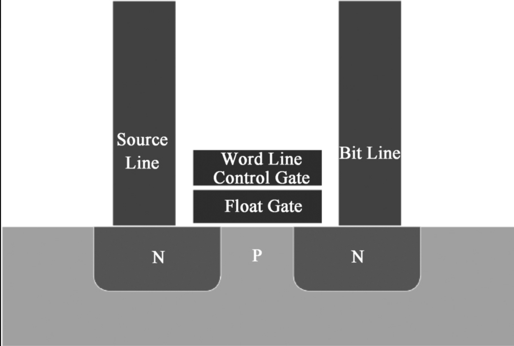
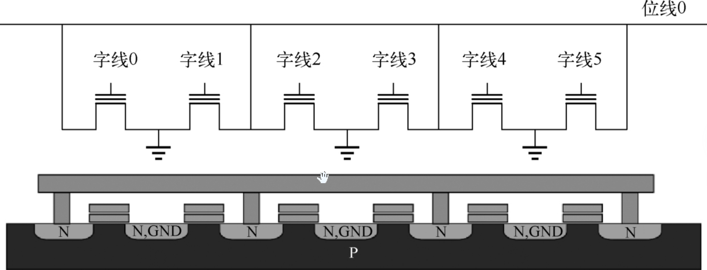
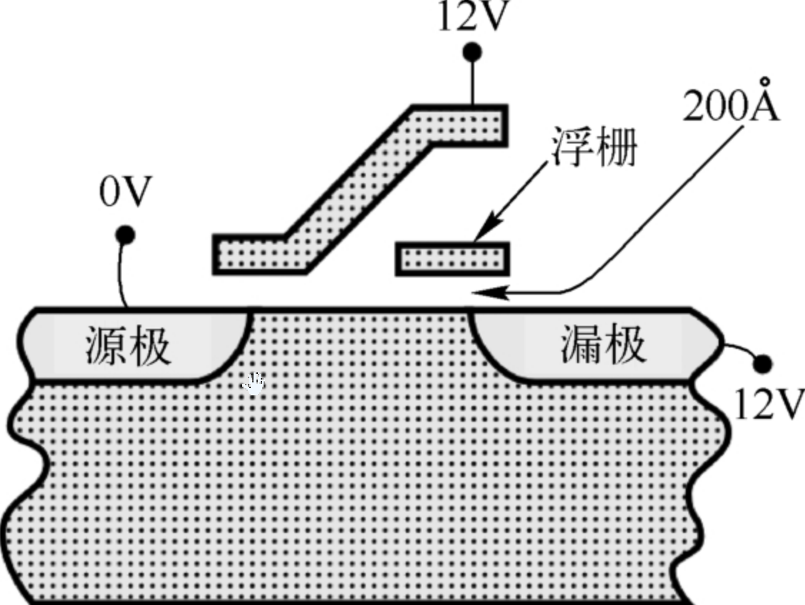
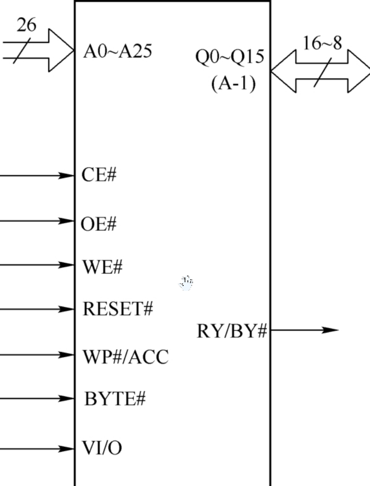
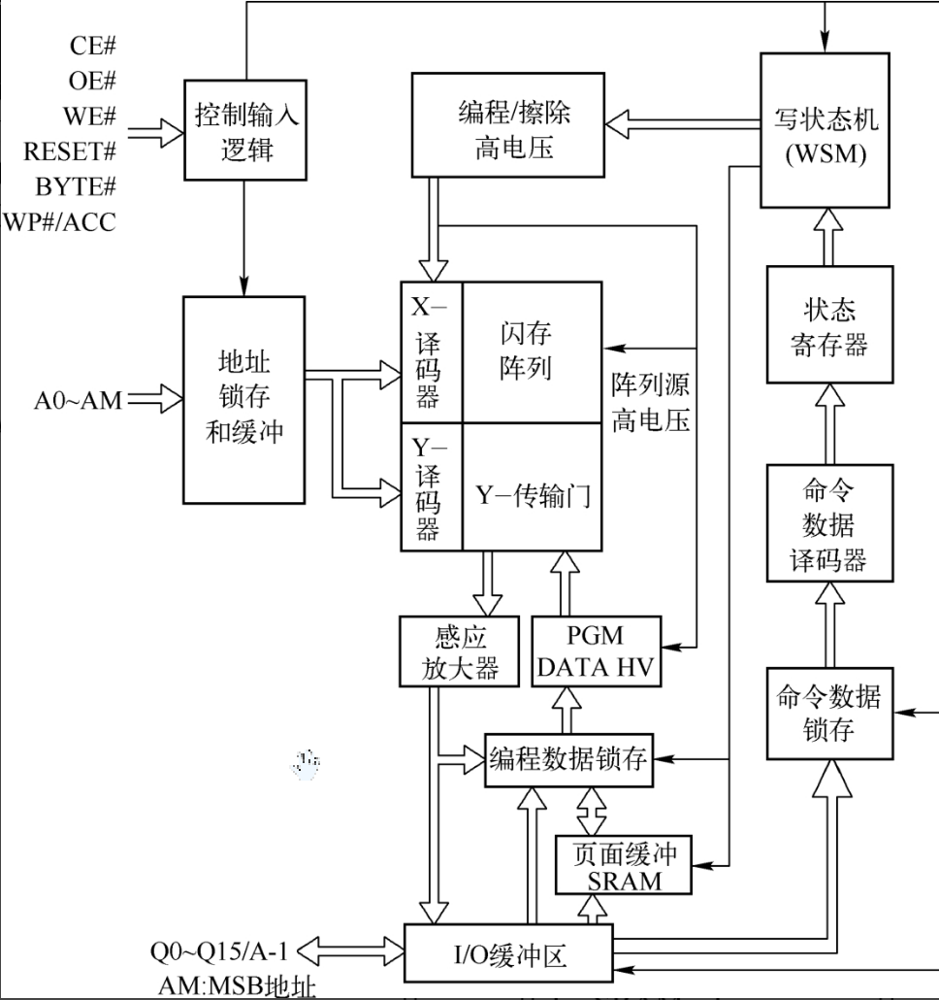

存储系统Cache、SRAM、FLASH、EEPROM和DRAM原理解析和实战笔记（上）。

<!-- more -->

你说你懂存储系统，我不信。

## 1 前言

在计算机硬件系统中，由不同类型存储器所构成的存储器子系统是整个计算机系统中非常重要的一部分。随着半导体技术的不断发展，存储器子系统中越来越多地采用半导体存储设备来保存程序代码或者处理过程中产生的暂时或者永久数据。本文将系统介绍存储器的分类、SRAM存储器原理、DRAM存储器原理、Flash存储器原理和Cache，以及在嵌入式系统常采用的eeprom，以帮助读者理解和掌握不同类型存储器的工作原理，以及它们在计算机系统中的使用方法。

## 2 存储器分类

一般将存储器分成两类，即易失性存储器和非易失性存储器。

### 2.1 易失性存储器

当给易失性存储器（Volatile Memory）断电时，则会丢失保存在易失性存储器中的数据。然而，它比非易失性存储器速度更快且价格更低。这种类型的存储器主要用作计算机系统的主存储器，因为在关闭计算机时数据将保存在硬盘（固态硬盘或机械硬盘）上。

随机访问存储器（Random Access Memory，RAM）已经成为任何可以执行写入和读取操作的半导体存储器的通用术语，而只读存储器（Read-Only Memory，ROM）只能执行读取操作。

注：许多半导体存储器，而不仅仅是RAM，都具有随机存取/访问特性。

#### 2.1.1 动态随机访问存储器

动态随机访问存储器（Dynamic Random Access Memory，DRAM），它使用由一个MOS场效应晶体管（MOS Field-Effect Transistor，MOSFET）和一个MOS电容构成的金属氧化物半导体（Metal Oxide Semiconductor，MOS）存储器单元来保存一个比特或位。这种类型的RAM最便宜，密度也最高，因此用作计算机中的主存储器。但是，存储单元中用于保存数据的电荷会慢慢泄露，因此必须定期刷新（重写）存储单元，这就需要额外的电路。刷新过程由计算机系统内部自动处理，对使用者是透明的。

1）快速页面模式DRAM

快速页面模式DRAM（Fast Page Mode DRAM，FPM DRAM）是一种比较老的异步DRAM类型，它允许以更快的速度重复访问单个存储器“页面”来改进以前的类型。该类型的存储器在20世纪90年代中期使用。

2）扩展数据输出DRAM

扩展数据输出DRAM（Extend Data Out DRAM，EDO DRAM）是一种较老类型的异步DRAM，其访问时间比早期类型更快，因为它能够在上次访问的数据仍在传输的同时启动新的存储器访问。它在20世纪90年代后期使用。

3）视频随机访问存储器

视频随机访问存储器（Video Random Access Memory，VRAM）是一种较老的双端口存储器，曾用作视频卡的帧缓冲区。

4）同步动态随机存取存储器

同步动态随机存取存储器（Synchronous Dynamic Random Access Memory，SDRAM）。给DRAM添加的电路可以用添加到计算机存储器总线的时钟来同步所有操作。这就允许芯片使用流水线同时处理多个存储器请求，以提高速度。将芯片上的数据进行分组，每个分组可以同时进行存储器操作。到2000年左右，它成为计算机主存储器的主要类型。

（1）双数据率SDRAM（Dual-Data Rate Synchronous Dynamic Random Access Memory，DDR SDRAM）。通过双泵（在时钟脉冲的上升沿和下降沿传输数据），可以在每个时钟周期传输两次数据（两个连续的字）。这个想法的扩展是2012年用于提高存储器访问速率和吞吐量的技术。由于事实证明难以进一步提高存储器芯片的内部时钟速度，因此这些芯片通过在每个时钟周期传输更多的数据字来提高传输速率。例如，DDR2 SDRAM在每个内部时钟周期传输4个连续的字；DDR3 SDRAM在每个内部时钟周期传输8个连续的字；DDR4SDRAM在每个内部时钟周期传输16个连续的字。

（2）Rambus DRAM。Rambus DRAM简称RDRAM，一种替代的双数据率存储器标准，曾用于一些英特尔系统，但最终输给了DDR SDRAM。例如，极限速率DRAM（Extreme Data Rate DRAM，XDR DRAM）。

（3）同步图形RAM。同步图形RAM（Synchronous Graphics RAM，SGRAM）是一种专门为图形适配器制作的SDRAM。它可以执行诸如位屏蔽和块写入等图形的相关操作，并且一次可以打开两页存储器。例如，GDDR SDRAM、GDDR2SDRAM、GDDR3 SDRAM、GDDR4 SDRAM、GDDR5SDRAM、GDDR6 SDRAM。

（4）高带宽存储器（High Bandwidth Memory，HBM）。一种用于图形卡的SDRAM开发，可以以更快的速度传输数据。它由多个堆叠在一起的存储器芯片组成，具有更宽的数据总线。

5）伪静态RAM

伪静态RAM（Pseudo-Static RAM，PSRAM）是一种DRAM，它有在芯片上执行存储器刷新的电路，因此它的作用类似于SRAM，它允许关闭外部存储器控制器以节省能源，用于一些游戏机，如Wii。

#### 2.1.2 静态随机访问存储器

静态随机访问存储器（Static Random Access Memory，SRAM）将每一位二进制数据保存在称为触发器的电路中，该电路由4～6个晶体管构成。与DRAM相比，SRAM的密度更低，每个比特或位的成本更高，但速度更快，不需要存储器刷新操作。它用于处理器芯片中；较小的高速缓存。

#### 2.1.3 内容可寻址存储器

内容可寻址存储器（Content Addressable Memory，CAM）是一种特殊类型存储器，其取代使用地址访问数据，而是应用数据字。如果字保存在存储器中，则返回位置。它主要集成在其他芯片中，如用于高速缓存的位处理器。

### 2.2 非易失性存储器

在给非易失性存储器（Non-Volatile Memory，NVM）断电时，信息仍然保存在该存储器中。因此，它可用作没有磁盘的便携式设备的存储器，或者用作可移动存储卡。非易失性半导体存储器（Non-Volatile Semiconductor Memory，NVSM）将数据保存在浮栅存储单元中，每个单元都由一个浮栅MOSFET组成。

#### 2.2.1 只读存储器

只读存储器（Read-Only Memory，ROM）旨在永久保存数据。在正常的操作过程中只能读取ROM中的内容，而不能写入。它通常用于保存计算机必须立即访问的系统软件，如启动计算机的BIOS程序，以及用于便携式设备和嵌入式计算机（如微控制器）的软件（微码）。

1）掩模编程只读存储器与掩模只读存储器

对于掩模编程只读存储器（Mask Programmed ROM，MPROM）与掩模只读存储器（Mask ROM，MROM）来说，在制造它们时，就将数据编程（写入）到芯片中，因此这种存储器仅用于大批量生产，不能重新写入新的数据。

2）可编程只读存储器

对于可编程只读存储器（Programmable ROM，PROM）来说，在将其装配到电路中之前就将数据写到现有的PROM芯片中，但它只能写入一次。当将PROM芯片插入专用的编程器设备中时，就可以将数据写到PROM中。

3）可擦除可编程只读存储器

对于可擦除可编程只读存储器（Erasable Programmable Read-Only Memory，EPROM）来说，可以从印刷电路板上取下该芯片，然后将其暴露在紫外线下以擦除现有的数据，并将其插入专用的编程器中就可以将新的数据重新写入ERPOM芯片中。EPROM芯片封装的顶部有一个小的透明“窗口”，其允许紫外线照进EPROM芯片。EPROM通常用于原型和小型生产运行设备，该芯片中的程序一般需要在工厂进行更改。

4）电可擦除的可编程只读存储器

电可擦除的可编程只读存储器（Electronically Erasable Programmable Read-Only Memory，EEPROM）可以用电方式重新写入新的数据，而芯片仍然装配在电路板上，但写入的过程很慢。该存储器用于保存固件，即运行硬件设备（如大多数计算机中的BIOS程序）的底层微代码，以方便可以随时对其进行更新。

## 3 非易失性随机访问存储器

非易失性随机访问存储器（Non-Volatile Random Access Memory，NVRAM）的典型代表是铁电随机访问存储器（Ferroelectric Random Access Memory，FRAM/FeRAM），它是一种独立的非易失性存储器，可以在断电时立即捕获和保存关键数据。

## 4 Flash存储器（闪存）

对于这种类型的存储器，写入过程的速度介于EEROM和RAM存储器之间。它可以写入数据，但速度不够快，无法用作计算机的内存/主存。它通常用作硬盘的半导体版本（以前计算机的硬盘采用的是机械硬盘），用于存储文件。它也用于便携式设备，如PDA、USB闪存驱动器，以及用于数码相机和手机的可移动存储卡。

为了方便芯片和嵌入式爱好者和研究者，这里先研究FLASH存储器的设计。

目前使用的两种主要的非易失性Flash存储器（以下简称闪存）包括NOR闪存和NAND闪存。下面将介绍NAND闪存和NOR闪存的工作原理，并讨论两者的区别。

### 4.1 浮栅MOSFET的原理

在闪存中，每个存储单元类似于一个标准的金属氧化物半导体场效应晶体管（Metal-Oxide-Semiconductor Field-Effect Transistor，MOSFET），只是晶体管有两个栅极而不是一个栅极，如下图所示。

图中，Bit Line表示位线，Source Line表示源线，Word Line表示字线。

这些单元可以看作一个电子开关，其中电流在两个端子（源极和漏极）之间流动，并且由浮栅（Float Gate，FG）和控制栅（Control Gate，CG）控制。CG类似于其他MOS晶体管中的栅极，但在其下方，FG四周被氧化层绝缘。FG介于CG和MOSFET通道之间，由于FG被其绝缘层电隔离，因此在其上的电子会被捕获。当用电子给FG充电时，该电荷会屏蔽来自CG的电场，从而增加单元的阈值电压($V_{T1}$)。这意味着现在必须向CG施加更高的电压($V_{T2}$)，因此，逻辑“1”保存在栅极中。如果沟道在中间电压下不导通，则表明FG已经充电，因此，逻辑“0”保存在栅极中。当在CG上的中间电压有效时，通过确定是否有电流流过晶体管来感应逻辑“0”和逻辑“1”的存在。在每个单元保存多于一位的多电平单元器件中，检测电流量（而不是简单地存在或不存在），以便更精确地确定在FG上的电荷水平。之所以称为浮栅MOSFET，是因为浮栅和硅之间有一层电绝缘的隧道氧化层，因此栅“浮”在硅上面。氧化物将电子限制在浮栅中。由于氧化物所经历的极高电场（每厘米1000万电子伏特），会发生退化或磨损（以及浮栅闪存的有限耐久性）。随着时间的推移，这种高电压密度会破坏相对较薄的氧化物中的原子键，逐渐降低其电绝缘性能，允许捕获电子并从浮栅自由（泄露）进入氧化物，增加数据丢失的可能性，这是因为电子（其数量通常用于表示不同的电荷水平，每个电子分配给MLC闪存中的不同位组合）通常位于浮栅中。这就是为什么数据保留会下降并且数据丢失的风险随着退化的增加而增加的原因。在嵌入式系统中使用NAND闪存和NOR闪存有特定的优点和缺点。NAND闪存最适合文件或顺序数据应用，NOR闪存最适合随机存取。与NOR闪存相比，NAND闪存的优势在于快速编程和擦除操作。NOR闪存的优势在于其随机访问和字节写入能力。随机访问为NOR闪存提供了就地执行（Execute-In-Place，XiP）功能，这在嵌入式应用程序中非常必要。越来越多的处理器包括直接NAND闪存接口，并且支持直接从NAND闪存器件（无NOR闪存）启动。当成本、空间和存储容量非常重要时，这些处理器提供了很好的解决方案。使用这些处理器，将NAND闪存设计为嵌入式应用时，XiP功能将不再是考虑因素。

NAND闪存和NOR闪存的性能比较如下表所示。通过该表，可帮助读者了解两者之间的主要差别。

|    | NAND闪存                  | NOR闪存                |
|----|-------------------------|----------------------|
| 优势 | 快速编程、快速擦除               | 随机访问/存取、可能的字节编程      |
| 劣势 | 较慢随机访问/存取、字节编程困难        | 较慢编程、较慢擦除            |
| 应用 | 文件应用、语音、数据、录像机、任何大的顺序数据 | 替代EPROM、从非易失性存储器直接执行 |

### 4.2 NOR闪存

NOR闪存最常用于需要写入和读取单个数据字节的应用程序，并且最常用于需要随机访问和就地访问技术的应用程序。由于每次读取访问花费的时间相同，因此顺序读取并不比随机访问快。擦除/编程周期通常很长。

目前，NOR闪存可提供兆位或千兆位的容量。根据器件的不同，在写入数据之前必须擦除单个字节或扇区，擦除/编程速度通常低于1MB/s。

NOR闪存具有高可靠性，通常可以保持数据完整性20年或更长时间。

如图所示，在NOR闪存中，每个单元的一端直接接地，另一端直接连接到位线。这种排列称为“NOR闪存”，因为它的作用类似于“或非”（NDR）门：当拉高其中一条字线（连接到单元的CG）时，相应的存储晶体管就会将输出位线拉低。

**1.编程**

如下图所示，处于默认状态的单级NOR闪存单元在逻辑上等效于二进制的“1”，因为在向控制栅极施加适当电压的情况下，电流将流经沟道，从而拉低位线电压。可以通过以下过程编程NOR闪存单元或将其设置为二进制的“0”值。

可以通过以下过程编程NOR闪存单元或将其设置为二进制的“0”值。

（1）向CG施加升高的导通电压（通常大于5V）。

（2）沟道现在是打开的，因此电子可以从源极流向漏极（假设是NMOS晶体管）。

（3）源极-漏极电流足够大，通过称为热电子注入的过程，导致一些高能电子通过绝缘层跳到FG上。

**2.擦除**

如图所示，为了擦除NOR闪存单元（将其复位到“1”状态），在CG和源端子之间施加极性相反的大电压，通过量子隧道将电子拉离FG。现代NOR闪存芯片分为擦除段（通常称为块或扇区）。

擦除操作只能以块为单位进行；擦除段中的所有单元必须一起擦除。但是，NOR单元通常可以一次执行一个字节或一个字的编程。

**3.通用闪存接口**

用于锁定、解锁、编程或擦除NOR存储器的特定命令因不同的制造商而有所不同。为了避免为制造的每个器件都需要单独的驱动程序软件，特殊的通用闪存接口（Common Flash Memory Interface，CFI）命令允许器件识别自身，以及它的关键操作参数。

**4.芯片实例**

本部分将以中国台湾旺宏电子的单电压3V NOR 闪存MX29GL512G为例说明其原理和接口。

1）接口信号

该器件的接口如图所示，接口信号的定义如表所示。

| 信号      | 功能                   |
|---------|----------------------|
| A0-A25  | 地址输入 A0-A025         |
| Q0-Q14  | 数据输入/输出              |
| Q15/A-1 | Q15(字模式)/地址LSB(字节模式) |
| CE#     | 芯片使能输入               |
| WE#     | 写使能输入                |
| OE#     | 输出使能输入               |
| RESET#  | 硬件复位引脚、低有效           |
| WP#/ACC | 硬件写保护/编程加速输入         |
| RY/BY#  | 准备/忙输出               |
| BYTE#   | 选择8位或16位模式           |
| VCC     | +3.0V单电源供电           |
| GND     | 器件地                  |

2）内部结构分析

单电压3V NOR闪存的内部结构如图所示。图中的每个块代表实际芯片中用于访问、擦除、编程和读取存储器阵列的一个或多个电路模块。

控制输入逻辑块接收输入引脚CE#、OE#、WE#、RESET#、BYTE#和WP#/ACC。它根据输入引脚创建内部时序控制信号并输出到地址锁存和缓冲块，以锁存外部地址引脚A0～AM（AM=A24，用于MX29GL512G；AM=A25，用于MX68GL1G0G）。

内部地址从该块输出到主阵列和由X-译码器、Y-译码器、Y-传输门与闪存阵列组成的译码器。X-译码器对闪存阵列的字线进行译码，而Y-译码器对闪存阵列的位线进行译码。通过Y-传输门，选择位线电气连接到感应放大器和编程数据高电压（PGM DATA HV）块。

感应放大器用于读出闪存的内容，而编程数据高电压块用于在编程期间有选择地向位线提供高功率。I/O缓冲区块控制Q0～Q15/A-1引脚上的输入和输出。在读操作期间，I/O缓冲区接收来自感应放大器的数据并相应地驱动输出引脚。在编程命令的最后一个周期，I/O缓冲区块将Q0～Q15/A-1上的数据传输到编程数据锁存块，它控制编程数据高电压块中的大功率驱动器，根据用户的输入模式选择性地编程字/字节中的位。

在写到缓冲区序列期间，I/O缓冲区块将Q0～Q15上的数据传输到页面缓冲区SRAM以保存用户数据。当用户发出确认命令后，页面缓冲区SRAM的数据将依次传输到编程数据锁存块并通过编程数据高电压块将数据编程到闪存单元中。

编程/擦除高电压块包含产生和传输必要的高电压到X-译码器、闪存阵列和编程数据高电压块。逻辑控制模块包括写状态机、状态寄存器和命令数据译码器以及命令数据锁存块。当用户通过切换WE#发出命令时，Q0～Q15/A-1上的命令会锁存在命令数据锁存块中，并由命令数据译码器译码。状态寄存器接收命令并记录器件当前的状态。写状态机块通过控制图中的每个块，根据当前命令状态实现编程或擦除的内部算法。

3）扇区构成

对于MX29GL512G来说，其扇区结构如表所示。

| 扇区大小（字节） | 扇区  | 扇区地址(A24-A16) | 地址范围(×16)         |
|----------|-----|---------------|-------------------|
| 128      | SA0 | 000000000     | 0000000h-000FFFFh |
| 128      | SA1 | 000000001     | 0010000h-001FFFFh |
| 128      | SA2 | 000000010     | 0020000h-002FFFFh |
| ...      | ... | ...           | ...               |

4）典型操作

本部分将通过扇区的擦除操作说明命令的用法。扇区擦除操作用于通过将扇区所有存储位置返回到“1”状态来清除扇区内的数据。启动擦除操作需要6个命令周期，前两个周期是“解锁周期”，第三个是配置周期，第四个和第五个也是“解锁周期”，第六个周期是扇区擦除命令，具体操作命令如表所示。

| 周期      | 第一周期 | 第二周期 | 第三周期 | 第四周期 | 第五周期 | 第六周期 |
|---------|------|------|------|------|------|------|
| 地址/字节模式 | AAA  | 555  | AAA  | AAA  | 555  | 扇区   |
| 地址/字模式  | 555  | 2AA  | 555  | 555  | 2AA  | 扇区   |
| 数据      | AA   | 55   | 80   | AA   | 55   | 30   |

当扇区擦除操作开始后，将忽略掉除暂停擦除和扩展状态寄存器读取之外的所有命令。中断擦除操作的唯一方法是使用擦除挂起命令或硬件复位。硬件复位将完全终止操作并将器件返回到读取模式。

