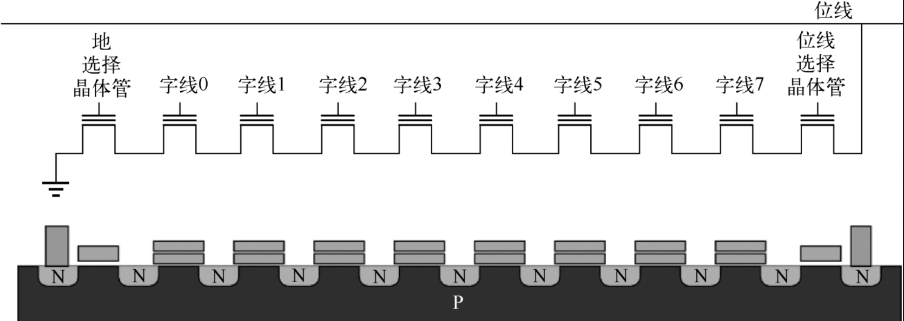
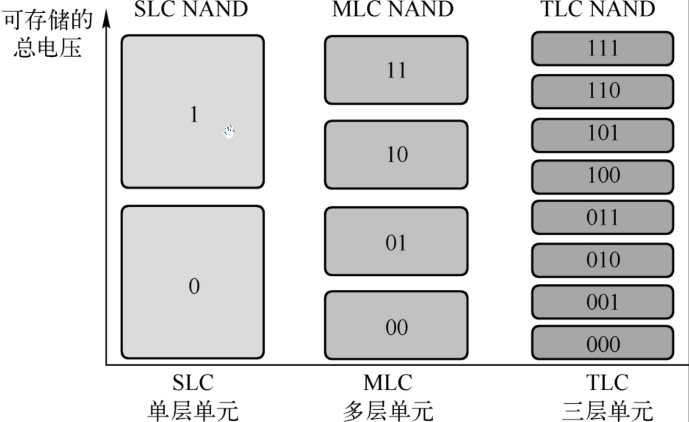
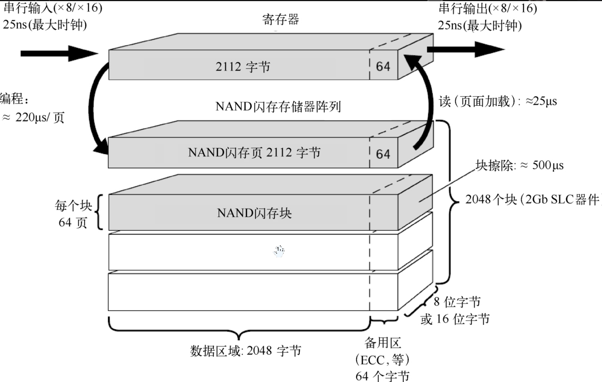
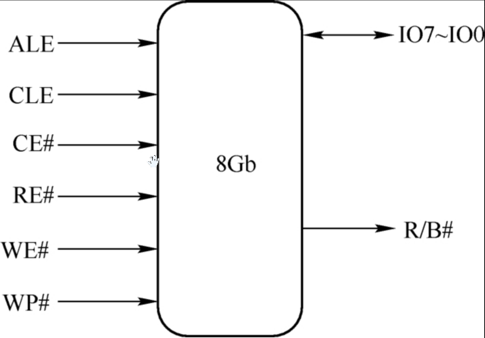
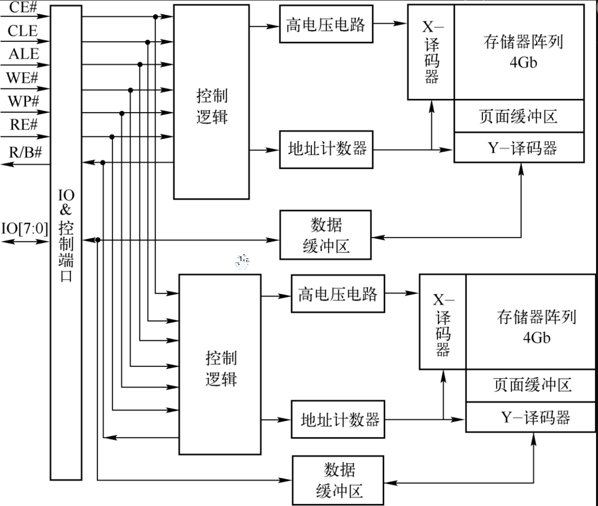
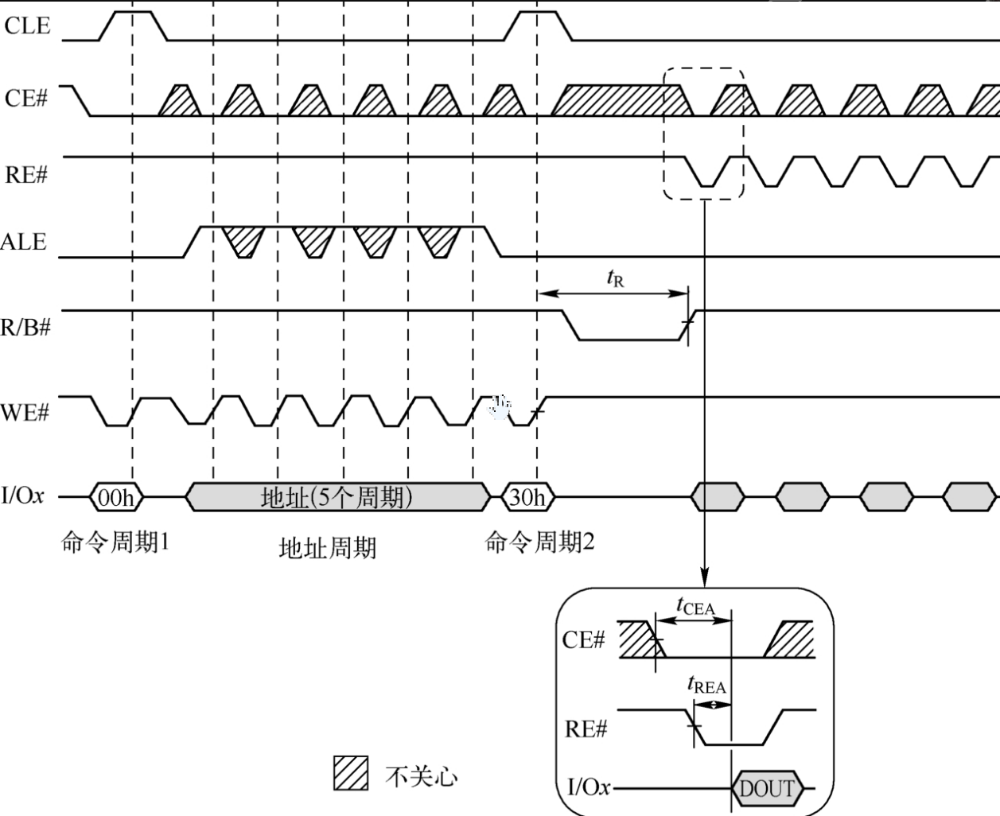
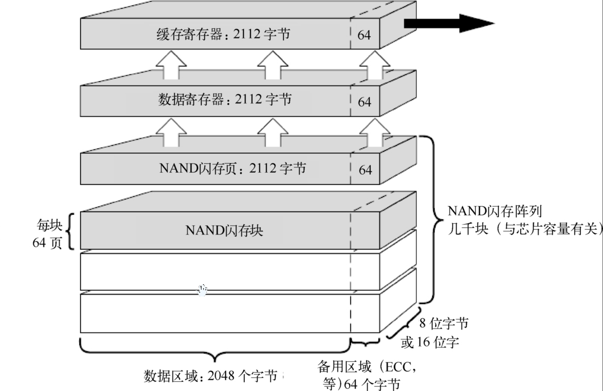

存储系统Cache、SRAM、FLASH、EEPROM和DRAM原理解析和实战笔记（下）。

<!-- more -->

你说你懂存储系统，我不信。

## 1 前言

在计算机硬件系统中，由不同类型存储器所构成的存储器子系统是整个计算机系统中非常重要的一部分。随着半导体技术的不断发展，存储器子系统中越来越多地采用半导体存储设备来保存程序代码或者处理过程中产生的暂时或者永久数据。本文将系统介绍存储器的分类、SRAM存储器原理、DRAM存储器原理、Flash存储器原理和Cache，以及在嵌入式系统常采用的eeprom，以帮助读者理解和掌握不同类型存储器的工作原理，以及它们在计算机系统中的使用方法。

前面的博客讲了存储器分类、存储器的基本概念以及Nor Flash，今天讲讲NAND FLASH。

## 2 NAND闪存

NAND闪存按块排列，可以在其中写入、读取或擦除数据。在顺序读取期间，接收第一个数据字节的延迟远高于NOR闪存，但随后检索数据的顺序字节比使用NOR闪存快得多。写入数据时，可以将整块数据快速传输到NAND闪存，然后在一次操作中写入该块。有效的读写速度与块擦除时间都比NOR闪存快得多。

NAND闪存最适合执行大型顺序数据访问的系统，这很好地映射了当今用作具有面向块的存储子系统的计算系统和操作系统的主要存储设备的用途。由于闪存单元的物理硅设计，对于类似的工艺技术，NAND闪存单元比NOR闪存单元占用的硅片面积少约40%。

NAND闪存的结构如图所示。NAND闪存也使用浮栅晶体管，但它们的连接方式类似于“与非”（NAND）门：几个晶体管串联连接，只有当所有字线都拉高时（高于晶体管的VT），位线才会拉低。然后，这些组通过一些额外的晶体管连接到NOR类型的位线阵列，就像单个晶体管在NOR闪存中的连接一样。

与NOR闪存相比，用串行连接组替换单个晶体管增加了额外的寻址级别。NOR闪存可以按页、字和位寻址。位级寻址适合位串行应用程序（如硬盘仿真），一次只能访问一位。另外，就地执行应用程序同时访问一个字中的每一位，这要求字级寻址。在任何情况下，位寻址模式和字寻址模式均可用于NOR或NAND闪存。

要读取数据，首先选择所需要的组（与从NOR阵列中选择单个晶体管的方式相同）。接下来，将大部分字线上拉到已编程位的$V_T$以上，而将其中之一则上拉到刚好高于已擦除的$V_T$。如果所选位尚未编程，则串联组将导通（并将位线拉低）。

尽管增加了晶体管，地线和位线的减少允许更密集的布局和每个芯片更大的存储容量（地线和位线实际上比图中的线宽多）。此外，NAND闪存通常允许包含一定数量的故障（用于BIOS ROM的NOR闪存期望无故障）。制造商尝试通过缩小晶体管的尺寸使可用的存储量最大化。

1. 类型

根据工艺的不同，将NAND闪存划分为以下类型，如图所示。

1）单层单元NAND闪存

单层单元（Single Level Cell，SLC）技术在每个单元中保存一位数据。单元保存“0”或“1”。SLC技术提供NAND闪存技术的最高可靠性和耐用性。

2）多层单元NAND闪存

多层单元（Multi-Level Cell，MLC）技术在每个单元中保存多于一位的数据，导致数据密度增加，因此容量比SLC技术更高。今天，每单元2位、3位甚至4位MLC闪存技术非常普遍。由于每个单元保存的不仅仅是一位数据，分割单元不同位解释的电压裕度降低，当单元内的充电电压随时间变化时，MLC技术对数据错误更加敏感。因此，MLC闪存技术的耐用性比SLC闪存技术低得多。

3）三层单元

三层单元（Triple Level Cell，TLC）是MLC的一个子集，专门用于每单元3位的功能。

如今，采用SLC技术获得大容量NAND闪存SSD变得越来越困难。相反，许多供应商正在使用MLC闪存阵列的多个位状态来模拟SLC闪存阵列的可靠性来实现SLC的可靠性与耐用性。通过每个有效SLC位使用多个MLC位状态，SLC模式下的闪存阵列的有效容量小于原始的MLC容量。

2. 写和擦除

NAND闪存使用隧道注入进行写入操作，以及使用隧道释放进行擦除操作。NAND闪存构成了称为USB闪存驱动器的可移动USB存储设备的核心，以及当今可用的大多数存储卡格式与固态驱动器。

NAND闪存的层次结构从单元级开始，它建立串，然后是页、块、平面，最后是晶圆。串是一系列连接的NAND单元，其中一个单元的源极连接到下一个单元的漏极。根据NAND技术，一个串通常由32～128个NAND单元组成。将串组织成页，然后组织成块，其中每个串连接到称为位线（BL）的单独线。串中具有相同位置的所有单元通过字线（WL）的控制门连接。包含一定数量块的平面，它们通过相同的BL连接。闪存晶圆由一个或多个平面，以及执行所有读/写/擦除操作所需的外围电路组成。一个2GB NAND闪存的典型组成结构（包含2048个块）如图所示。

NAND闪存的架构意味着数据可以按页读取和编程，通常大小为4～16KB，但只能在由多个页和大小为兆字节组成的整个块级别进行擦除。当擦除一个块时，将所有单元在逻辑上设置为“1”。数据只能在一次通过时编程到被擦除的块中的一页。通过编程设置为“0”的任何单元只能通过擦除整个块来复位为“1”，这意味着在将新数据编程到已经包含数据的页面之前，必须将页面的当前内容加上新数据复制到新的擦除页面。如果有合适的页面可用，则可以立即将数据写入其中。如果没有可用的已擦除页面，则必须先擦除该块，其次将数据复制到该块中的页面，最后才能将旧页面标记为无效，这样就可以擦除和重新使用。

3. 接口标准

一个名为开放NAND闪存接口工作组（Open Flash Interface Working Group，ONFI）的小组已经为NAND闪存芯片开发了标准化的底层接口。这允许来自不同供应商的符合标准的NAND器件之间的互操作性。ONFI规范版本1.0于2006年12月28日发布。它规定：

（1）TSOP-48、WSOP-48、LGA-52和BGA-63封装中NAND闪存的标准物理接口（引脚排列）；

（2）用于读取、写入和擦除NAND闪存芯片的标准命令集；

（3）一种自我识别机制（类似于SDRAM存储器模块的串行存在检测功能）。

ONFI得到了主要NAND闪存制造商的支持，包括海力士（Hynix）、英特尔（Intel）、美光科技（Micron Technology）和恒忆（Numonyx），以及包含NAND闪存芯片的主要芯片制造商。

两个主要的闪存芯片制造商［东芝（Toshiba）和三星（Samsung）］，选择使用它们自己设计的接口，称为Toggle模式（现在是Toggle V2.0）。此接口与ONFI规范不兼容，结果是为一个供应商的器件生产的产品可能无法使用另一个供应商的器件。

包括英特尔、戴尔（Dell）和微软（Microsoft）在内的一组供应商组成了一个非易失性存储器主机控制器接口（Non-Volatile Memory Host Controller Interface，NVMHCI）工作组。该小组的目标是为非易失性存储器子系统提供标准的软件和硬件编程接口，包括连接到PCI Express总线的“闪存缓存”器件。

4. 芯片实例

本部分将以中国台湾旺宏电子的1.8V 8Gb NAND闪存MX60UF8G18AC为例，说明其原理和接口。该器件的接口信号如图所示，接口信号的定义如表所示。

| 引脚      | 功能          |
|---------|-------------|
| IO7~IO0 | 数据I/O端口     |
| CE#     | 芯片使能（低有效）   |
| RE#     | 读使能（低有效）    |
| WE#     | 写使能（低有效）    |
| CLE     | 命令锁存使能      |
| ALE     | 地址锁存使能      |
| WP#     | 写保护（低有效）    |
| R/B#    | 准备/忙（集电极开漏） |
| VSS     | 地           |
| VCC     | 用于器件工作的供电电压 |
| NC      | 内部没有连接      |
| DNU     | 没有使用（不要连接）  |

该芯片的内部结构如下图所示，其是一款8Gb SLC NAND闪存芯片。该芯片具有标准的NAND闪存特性和典型的编程/擦除10万个周期（带有ECC）的可靠质量，适合嵌入式系统代码和数据的存储。该系列器件要求每（512+16）个字节就需要4位纠错码（Error Correcting Code，ECC）。

MX60UF8G18AC通常以2112字节的页访问，以进行读取和编程操作。该闪存由数千个块组成，每块由64个页面组成，一个页面包括（2048+64）个字节，由两个NAND串结构组成，每个串中有32个串联单元。每个页面有额外的64个字节用于ECC和其他用途。该器件具有2112字节的片上缓冲区，用于数据的加载和访问。

MX60UF8G18AC的缓存读操作实现首字节读访问延迟25us，顺序读取25ns，下一个顺序页的延迟时间从$t_{R}$缩短到$t_{RCBSY}$。该器件在所有操作模式（读取/编程/擦除）期间的电流为30mA，在待机模式下为100uA。

所有NAND闪存操作都是通过发出一个命令周期来启动的，这是通过将命令置于I/O［7∶0］上，将CE#驱动为低电平，将CLE驱动为高电平，然后发出写时钟（WE#）来实现的。在WE#的上升沿将命令、地址和数据驱动到NAND闪存器件，如图所示。命令周期和地址周期如表所示。地址周期的地址分配策略同样如表所示。

| 命令           | 命令周期1 | 地址周期个数 | 要求的数据周期 | 命令周期2 | 忙时有效 |
|--------------|-------|--------|---------|-------|------|
| 读取页面操作       | 00h   | 5      | 无       | 30h   | 否    |
| 读页面缓存顺序操作    | 31h   | -      | 无       | -     | 否    |
| 最后读取页面缓存顺序操作 | 3Fh   | -      | 无       | -     | 否    |
| 用于内部数据移动的读取  | 00h   | 5      | 无       | 35h   | 否    |
| 随机数据读取       | 05h   | 2      | 无       | E0h   | 否    |
| 读ID          | 90h   | 1      | 无       | -     | 否    |
| 读状态          | 70h   | -      | 无       | -     |  是   |
| 编程页面         | 80h   | 5      | 是       | 10h   | 否    |
| 编程页面缓存       | 80h   | 5      | 是       | 15h   | 否    |
| 用于内部数据移动的编程  | 85h   | 5      | 可选      | 10h   | 否    |
| 随机数据输入       | 85h   | 2      | 是       | -     | 否    |
| 擦除块          | 60h   | 3      | 否       | D0h   | 否    |
| 复位           | FFh   | -      | 否       | -     | 是    |

地址周期的地址分配策略：

| 地址        | IO7 | IO6 | IO5 | IO4 | IO3 | IO2 | IO1 | IO0 |
|-----------|-----|-----|-----|-----|-----|-----|-----|-----|
| 列地址-第一个周期 | A7  | A6  | A5  | A4  | A3  | A2  | A1  | A0  |
| 列地址-第二个周期 | L   | L   | L   | L   | A11 | A10 | A9  | A8  |
| 列地址-第三个周期 | A19 | A18 | A17 | A16 | A15 | A14 | A13 | A12 |
| 列地址-第四个周期 | A27 | A26 | A25 | A24 | A23 | A22 | A21 | A20 |
| 列地址-第五个周期 | L   | L   | L   | L   | L   | A30 | A29 | A28 |

表中：
（1）A18是选择平面。

（2）A30是选择晶圆。

A30=0时选择下面的4Gb；A30=1时选择上面的4Gb。

此外，需要注意的是，NAND闪存中实际有两个寄存器，一个数据寄存器和一个缓存寄存器，如图所示，这两个寄存器的属性在各种NAND闪存缓存模式中起着重要的作用。

页面读取缓存模式使能用户在输出先前访问的数据的同时，对来自阵列的下一个顺序访问进行流水线处理。这种双缓冲技术可以隐藏读传输时间tR。数据最初从NAND闪存阵列传输到数据寄存器。如果高速缓存寄存器可用（不忙），则数据会快速从数据寄存器移动到高速缓存寄存器。数据传输到缓存寄存器后，数据寄存器可用，可以开始从NAND闪存阵列加载下一个连续页面。

在8位I/O器件上，使用页面读取缓存模式命令比传统的页面读命令提高了33%的性能，吞吐量高达31MB/s。在16位I/O器件上，吞吐量可以增加到37MB/s，与正常的页面读取操作相比，性能提高了40%。

留一个思考题：说明NAND闪存内部结构的组织形式。

