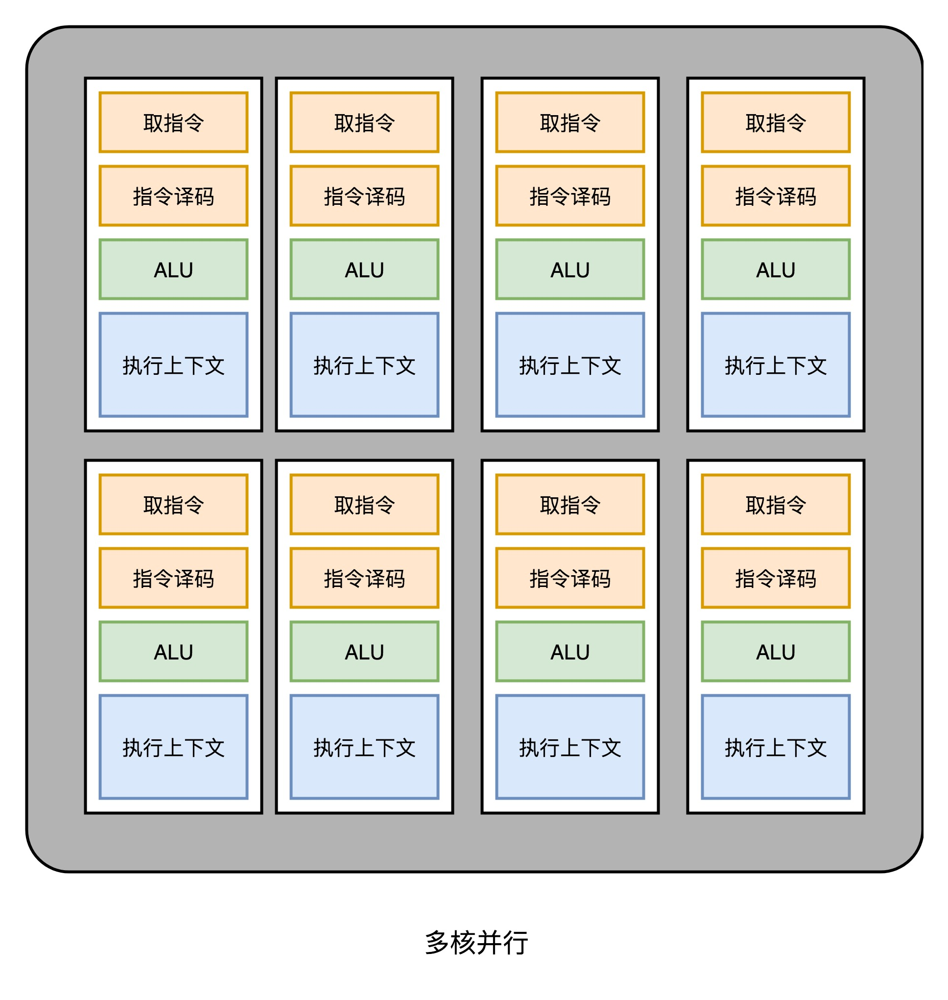
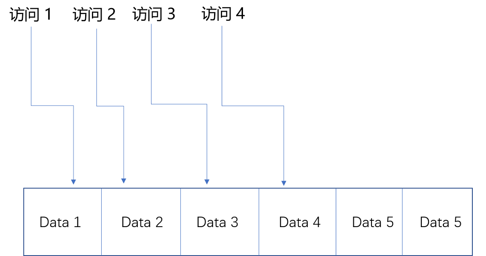

计算机组成原理总结学习笔记。

<!-- more -->

## 一、计算机组成原理概述

**1、计算机的基本硬件组成===CPU、内存和主板**

　　（1）CPU

​    　　计算机最重要的核心配件，叫做中央处理器。计算机的所有“计算”都是由 CPU 来进行的。CPU 也是整台计算机中造价最昂贵的部分之一。CPU，一般都被叫作超大规模集成电路（Very-Large-Scale Integration，VLSI）。这些电路，实际上都是一个个晶体管组合而成的。CPU 在计算，其实就是让晶体管里面的“开关”不断地去“打开”和“关闭”，来组合完成各种运算和功能。

　　（2）内存

 　　   程序、打开的浏览器、运行的游戏，都要加载到内存里才能运行。程序读取的数据、计算得到的结果，也都要放在内存里。内存越大，能加载的东西自然也就越多。存放在内存里的程序和数据，需要被 CPU 读取，CPU 计算完之后，还要把数据写回到内存。然而 CPU 不能直接插到内存上，反之亦然。

　　（3）主板

　　    主板是一个有着各种各样，有时候多达数十乃至上百个插槽的配件。CPU 要插在主板上，内存也要插在主板上。主板的芯片组（Chipset）和总线（Bus）解决了 CPU 和内存之间如何通信的问题。芯片组控制了数据传输的流转，也就是数据从哪里到哪里的问题。总线则是实际数据传输的高速公路。因此，总线速度（Bus Speed）决定了数据能传输得多快。

　　（4）其他非必要组件

   　　 电源、输入（Input）/ 输出（Output）设备，也就是 I/O 设备、机箱、风扇、硬盘、显卡（GPU）等


**2、冯·诺依曼体系结构**

　　（1）包含算术逻辑单元（Arithmetic Logic Unit，ALU）和处理器寄存器（Processor Register）的处理器单元（Processing Unit），用来完成各种算术和逻辑运算

　　（2）包含指令寄存器（Instruction Register）和程序计数器（Program Counter）的控制器单元（Control Unit/CU），用来控制程序的流程，通常就是不同条件下的分支和跳转。

　　（3）用来存储数据（Data）和指令（Instruction）的内存。以及更大容量的外部存储（通常指硬盘）；

　　（4）输入输出设备。个人电脑的鼠标键盘是输入设备，显示器是输出设备。智能手机，触摸屏既是输入设备，又是输出设备。而跑在各种云上的服务器，则是通过网络来进行输入和输出。

​    　　**任何一台计算机的任何一个部件都可以归到运算器、控制器、存储器、输入设备和输出设备中，而所有的现代计算机也都是基于这个基础架构来设计开发的。**

​    　　而所有的计算机程序，也都可以抽象为从输入设备读取输入信息，通过运算器和控制器来执行存储在存储器里的程序，最终把结果输出到输出设备中。而我们所有撰写的无论高级还是低级语言的程序，也都是基于这样一个抽象框架来进行运作的。


​    　　**学习计算机组成原理，其实就是学习和拆解冯·诺依曼体系结构。**

​    　　**学习控制器、运算器的工作原理，也就是 CPU 是怎么工作的，以及为何这样设计；学习内存的工作原理，从最基本的电路，到上层抽象给到 CPU 乃至应用程序的接口是怎样的；学习 CPU 是怎么和输入设备、输出设备打交道的。**

​    　　**理解从控制器、运算器、存储器、输入设备以及输出设备，从电路这样的硬件，到最终开放给软件的接口，是怎么运作的，为什么要设计成这样，以及在软件开发层面怎么尽可能用好它。**

**3、计算机组成原理知识地图**


**4、“性能”介绍：性能可以看做时间的倒数**

 　　 计算机性能中，有两个重要的指标：、吞吐率

​    　　（1）响应时间指的就是，我们执行一个程序，到底需要花多少时间。花的时间越少，自然性能就越好。

​    　　（2）吞吐率是指在一定的时间范围内，到底能处理多少事情。这里的“事情”，在计算机里就是处理的数据或者执行的程序指令。

**5、CPU指针：计算机的计时单位**

 　　虽然时间是一个很自然的用来衡量性能的指标，但是用时间来衡量时，有两个问题。

​    　　（1）时间不准：计算机可能同时运行着好多个程序，CPU 实际上不停地在各个程序之间进行切换。在这些走掉的时间里面，很可能 CPU 切换去运行别的程序了。而且，有些程序在运行的时候，可能要从网络、硬盘去读取数据，要等网络和硬盘把数据读出来，给到内存和 CPU。所以说，要想准确统计某个程序运行时间，进而去比较两个程序的实际性能，我们得把这些时间给刨除掉。

​    　　（2）即使已经拿到了 CPU 时间，也不一定可以直接“比较”出两个程序的性能差异。即使在同一台计算机上，CPU 可能满载运行也可能降频运行，降频运行的时候自然花的时间会多一些。

​     　　除了 CPU 之外，时间这个性能指标还会受到主板、内存这些其他相关硬件的影响。所以，需要对“时间”这个可以感知的指标进行拆解，把程序的 CPU 执行时间变成 CPU 时钟周期数（CPU Cycles）和 时钟周期时间（Clock Cycle）的乘积。

**程序的 CPU 执行时间 =CPU 时钟周期数×时钟周期时间**

​    　　**时钟周期时间：CPU内部有一个叫做晶体振荡器（Oscillator Crystal）的东西，简称为晶振。我们把晶振当成 CPU 内部的电子表来使用。晶振带来的每一次“滴答”，就是时钟周期时间。**

​    　　**最简单的提升性能方案，自然缩短时钟周期时间，也就是提升主频。换句话说，就是换一块好一点的 CPU。如果能够减少程序需要的 CPU 时钟周期数量，一样能够提升程序性能。**

​    　　对于 CPU 时钟周期数，可以再做一个分解，把它变成“指令数×每条指令的平均时钟周期数（Cycles Per Instruction，简称 CPI）”。不同的指令需要的 Cycles 是不同的，加法和乘法都对应着一条 CPU 指令，但是乘法需要的 Cycles 就比加法要多，自然也就慢。在这样拆分了之后，我们的程序的 CPU 执行时间就可以变成这样三个部分的乘积。

**程序的 CPU 执行时间 = 指令数×CPI×Clock Cycle Time**

 　　提升性能需要优化的3个方面：

​    　　（1）时钟周期时间，就是计算机主频，这个取决于计算机硬件。

​    　　（2）每条指令的平均时钟周期数 CPI，就是一条指令到底需要多少 CPU Cycle。

​    　　（3）指令数，代表执行我们的程序到底需要多少条指令、用哪些指令。这个很多时候就把挑战交给了编译器。同样的代码，编译成计算机指令时候，就有各种不同的表示方式。

**6、从哪些方面提升“性能”**

　　CPU性能里面有一个公式：

**程序的 CPU 执行时间 = 指令数×CPI×Clock Cycle Time**

​    　提升计算机的性能，我们可以从**指令数**、**CPI** 以及 **CPU 主频**这三个地方入手。

​    　　（1）在 CPU 上多放一点晶体管，不断提升 CPU 的时钟频率，这样就能让 CPU 变得更快，程序的执行时间就会缩短。但是这样会有一个极限，导致功耗增加太多，就会导致 CPU 散热跟不上。

​    　　（2）并行提高性能，提升吞吐率，现在用的 2 核、4 核，乃至 8 核的 CPU就是这种方式。

​           　　 并不是所有问题，都可以通过并行提高性能来解决。如果想要使用这种思想，需要满足这样几个条件。

​           　　 第一，需要进行的计算，本身可以分解成几个可以并行的任务。好比上面的乘法和加法计算，几个人可以同时进行，不会影响最后的结果。

​           　　 第二，需要能够分解好问题，并确保几个人的结果能够汇总到一起。

​            　　第三，在“汇总”这个阶段，是没有办法并行进行的，还是得顺序执行，一步一步来。

​            　　这就引出了我们在进行性能优化中，常常用到的一个经验定律，阿姆达尔定律（Amdahl’s Law）。这个定律说的就是，对于一个程序进行优化之后，处理器并行运算之后效率提升的情况。具体可以用这样一个公式来表示：

​        **优化后的执行时间 = 受优化影响的执行时间 / 加速倍数 + 不受影响的执行时间**

​          　　 现在无论是简单地通过提升主频，还是增加更多的 CPU 核心数量，通过并行来提升性能，都会遇到相应的瓶颈。仅仅简单地通过“堆硬件”的方式，在今天已经不能很好地满足我们对于程序性能的期望了。

## 二、指令、栈、内存、ELF和静态链

**1、计算机指令**

　从硬件的角度来看，CPU 就是一个**超大规模集成电路**，通过电路实现了加法、乘法乃至各种各样的处理逻辑。

​    从软件的角度来讲，CPU 就是一个执行各种**计算机指令**（Instruction Code）的逻辑机器。这里的计算机指令，就好比一门 CPU 能够听得懂的语言，也可以把它叫作**机器语言**（Machine Language）。

​    不同的 CPU 能够听懂的语言不太一样。比如，个人电脑用的是 Intel 的 CPU，苹果手机用的是 ARM 的 CPU。这两者能听懂的语言就不太一样。类似这样两种 CPU 各自支持的语言，就是两组不同的**计算机指令集**。

​    一个计算机程序，不可能只有一条指令，而是由成千上万条指令组成的。但是 CPU 里不能一直放着所有指令，所以计算机程序平时是存储在存储器中的。这种程序指令存储在存储器里面的计算机，我们就叫作**存储程序型计算机**（Stored-program Computer）。

**2、代码怎么变成机器码**

​    把整个程序翻译成一个**汇编语言**（ASM，Assembly Language）的程序，这个过程我们一般叫编译（Compile）成汇编代码。

​    针对汇编代码，我们可以再用汇编器（Assembler）翻译成机器码（Machine Code）。这些机器码由“0”和“1”组成的机器语言表示。这一条条机器码，就是一条条的**计算机指令**。这样一串串的 16 进制数字，就是我们 CPU 能够真正认识的计算机指令。

​    从高级语言到汇编代码，再到机器码，就是一个日常开发程序，最终变成了 CPU 可以执行的计算机指令的过程。

**3、解析指令和机器码**

　常见的指令可以分成五大类。

​    第**一**类是算术类指令。我们的加减乘除，在 CPU 层面，都会变成一条条算术类指令。

​    第二类是数据传输类指令。给变量赋值、在内存里读写数据，用的都是数据传输类指令。

​    第三类是逻辑类指令。逻辑上的与或非，都是这一类指令。

​    第四类是条件分支类指令。日常我们写的“if/else”，其实都是条件分支类指令。

​    最后一类是无条件跳转指令。写一些大一点的程序，我们常常需要写一些函数或者方法。在调用函数的时候，其实就是发起了一个无条件跳转指令。


**4、CPU 是如何执行指令的**

　逻辑上，我们可以认为，CPU 其实就是由一堆寄存器组成的。而寄存器就是 CPU 内部，由多个触发器（Flip-Flop）或者锁存器（Latches）组成的简单电路。N 个触发器或者锁存器，就可以组成一个 N 位（Bit）的寄存器，能够保存 N 位的数据。比方说， 64 位 Intel 服务器，寄存器就是 64 位的。

​    一个 CPU 里面会有很多种不同功能的寄存器。介绍三种比较特殊的：

​    一个是 PC 寄存器（Program Counter Register），我们也叫指令地址寄存器（Instruction Address Register）。顾名思义，它就是用来存放下一条需要执行的计算机指令的内存地址。

​    第二个是指令寄存器（Instruction Register），用来存放当前正在执行的指令。

​    第三个是条件码寄存器（Status Register），用里面的一个一个标记位（Flag），存放 CPU 进行算术或者逻辑计算的结果。

​    除了这些特殊的寄存器，CPU 里面还有更多用来存储数据和内存地址的寄存器。这样的寄存器通常一类里面不止一个。通常根据存放的数据内容来给它们取名字，比如整数寄存器、浮点数寄存器、向量寄存器和地址寄存器等等。有些寄存器既可以存放数据，又能存放地址，就叫它通用寄存器。


**5、程序栈**

​    程序中函数相互调用，是在原来顺序执行的指令过程里，执行了一个内存地址的跳转指令，让指令从原来顺序执行的过程里跳开，从新的跳转后的位置开始执行。在对应函数的指令执行完了之后，还要再回到函数调用的地方，继续执行 call 之后的指令。

​    那有没有一个可以不跳转回到原来开始的地方，来实现函数的调用呢？直觉上似乎有这么一个解决办法。可以把调用的函数指令，直接插入在调用函数的地方，替换掉对应的 call 指令，然后在编译器编译代码的时候，直接就把函数调用变成对应的指令替换掉。

​    不过，这个方法有些问题。如果函数 A 调用了函数 B，然后函数 B 再调用函数 A，我们就得面临在 A 里面插入 B 的指令，然后在 B 里面插入 A 的指令，这样就会产生无穷无尽地替换。就好像两面镜子面对面放在一块儿，任何一面镜子里面都会看到无穷多面镜子。

​    换个方法：把后面要跳回来执行的指令地址给记录下来，像前面讲 **PC 寄存器**一样，可以专门设立一个“程序调用寄存器”，来存储接下来要跳转回来执行的指令地址。等到函数调用结束，从这个寄存器里取出地址，再跳转到这个记录的地址，继续执行就好了。 

​    但是在多层函数调用里，简单只记录一个地址也是不够的。在调用函数 A 之后，A 还可以调用函数 B，B 还能调用函数 C。这一层又一层的调用并没有数量上的限制。在所有函数调用返回之前，每一次调用的返回地址都要记录下来，但是CPU 里的寄存器数量并不多。

​    一个更完善的解决方法：在内存里面开辟一段空间，用**栈**这个后进先出（LIFO，Last In First Out）的数据结构。栈就像一个乒乓球桶，每次程序调用函数之前，我们都把调用返回后的地址写在一个乒乓球上，然后塞进这个球桶。这个操作其实就是常说的压栈。如果函数执行完了，就从球桶里取出最上面的那个乒乓球，很显然，这就是出栈。拿到出栈的乒乓球，找到上面的地址，把程序跳转过去，就返回到了函数调用后的下一条指令了。如果函数 A 在执行完成之前又调用了函数 B，那么在取出乒乓球之前，需要往球桶里塞一个乒乓球。而从球桶最上面拿乒乓球的时候，拿的也一定是最近一次的，也就是最下面一层的函数调用完成后的地址。乒乓球桶的底部，就是栈底，最上面的乒乓球所在的位置，就是栈顶。


​     在真实的程序里，压栈的不只有函数调用完成后的返回地址。比如函数 A 在调用 B 的时候，需要传输一些参数数据，这些参数数据在寄存器不够用的时候也会被压入栈中。整个函数 A 所占用的所有内存空间，就是函数 A 的**栈帧**（Stack Frame）。而实际的程序栈布局，顶和底与乒乓球桶相比是倒过来的。底在最上面，顶在最下面，这样的布局是因为栈底的内存地址是在一开始就固定的。而一层层压栈之后，栈顶的内存地址是在逐渐变小而不是变大。

**6、ELF和静态链接**

　高级编程语言编写的程序，通过编译器编译成汇编代码，然后汇编代码再通过汇编器变成 CPU 可以理解的机器码，于是 CPU 就可以执行这些机器码了。实际上，“C 语言代码 - 汇编代码 - 机器码” 这个过程，在计算机上进行的时候是由两部分组成的。

​    第一个部分由编译（Compile）、汇编（Assemble）以及链接（Link）三个阶段组成。在这三个阶段完成之后，就生成了一个可执行文件。

​    第二部分，我们通过装载器（Loader）把可执行文件装载（Load）到内存中。CPU 从内存中读取指令和数据，来开始真正执行程序。


   在 Linux 下，可执行文件和目标文件所使用的都是一种叫 **ELF**（Execuatable and Linkable File Format）的文件格式，中文名字叫**可执行与可链接文件格式**，这里面不仅存放了编译成的汇编指令，还保留了很多别的数据。Windows 的可执行文件格式是一种叫作 **PE**（Portable Executable Format）的文件格式。Linux 下的装载器只能解析 ELF 格式而不能解析 PE 格式。

**7、程序装载**

   在运行这些可执行文件的时候，其实是通过一个装载器，解析 ELF 或者 PE 格式的可执行文件。装载器会把对应的指令和数据加载到内存里面来，让 CPU 去执行。装载器需要满足两个要求：

​    第一，可执行程序加载后占用的内存空间应该是连续的。执行指令的时候，程序计数器是顺序地一条一条指令执行下去。这也就意味着，这一条条指令需要连续地存储在一起。

​    第二，需要同时加载很多个程序，并且不能让程序自己规定在内存中加载的位置。虽然编译出来的指令里已经有了对应的各种各样的内存地址，但是实际加载的时候，我们其实没有办法确保，这个程序一定加载在哪一段内存地址上。因为我们现在的计算机通常会同时运行很多个程序，可能你想要的内存地址已经被其他加载了的程序占用了。

​    要满足这两个基本的要求，很容易想到一个办法。那就是可以在内存里面，找到一段连续的内存空间，然后分配给装载的程序，然后把这段连续的内存空间地址，和整个程序指令里指定的内存地址做一个映射。

​    我们把指令里用到的内存地址叫作虚拟内存地址（Virtual Memory Address），实际在内存硬件里面的空间地址，我们叫物理内存地址（Physical Memory Address）。

​    程序里有指令和各种内存地址，我们只需要关心虚拟内存地址就行了。对于任何一个程序来说，它看到的都是同样的内存地址。我们维护一个虚拟内存到物理内存的映射表，这样实际程序指令执行的时候，会通过虚拟内存地址，找到对应的物理内存地址，然后执行。因为是连续的内存地址空间，所以我们只需要维护映射关系的起始地址和对应的空间大小就可以了。

**8、内存分段**

　　找出一段连续的物理内存和虚拟内存地址进行映射的方法，我们叫分段（Segmentation）。这里的段，就是指系统分配出来的那个连续的内存空间。分段的办法很好，解决了程序本身不需要关心具体的物理内存地址的问题，但它也有一些不足之处，第一个就是内存碎片（Memory Fragmentation）的问题。


​    解决的办法叫内存交换（Memory Swapping）。把某个程序内存写到硬盘上，然后再从硬盘上读回来到内存里面。不过读回来的时候，不再把它加载到原来的位置，而是紧紧跟在那已经被占用了的某个内存后面。虚拟内存、分段，再加上内存交换，看起来似乎已经解决了计算机同时装载运行很多个程序的问题。不过，这三者的组合仍然会遇到一个性能瓶颈。硬盘的访问速度要比内存慢很多，而每一次内存交换，都需要把一大段连续的内存数据写到硬盘上。所以，如果内存交换的时候，交换的是一个很占内存空间的程序，这样整个机器都会显得卡顿。

**9、内存分页**

​     既然问题出在内存碎片和内存交换的空间太大上，那么解决问题的办法就是，少出现一些内存碎片。另外，当需要进行内存交换的时候，让需要交换写入或者从磁盘装载的数据更少一点，这样就可以解决这个问题。这个办法，在现在计算机的内存管理里面，就叫作内存分页（Paging）。

​     和分段这样分配一整段连续的空间给到程序相比，分页是把整个物理内存空间切成一段段固定尺寸的大小。而对应的程序所需要占用的虚拟内存空间，也会同样切成一段段固定尺寸的大小。这样一个连续并且尺寸固定的内存空间，我们叫页（Page）。从虚拟内存到物理内存的映射，不再是拿整段连续的内存的物理地址，而是按照一个一个页来的。页的尺寸一般远远小于整个程序的大小。在 Linux 下，我们通常只设置成 4KB。

​    由于内存空间都是预先划分好的，也就没有了不能使用的碎片，而只有被释放出来的很多 4KB 的页。即使内存空间不够，需要让现有的、正在运行的其他程序，通过内存交换释放出一些内存的页出来，一次性写入磁盘的也只有少数的一个页或者几个页，不会花太多时间，让整个机器被内存交换的过程给卡住。


​    更进一步地，分页的方式使得我们在加载程序的时候，不再需要一次性都把程序加载到物理内存中。我们完全可以在进行虚拟内存和物理内存的页之间的映射之后，并不真的把页加载到物理内存里，而是只在程序运行中，需要用到对应虚拟内存页里面的指令和数据时，再加载到物理内存里面去。 

​    实际上，我们的操作系统，的确是这么做的。当要读取特定的页，却发现数据并没有加载到物理内存里的时候，就会触发一个来自于 CPU 的缺页错误（Page Fault）。操作系统会捕捉到这个错误，然后将对应的页，从存放在硬盘上的虚拟内存里读取出来，加载到物理内存里。这种方式，可以运行那些远大于实际物理内存的程序。同时，这样一来，任何程序都不需要一次性加载完所有指令和数据，只需要加载当前需要用到就行了。

​    通过虚拟内存、内存交换和内存分页这三个技术的组合，我们最终得到了一个让程序不需要考虑实际的物理内存地址、大小和当前分配空间的解决方案。这些技术和方法，对于我们程序的编写、编译和链接过程都是透明的。这也是我们在计算机的软硬件开发中常用的一种方法，就是加入一个间接层。

​    通过引入虚拟内存、页映射和内存交换，我们的程序本身，就不再需要考虑对应的真实的内存地址、程序加载、内存管理等问题了。任何一个程序，都只需要把内存当成是一块完整而连续的空间来直接使用。

## 三、动态链接、二进制、电信号和浮点数

**1、动态链接是什么**

　程序的链接，是把对应的不同文件内的代码段，合并到一起，成为最后的可执行文件。这个链接的方式，让我们在写代码的时候做到了“复用”。同样的功能代码只要写一次，然后提供给很多不同的程序进行链接就行了。如果有很多个程序都要通过装载器装载到内存里面，那里面链接好的同样的功能代码，也都需要再装载一遍，再占一遍内存空间。解决程序装载到内存的时候，最根本的问题其实就是内存空间不够用。最合理们的一个解决方案是，能够让同样功能的代码，在不同的程序里面，不需要各占一份内存空间，这个思路就引入一种新的链接方法，叫作**动态链接**（Dynamic Link）。相应的，我们之前说的合并代码段的方法，就是**静态链接**（Static Link）。

​    这个加载到内存中的共享库会被很多个程序的指令调用到。在 Windows 下，这些共享库文件就是.dll 文件，也就是 Dynamic-Link Libary（DLL，动态链接库）。在 Linux 下，这些共享库文件就是.so 文件，也就是 Shared Object（一般我们也称之为动态链接库）。这两大操作系统下的文件名后缀，一个用了“动态链接”的意思，另一个用了“共享”的意思，正好覆盖了两方面的含义。


**2、二进制**

​    程序 = 算法 + 数据结构。如果对应到组成原理或者说硬件层面，算法就是各种计算机指令，数据结构就对应二进制数据。现代计算机都是用 0 和 1 组成的二进制，来表示所有的信息。存储在内存里面的字符串、整数、浮点数也都是用二进制表示的。万事万物在计算机里都是 0 和 1。

​    二进制和平时用的十进制，其实并没有什么本质区别，只是平时我们是“逢十进一”，这里变成了“逢二进一”而已。每一位，相比于十进制下的 0～9 这十个数字，只能用 0 和 1 这两个数字。

**3、字符串标识**

　不仅数值可以用二进制表示，字符乃至更多的信息都能用二进制表示。最典型的例子就是字符串（Character String）。最早计算机只需要使用英文字符，加上数字和一些特殊符号，然后用 8 位的二进制，就能表示我们日常需要的所有字符了，这个就是我们常常说的 ASCII 码（American Standard Code for Information Interchange，美国信息交换标准代码）。


​    ASCII 码就好比一个字典，用 8 位二进制中的 128 个不同的数，映射到 128 个不同的字符里。比如，小写字母 a 在 ASCII 里面，就是第 97 个，也就是二进制的 0110 0001，对应的十六进制表示就是 61。而大写字母 A，就是第 65 个，也就是二进制的 0100 0001，对应的十六进制表示就是 41。

​    在 ASCII 码里面，数字 9 不再像整数表示法里一样，用 0000 1001 来表示，而是用 0011 1001 来表示。字符串 15 也不是用 0000 1111 这 8 位来表示，而是变成两个字符 1 和 5 连续放在一起，也就是 0011 0001 和 0011 0101，需要用两个 8 位来表示。    

​    们可以看到，最大的 32 位整数，就是 2147483647。如果用整数表示法，只需要 32 位就能表示了。但是如果用字符串来表示，一共有 10 个字符，每个字符用 8 位的话，需要整整 80 位。比起整数表示法，要多占很多空间。

​    这也是为什么，很多时候我们在存储数据的时候，要采用二进制序列化这样的方式，而不是简单地把数据通过 CSV 或者 JSON，这样的文本格式存储来进行序列化。不管是整数也好，浮点数也好，采用二进制序列化会比存储文本省下不少空间。


**4、计算机为什么选择二进制**

（1）易于物理实现

​    因为具有两种稳定状态的物理原件是很多的，如门电路的导通与截止，电压的高与底，而他们恰好对应表示1和0两个字符。假如采用十进制，要制造具有10种稳定状态的物理电路，那是非常困难的。

（2）二进制数运算简单

​    数学推导证明，对R进制算术的求和、求积规则各有R(R+1)/2中。如采用十进制就有55种求和与求积的运算规则；而二进制仅各有三种，因而简化了运算器等物理器件的设计。

（3）机器可靠性高

​    由于电压的高低，电流的有无等都是一种质的变化，两种状态分明。所以基2码的传递抗干扰能力强，鉴别信息的可靠性高。

（4）通用性强

​    基2码不仅成功地运用于数值信息编码(二进制)，而且适用于各种非数值信息的数字化编码。特别是仅有的两个符号0和1恰好与逻辑命题的两个值“真”和“假”相对应，从而为计算机实现逻辑运算和逻辑判断提供了方便。

**5、电信号传输的概念**

   从信息编码的角度来说，金、鼓、灯塔、烽火台类似电报的二进制编码。电报传输的信号有两种，一种是短促的**点信号**（dot 信号），一种是长一点的**划信号**（dash 信号）。我们把“点”当成“1”，把“划”当成“0”。这样一来，我们的电报信号就是另一种特殊的二进制编码了。电影里最常见的电报信号是“SOS”，这个信号表示出来就是 “点点点划划划点点点”。

​    比起灯塔和烽火台这样的设备，电报信号有两个明显的优势。第一，信号的传输距离迅速增加。因为电报本质上是通过电信号来进行传播的，所以从输入信号到输出信号基本上没有延时。第二，输入信号的速度加快了很多。电报机只有一个按钮，按下就是输入信号，按的时间短一点，就是发出了一个“点”信号；按的时间长一些，就是一个“划”信号。只要一个手指，就能快速发送电报。而且，制造一台电报机也非常容易。电报机本质上就是一个“蜂鸣器 + 长长的电线 + 按钮开关”。蜂鸣器装在接收方手里，开关留在发送方手里。双方用长长的电线连在一起。当按钮开关按下的时候，电线的电路接通了，蜂鸣器就会响。短促地按下，就是一个短促的点信号；按的时间稍微长一些，就是一个稍长的划信号。

 


​    有了电报机，只要铺设好电报线路，就可以传输我们需要的讯息了。但是这里面又出现了一个新的挑战，就是随着电线的线路越长，电线的电阻就越大。当电阻很大，而电压不够的时候，即使你按下开关，蜂鸣器也不会响。

​    对于电报来说，电线太长了，使得线路接通也没有办法让蜂鸣器响起来。那么，我们就不要一次铺太长的线路，而把一小段距离当成一个线路，也和驿站建立一个小电报站。我们在小电报站里面安排一个电报员，他听到上一个小电报站发来的信息，然后原样输入，发到下一个电报站去。这样，我们的信号就可以一段段传输下去，而不会因为距离太长，导致电阻太大，没有办法成功传输信号。为了能够实现这样**接力传输信号**，在电路里面，工程师们造了一个叫作**继电器**（Relay）的设备。


​    这个过程中，需要在每一阶段原样传输信号，事实上可以使用一种设备代替这种传递工作。把原先用来输出声音的蜂鸣器，换成一段环形的螺旋线圈，让电路封闭通上电。因为电磁效应，这段螺旋线圈会产生一个带有磁性的电磁场。原本需要输入的按钮开关，就可以用一块磁力稍弱的磁铁把它设在“关”的状态。这样，按下上一个电报站的开关，螺旋线圈通电产生了磁场之后，磁力就会把开关“吸”下来，接通到下一个电报站的电路。在中间所有小电报站都用这个“**螺旋线圈 + 磁性开关**”的方式，来替代蜂鸣器和普通开关，而只在电报的始发和终点用普通的开关和蜂鸣器，就有了一个拆成一段一段的电报线路，接力传输电报信号。事实上，继电器还有一个名字就叫作**电驿**，这个“驿”就是驿站的驿。

​    有了继电器之后，我们不仅有了一个能够接力传输信号的方式，更重要的是，和输入端通过开关的“开”和“关”来表示“1”和“0”一样，我们在输出端也能表示“1”和“0”了。

​    输出端的作用，不仅仅是通过一个蜂鸣器或者灯泡，提供一个供人观察的输出信号，通过“螺旋线圈 + 磁性开关”，使得我们有“开”和“关”这两种状态，这个“开”和“关”表示的“1”和“0”，还可以作为后续线路的输入信号，让我们开始可以通过最简单的电路，来组合形成我们需要的逻辑。

​    通过这些线圈和开关，我们也可以很容易地创建出 “**与（AND）”“或（OR）”“非（NOT）”**这样的逻辑。我们在输入端的电路上，提供串联的两个开关，只有两个开关都打开，电路才接通，输出的开关也才能接通，这其实就是模拟了计算机里面的“与”操作。

​    在输入端的电路，提供两条独立的线路到输出端，两条线路上各有一个开关，那么任何一个开关打开了，到输出端的电路都是接通的，这其实就是模拟了计算机中的“或”操作。

​    把输出端的“螺旋线圈 + 磁性开关”的组合，从默认关掉，只有通电有了磁场之后打开，换成默认是打开通电的，只有通电之后才关闭，就得到了一个计算机中的“非”操作。输出端开和关正好和输入端相反。这个在数字电路中，也叫作**反向器**（Inverter）。


 
**6、浮点数**

​    用科学计数法来表示实数。浮点数的科学计数法的表示，有一个 **IEEE** 的标准，它定义了两个基本的格式。一个是用 32 比特表示单精度的浮点数，也就是 float 或者 float32 类型。另外一个是用 64 比特表示双精度的浮点数，也就是 double 或者 float64 类型。


​    单精度的 32 个比特可以分成三部分。

​    第一部分是一个符号位，用来表示是正数还是负数。一般用 s 来表示。在浮点数里，不像正数分符号数还是无符号数，所有的浮点数都是有符号的。

​    接下来是一个 8 个比特组成的指数位。一般用 e 来表示。8 个比特能够表示的整数空间，就是 0～255。在这里用 1～254 映射到 -126～127 这 254 个有正有负的数上。因为浮点数，不仅仅想要表示很大的数，还希望能够表示很小的数，所以指数位也会有负数。

​    最后，是一个 23 个比特组成的有效数位。我们用 f 来表示。

​    回到浮点数的加法过程，其中指数位较小的数，需要在有效位进行右移，在右移的过程中，最右侧的有效位就被丢弃掉了。这会导致对应的指数位较小的数，在加法发生之前，就丢失精度。两个相加数 的指数位差的越大，位移的位数越大，可能丢失的精度也就越大。当然，也有可能右移丢失的有效位都是 0。这种情况下，对应的加法虽然丢失了需要加的数字的精度，但是因为对应的值都是 0，实际的加法的数值结果不会有精度损失。

​    一个常见的应用场景是，在一些“积少成多”的计算过程中，比如在机器学习中，经常要计算海量样本计算出来的梯度或者 loss，于是会出现几亿个浮点数的相加。每个浮点数可能都差不多大，但是随着累积值的越来越大，就会出现“大数吃小数”的情况。

​    可以做一个简单的实验，用一个循环相加 2000 万个 1.0f，最终的结果会是 1600 万左右，而不是 2000 万。这是因为，加到 1600 万之后的加法因为精度丢失都没有了。这个代码比起上面的使用 2000 万来加 1.0 更具有现实意义。

```
public class FloatPrecision {
    public static void main(String[] args) {
        float sum = 0.0f;
        for (int i = 0; i < 20000000; i++) {
            float x = 1.0f;
            sum += x;
        }
        System.out.println("sum is " + sum);
    }
}
```

结果：sum is 1.6777216E7

面对这个问题，具体的解决办法。一种叫作Kahan Summation的算法来解决这个问题。

```
public class KahanSummation {
    public static void main(String[] args) {
        float sum = 0.0f;
        float c = 0.0f;
        for (int i = 0; i < 20000000; i++) {
            float x = 1.0f;
            float y = x - c;
            float t = sum + y;
            c = (t-sum)-y;
            sum = t;
        }
        System.out.println("sum is " + sum);
    }
}
```

结果：sum is 2.0E7

这个算法的原理其实并不复杂，就是在每次的计算过程中，都用一次减法，把当前加法计算中损失的精度记录下来，然后在后面的循环中，把这个精度损失放在要加的小数上，再做一次运算。

## 四、CPU组成

**1、指令周期**

   计算机每执行一条指令的过程，可以分解成这样几个步骤。

​    （1）.**Fetch**（取得指令），也就是从 PC 寄存器里找到对应的指令地址，根据指令地址从内存里把具体的指令，加载到指令寄存器中，然后把 PC 寄存器自增，好在未来执行下一条指令。

​    （2）.**Decode**（指令译码），也就是根据指令寄存器里面的指令，解析成要进行什么样的操作，是 R、I、J 中的哪一种指令，具体要操作哪些寄存器、数据或者内存地址。

​    （3）.**Execute**（执行指令），也就是实际运行对应的 R、I、J 这些特定的指令，进行算术逻辑操作、数据传输或者直接的地址跳转。

​    （4）. 重复进行 1～3 的步骤。

​    这样的步骤，其实就是一个永不停歇的“**Fetch - Decode - Execute**”的循环，这个循环称之为**指令周期**（Instruction Cycle）。


​    在取指令的阶段，指令是放在存储器里的，通过 PC 寄存器和指令寄存器取出指令的过程，是由**控制器**操作的。指令的解码过程，也是由控制器进行的。一旦到了执行指令阶段，无论是进行算术操作、逻辑操作的 R 型指令，还是进行数据传输、条件分支的 I 型指令，都是由**算术逻辑单元**（ALU）操作的，也就是由**运算器**处理的。一个简单的无条件地址跳转，可以直接在控制器里面完成，不需要用到运算器。


**2、数据通路**

​    数据通路就是处理器单元。它通常由两类原件组成。

​    第一类叫**操作元件**，也叫组合逻辑元件（Combinational Element），就是 ALU。功能是在特定的输入下，根据下面的组合电路的逻辑，生成特定的输出。

​    第二类叫**存储元件**，也有叫状态元件（State Element）的。比如计算过程中需要用到的寄存器，无论是通用寄存器还是状态寄存器，其实都是存储元件。

​    通过数据总线的方式，把它们连接起来，就可以完成数据的存储、处理和传输了，这就是所谓的**建立数据通路**。

**3、控制器**

​    可以看成只是机械地重复“Fetch - Decode - Execute“循环中的前两个步骤，然后把最后一个步骤，通过控制器产生的控制信号，交给 ALU 去处理。


**4、CPU需要的硬件电路**

​    1）ALU 这样的**组合逻辑电路**，实际就是一个没有状态的，根据输入计算输出结果的第一个电路。

​    2) 用来存储数据的**锁存器和 D 触发器电路**，能够进行状态读写的电路元件，也就是寄存器。这个电路能够存储到上一次的计算结果。这个计算结果并不一定要立刻拿到电路的下游去使用，但是可以在需要的时候拿出来用。常见的能够进行状态读写的电路，就有锁存器、D 触发器电路。

​    3）用来实现 PC 寄存器的**计数器电路**，需要有一个“自动”的电路，按照固定的周期，不停地实现 PC 寄存器自增，自动地去执行“Fetch - Decode - Execute“的步骤。

​    4）用来解码和寻址的**译码器电路**，无论是对于指令进行 decode，还是对于拿到的内存地址去获取对应的数据或者指令，都需要通过一个电路找到对应的数据。

​    这四类电路，通过各种方式组合在一起，就能最终组成功能强大的 CPU 了。

**5、时序逻辑电路**

​    1）实现自动运行。时序电路接通之后可以不停地开启和关闭开关，进入一个自动运行的状态。

​    2）通过时序电路实现的触发器，能把计算结果存储在特定的电路里面，而不是像组合逻辑电路那样，一旦输入有任何改变，对应的输出也会改变。

​    3）解决了各个功能按照时序协调的问题。无论是程序实现的软件指令，还是到硬件层面，各种指令的操作都有先后的顺序要求。时序电路使得不同的事件按照时间顺序发生。

**6、反馈电路**

)

   看图，合上开关 A，磁性线圈就会通电，产生磁性，开关 B 就会从合上变成断开。一旦这个开关断开了，电路就中断了，磁性线圈就失去了磁性。于是，开关 B 又会弹回到合上的状态。这样一来，电路接通，线圈又有了磁性。电路就会来回不断地在开启、关闭这两个状态中切换。这个不断切换的过程，对于下游电路来说，就是不断地产生新的 0 和 1 这样的信号。如果在下游的电路上接上一个灯泡，就会发现这个灯泡在亮和暗之间不停切换。这个按照固定的周期不断在 0 和 1 之间切换的信号，就是时钟信号（Clock Signal）。这种电路，其实就相当于把电路的输出信号作为输入信号，再回到当前电路。这样的电路构造方式，叫作**反馈电路**（Feedback Circuit）。

**7、程序计数器**

​    时钟信号提供定时的输入； D 型触发器可以在时钟信号控制的时间点写入数据。把这两个功能组合起来，就可以实现一个自动的计数器了。加法器的两个输入，一个始终设置成 1，另外一个来自于一个 D 型触发器 A。加法器的输出结果，写到这个 D 型触发器 A 里面。于是，D 型触发器里面的数据就会在固定的时钟信号为 1 的时候更新一次。这样就有了每过一个时钟周期，就能固定自增 1 的自动计数器了。这个自动计数器，可以拿来当PC 寄存器。也就是程序计数器（Program Counter）。

​    每次自增之后，可以去对应的 D 型触发器里面取值，这也是下一条需要运行指令的地址。加法计数、内存取值，乃至后面的命令执行，最终其实都是由时钟信号，来控制执行时间点和先后顺序的，这也是需要时序电路最核心的原因。


**8、译码器**

   来完成“寻址”的电路，就是译码器。在现在实际使用的计算机里面，内存所使用的 DRAM，并不是通过上面的 D 型触发器来实现的，而是使用了一种 CMOS 芯片来实现的。还是可以把内存芯片，当成是很多个连在一起的 D 型触发器来实现的。


​    通过一个反相器、两个与门和一个或门，就可以实现一个 2-1 选择器。通过控制反相器的输入是 0 还是 1，能够决定对应的输出信号，是和地址 A，还是地址 B 的输入信号一致。译码器的本质，就是从输入的多个位的信号中，根据一定的开关和电路组合，选择出自己想要的信号。

**9、构造CPU过程**

  D 触发器、自动计数以及译码器、 ALU，凑齐了一个拼装一个 CPU 必须要的零件了。


​    1）自动计数器，这个自动计数器会随着时钟主频不断地自增，来作为 PC 寄存器。

​    2）译码器，连在计数器后面。译码器还要同时连着内存（通过大量的 D 触发器组成的）。

​    3）自动计数器会随着时钟主频不断自增，从译码器当中，找到对应的计数器所表示的内存地址，然后读取出里面的 CPU 指令。

​    4）读取出来的 CPU 指令会通过CPU 时钟控制，写入到一个由 D 触发器组成的寄存器，也就是指令寄存器当中。

​    5）在指令寄存器后面，再跟一个译码器。这个译码器是把拿到的指令，解析成 opcode 和对应的操作数。

​    6）opcode 和操作数，对应的输出线路就要连接 ALU，开始进行各种算术和逻辑运算。对应的计算结果，则会再写回到 D 触发器组成的寄存器或者内存当中。

## 五、预测与冒险

1、**CPU 的流水线设计的三大冒险**

​    结构冒险（Structural Hazard）、数据冒险（Data Hazard）以及控制冒险（Control Hazard）。

2、**结构冒险**

 　结构冒险的本质是硬件层面资源的竞争。CPU 在同一个时钟周期，同时在运行两条计算机指令的不同阶段。但是这两个不同的阶段，可能会用到同样的硬件电路。


​    可以看到，在第 1 条指令执行到访存（MEM）阶段的时候，流水线里的第 4 条指令，在执行取指令（Fetch）的操作。访存和取指令，都要进行内存数据的读取。内存只有一个地址译码器的作为地址输入，那就只能在一个时钟周期里面读取一条数据，没办法同时执行第 1 条指令的读取内存数据和第 4 条指令的读取指令代码。解决这种资源冲突的本质方法就是增加资源，在 CPU 的结构冒险里面。对于访问内存数据和取指令的冲突，一个直观的解决方案就是内存分成两部分，让它们各有各的地址译码器。这两部分分别是存放指令的程序内存和存放数据的数据内存。

​    现代的 CPU 并不会直接读取主内存。它会从主内存把指令和数据加载到**高速缓存**中，这样后续的访问都是访问高速缓存。而指令缓存和数据缓存的拆分，使得 CPU 在进行数据访问和取指令的时候，不会再发生资源冲突的问题了。

3、**数据冒险**

​    数据冒险是程序逻辑层面的事，有三种类型：分别是**先写后读**（Read After Write，RAW）、**先读后写**（Write After Read，WAR）和**写后再写**（Write After Write，WAW）。

​    先写后读：先把数据写在内存里面，然后再把这个内存地址里面的数据写到寄存器里面，先写后读所面临一个数据依赖。如果顺序不鞥不能保证，程序就会报错。这个先写后读的依赖关系，一般被称之为**数据依赖**。

​    先读后写：把寄存器里面的数据读出来，再把数据写进寄存器。先读后写的依赖，一般被叫作**反依赖**。

​    写后再写：写入内存地址的两个数据需要有先后顺序，这种依赖称为**输出依赖**。

​    同一个寄存器或者内存地址的操作，都有明确强制的顺序要求。而这个顺序操作的要求，也为使用流水线带来了很大的挑战。因为流水线架构的核心，就是在前一个指令还没有结束的时候，后面的指令就要开始执行。解决这个问题最简单的办法就是流水线停顿，也叫做流水线冒泡。

​    就是执行后面的指令，进行指令译码的时候，会拿到对应指令所需要访问的寄存器和内存地址。能够判断出来，这个指令是否会触发数据冒险。如果会触发数据冒险，插入无效的NOP操作，让整个流水线停顿一个或者多个周期。


4、**操作数前推**

​    结构冒险：增加资源。

​    数据冒险：流水线停顿。

​    这两种解决方法比较死板，还会造成资源的浪费。

​    另一个解决方法：操作数前推。可以在第一条指令的执行阶段完成之后，直接将结果数据传输给到下一条指令的 ALU。然后，下一条指令不需要再插入两个 NOP 阶段，就可以继续正常走到执行阶段。也就是在第 1 条指令的执行结果，直接“转发”给了第 2 条指令的 ALU 作为输入。不但可以单独使用，还可以和流水线冒泡一起使用。


5、**乱序执行**

　在流水线里，后面的指令不依赖前面的指令，那就不用等待前面的指令执行，它完全可以先执行。


　可以看到，因为第三条指令并不依赖于前两条指令的计算结果，所以在第二条指令等待第一条指令的访存和写回阶段的时候，第三条指令就已经执行完成了。

​    CPU实现乱序执行的方式：


​    (1)在取指令和指令译码的时候，CPU还是在按顺序工作

​    (2)指令译码完成之后CPU进行一次指令分发，把指令发到一个叫作**保留站**（Reservation Stations）的地方。

​    (3)这些指令不会立刻执行，而要等待它们所依赖的数据，传递给它们之后才会执行。

​    (4)一旦指令依赖的数据来齐了，指令就可以交到后面的**功能单元**（Function Unit，FU），其实就是 **ALU**，去执行了。很多功能单元可以并行运行，但是不同的功能单元能够支持执行的指令并不相同。

​    (5)指令执行的阶段完成之后，把结果存放到一个叫作**重排序缓冲区**（Re-Order Buffer，ROB）的地方。

​    (6)在重排序缓冲区里，CPU 会按照取指令的顺序，对指令的计算结果**重新排序**。只有排在前面的指令都已经完成了，才会提交指令，完成整个指令的运算结果。

​    (7)实际的指令的计算结果数据，并不是直接写到内存或者高速缓存里，而是先写入**存储缓冲区**（Store Buffer） ，最终才会写入到高速缓存和内存里。

​    在乱序执行的情况下，只有 CPU 内部指令的执行层面，只要我们能在指令的译码阶段正确地分析出指令之间的数据依赖关系，这个“乱序”就只会在互相没有影响的指令之间发生。指令的计算结果写入到寄存器和内存之前，依然会进行一次排序，以确保所有指令在外部看来仍然是有序完成的。

6、**控制冒险**

　实现背景：增加资源、流水线停顿、操作数前推、乱序执行，这些解决各种“冒险”的技术方案，所有的流水线停顿操作都要从指令执行阶段开始。取指令和指令译码不会需要遇到任何停顿，这是基于一个假设。这个假设就是，所有的指令代码都是顺序加载执行的。不过这个假设，在执行的代码中，一旦遇到 if…else 这样的条件分支，或者 for/while 循环，就会不成立。


​    条件跳转指令的本质：在 jmp 指令发生的时候，CPU 可能会跳转去执行其他指令。jmp 后的那一条指令是否应该顺序加载执行，在流水线里面进行取指令的时候，没法知道。要等 jmp 指令执行完成，去更新了 PC 寄存器之后，才能知道，是否执行下一条指令，还是跳转到另外一个内存地址，去取别的指令。跳转指令的比较结果，仍然要在指令执行的时候才能知道。在流水线里，第一条指令进行指令译码的时钟周期里，其实就要去取下一条指令了。这个时候，其实还没有开始指令执行阶段，自然也就不知道比较的结果。

​    **分支预测：**

​    就是让 CPU 来猜一猜，条件跳转后执行的指令，应该是哪一条。

  （1）假装分支不发生，仍然按照顺序，把指令往下执行。分支预测失败，就把后面已经取出指令已经执行的部分，给丢弃掉。这个丢弃的操作，在流水线里面，叫作 Zap 或者 Flush。


 （2）动态分支预测

​      一级分支预测：用一个比特，去记录当前分支的比较情况，直接用当前分支的比较情况，来预测下一次分支时候的比较情况。

​      状态机：2 个比特来记录对应的状态。这样这整个策略，就可以叫作 2 比特饱和计数，或者叫双模态预测器（Bimodal Predictor），就是根据前面两条挨着的分支判断下面一条分支。

7、**嵌套循环影响性能的实例**

```java
public class BranchPrediction {
    public static void main(String args[]) {
        long start = System.currentTimeMillis();
        for (int i = 0; i < 100; i++) {
            for (int j = 0; j <1000; j ++) {
                for (int k = 0; k < 10000; k++) {
                }
            }
        }
        long end = System.currentTimeMillis();
        System.out.println("Time spent is " + (end - start)+ "ms");

        start = System.currentTimeMillis();
        for (int i = 0; i < 10000; i++) {
            for (int j = 0; j <1000; j ++) {
                for (int k = 0; k < 100; k++) {
                }
            }
        }
        end = System.currentTimeMillis();
        System.out.println("Time spent is " + (end - start) + "ms");
    }
}
```


 　**分析：**

　 这个差异就来自分支预测。循环其实也是利用 cmp 和 jle 这样先比较后跳转的指令来实现的。每一次循环都有一个 cmp 和 jle 指令。每一个 jle 就意味着，要比较条件码寄存器的状态，决定是顺序执行代码，还是要跳转到另外一个地址。也就是说，在每一次循环发生的时候，都会有一次“分支”。


​    分支预测策略最简单的一个方式，自然是“假定分支不发生”。对应到上面的循环代码，就是循环始终会进行下去。在这样的情况下，上面的第一段循环，也就是内层 k 循环 10000 次的代码。每隔 10000 次，才会发生一次预测上的错误。而这样的错误，在第二层 j 的循环发生的次数，是 1000 次。

​    最外层的 i 的循环是 100 次。每个外层循环一次里面，都会发生 1000 次最内层 k 的循环的预测错误，所以一共会发生 100 × 1000 = 10 万次预测错误。

​    上面的第二段循环，也就是内存 k 的循环 100 次的代码，则是每 100 次循环，就会发生一次预测错误。这样的错误，在第二层 j 的循环发生的次数，还是 1000 次。最外层 i 的循环是 10000 次，所以一共会发生 1000 × 10000 = 1000 万次预测错误。

​    第一段代码发生“分支预测”错误的情况比较少，更多的计算机指令，在流水线里顺序运行下去了，而不需要把运行到一半的指令丢弃掉，再去重新加载新的指令执行。

## 六、流水线、多发射和超标量、SIMD、异常

**1、完整功能的CPU有3个周期概念：指令周期、机器周期、时钟周期**

**2、一条CPU指令的执行步骤：取得指令-指令译码-执行指令，这个过程至少花费一个时钟周期。**

​    单指令周期处理器：一个周期内，只执行一条指令。这样就需要保证时钟周期等于执行时间最长的指令时间。这样时钟频率就不能太高，否则指令可能还没有执行完成就开始执行下一条指令，而之前的指令计算结果还没有存到寄存器中。


这样的CPU实际效率并不高。

**3、流水线**

​    CPU 的指令执行过程，其实也是由各个电路模块组成的。在取指令的时候，需要一个译码器把数据从内存里面取出来，写入到寄存器中；在指令译码的时候，需要另外一个译码器，把指令解析成对应的控制信号、内存地址和数据；到了指令执行的时候，需要的则是一个完成计算工作的 ALU。把时钟周期设置成整条指令执行的时间，而是拆分成完成这样的一个一个小步骤需要的时间。同时，每一个阶段的电路在完成对应的任务之后，也不需要等待整个指令执行完成，而是可以直接执行下一条指令的对应阶段。


不需要确保最复杂的那条指令在时钟周期里面执行完成，而只要保障一个最复杂的流水线级的操作，在一个时钟周期内完成就好了。

**4、 超长流水线**

​    流水线并没有缩短单条指令的响应时间，但是可以增加运行很多条指令时候的吞吐率。

​    流水线深度的增加，需要的电路数量变多了，也就是使用的晶体管也就变多了。过深的流水线，不仅不能提升计算机指令的吞吐率，更会加大计算的功耗和散热问题。而流水线带来的吞吐率提升，只是一个理想情况下的理论值。在实践的应用过程中，还需要解决指令之间的依赖问题。这个使得流水线，特别是超长的流水线的执行效率变得很低。要想解决好冒险的依赖关系问题，需要引入乱序执行、分支预测等技术。

**5、关于多发射和超标量**

​    通过增加硬件的方式，将取指令和指令译码实现并行，一次性取出多条指令，然后分发给多个并行的指令译码器，进行译码，然后对应交给不同的功能单元去处理。这样，在一个时钟周期里，能够完成的指令就不只一条了。这种 CPU 设计，叫作**多发射**（Mulitple Issue）和**超标量**（Superscalar）。

​    多发射是指将多条指令同时发射到不同的译码器或者后续处理流水线中。

​    超标量的CPU里面有很多并行的流水线，而不是单一一条。


**6、单指令多数据流**

​    SIMD 在获取数据和执行指令的时候，都做到了并行。一方面，在从内存里面读取数据的时候，SIMD 是一次性读取多个数据。对于那些在计算层面存在大量“数据并行”（Data Parallelism）的计算中，使用 SIMD 是一个很划算的办法。在这个大量的“数据并行”，其实通常就是实践当中的向量运算或者矩阵运算。在实际的程序开发过程中，过去通常是在进行图片、视频、音频的处理。最近几年则通常是在进行各种机器学习算法的计算。

**7、计算机是如何处理异常的**

​    关于异常，最有意思的一点就是，它其实是一个硬件和软件组合到一起的处理过程。异常的前半生，也就是异常的发生和捕捉，是在硬件层面完成的。但是异常的后半生，也就是说，异常的处理，其实是由软件来完成的。

​    计算机会为每一种可能会发生的异常，分配一个异常代码（Exception Number）。有些教科书会把异常代码叫作中断向量（Interrupt Vector）。异常发生的时候，通常是 CPU 检测到了一个特殊的信号。比如，按下键盘上的按键，输入设备就会给 CPU 发一个信号。或者，正在执行的指令发生了加法溢出，同样，可以有一个进位溢出的信号。这些信号呢，在组成原理里面，一般叫作发生了一个事件（Event）。CPU 在检测到事件的时候，其实也就拿到了对应的异常代码。

​    这些异常代码里，I/O 发出的信号的异常代码，是由操作系统来分配的，也就是由软件来设定的。而像加法溢出这样的异常代码，则是由 CPU 预先分配好的，也就是由硬件来分配的。这又是另一个软件和硬件共同组合来处理异常的过程。

​    拿到异常代码之后，CPU 就会触发异常处理的流程。计算机在内存里，会保留一个异常表（Exception Table）。也有地方，把这个表叫作中断向量表（Interrupt Vector Table），好和上面的中断向量对应起来。

​     CPU 在拿到了异常码之后，会先把当前的程序执行的现场，保存到程序栈里面，然后根据异常码查询，找到对应的异常处理程序，最后把后续指令执行的指挥权，交给这个异常处理程序。


**8、异常分类：中断、陷阱、故障和中止**

​    第一种异常叫**中断**（Interrupt）。顾名思义，自然就是程序在执行到一半的时候，被打断了。这个打断执行的信号，来自于 CPU 外部的 I/O 设备。在键盘上按下一个按键，就会对应触发一个相应的信号到达 CPU 里面。CPU 里面某个开关的值发生了变化，也就触发了一个中断类型的异常。

​    第二种异常叫**陷阱**（Trap）。陷阱，其实是程序员“故意“主动触发的异常。就好像你在程序里面打了一个断点，这个断点就是设下的一个"陷阱"。当程序的指令执行到这个位置的时候，就掉到了这个陷阱当中。然后，对应的异常处理程序就会来处理这个"陷阱"当中的猎物。

​    第三种异常叫**故障**（Fault）。它和陷阱的区别在于，陷阱是开发程序的时候刻意触发的异常，而故障通常不是。比如，在程序执行的过程中，进行加法计算发生了溢出，其实就是故障类型的异常。这个异常不是我们在开发的时候计划内的，也一样需要有对应的异常处理程序去处理。

​    故障和陷阱、中断的一个重要区别是，故障在异常程序处理完成之后，仍然回来处理当前的指令，而不是去执行程序中的下一条指令。因为当前的指令因为故障的原因并没有成功执行完成。

​    最后一种异常叫**中止**（Abort）。与其说这是一种异常类型，不如说这是故障的一种特殊情况。当 CPU 遇到了故障，但是恢复不过来的时候，程序就不得不中止了。


## 七、CISC和RISC、GPU

**1、CISC、RISC**

​    复杂指令集（Complex Instruction Set Computing，简称 CISC）：CPU 的指令集里的机器码是固定长度。计算机历史的早期，所有的 CPU 其实都是 CISC。计算机设计和制造还是严格受硬件层面的限制。CPU 指令集的设计，需要仔细考虑硬件限制。为了性能考虑，很多功能都直接通过硬件电路来完成。为了少用内存，指令的长度也是可变的。

​    精简指令集（Reduced Instruction Set Computing，简称 RISC）：CPU 的指令集里的机器码是可变长度。随着计算机技术的发展，计算机的性能越来越好，存储的空间也越来越大了。实际在 CPU 运行的程序里，80% 的时间都是在使用 20% 的简单指令。



​    在 RISC 架构里面，CPU 选择把指令“精简”到 20% 的简单指令。而原先的复杂指令，则通过用简单指令组合起来来实现，让软件来实现硬件的功能。这样，CPU 的整个硬件设计就会变得更简单了，在硬件层面提升性能也会变得更容易了.RISC 的 CPU 里完成指令的电路变得简单了，于是也就腾出了更多的空间。这个空间，常常被拿来放通用寄存器。因为 RISC 完成同样的功能，执行的指令数量要比 CISC 多，所以，如果需要反复从内存里面读取指令或者数据到寄存器里来，那么很多时间就会花在访问内存上。于是，RISC 架构的 CPU 往往就有更多的通用寄存器。

**2、微指令**

​    指令译码阶段，译码器将机器码翻译成几条微指令，这里的微指令是固定长度的 RISC 风格的。这些微指令放到一个微指令缓冲区里面，然后再从缓冲区里面，分发给到后面的超标量，并且是乱序执行的流水线架构里面。

​    缺点是需要更复杂的电路和更长的译码时间。

**3、图形渲染的流程**

​    图像进行实时渲染的过程，可以被分解成下面这样 5 个步骤：

​        顶点处理（Vertex Processing）

​        图元处理（Primitive Processing）

​        栅格化（Rasterization）

​        片段处理（Fragment Processing）

​        像素操作（Pixel Operations）

​    这一连串的过程，也被称之为图形流水线或者渲染管线。

**4、图形加速卡（GPU）**

​    图形渲染的流程是固定的，那我们直接用硬件来处理这部分过程，因为整个计算流程是完全固定的，不需要流水线停顿、乱序执行等等的各类导致 CPU 计算变得复杂的问题。也不需要有什么可编程能力，只要让硬件按照写好的逻辑进行运算就好了。

**5、现代 GPU 的三个核心创意**

（1）芯片瘦身

​    CPU中拿来实现处理乱序执行、进行分支预测，以及高速缓存部分，GPU 里不需要，GPU 的整个处理过程是一个流式处理（Stream Processing）的过程。因为没有那么多分支条件，或者复杂的依赖关系，可以把 GPU 里这些对应的电路都可以去掉。只留下取指令、指令译码、ALU 以及执行这些计算需要的寄存器和缓存就好了。


​    (2)多核并行和 SIMT

​    这样一来， GPU 电路就比 CPU 简单很多了。就可以在一个 GPU 里面，塞很多个这样并行的 GPU 电路来实现计算，就好像 CPU 里面的多核 CPU 一样。和 CPU 不同的是，我不需要单独去实现什么多线程的计算。因为 GPU 的运算是天然并行的。


​    CPU 里有一种叫作 SIMD 的处理技术。这个技术是说，在做向量计算的时候，要执行的指令是一样的，只是同一个指令的数据有所不同而已。在 GPU 的渲染管线里，这个技术可就大有用处了。

​    GPU 就借鉴了 CPU 里面的 SIMD，用了一种叫作SIMT（Single Instruction，Multiple Threads）的技术。SIMT 呢，比 SIMD 更加灵活。在 SIMD 里面，CPU 一次性取出了固定长度的多个数据，放到寄存器里面，用一个指令去执行。而 SIMT，可以把多条数据，交给不同的线程去处理。各个线程里面执行的指令流程是一样的，但是可能根据数据的不同，走到不同的条件分支。这样，相同的代码和相同的流程，可能执行不同的具体的指令。这个线程走到的是 if 的条件分支，另外一个线程走到的就是 else 的条件分支了。GPU 设计就可以进一步进化，也就是在取指令和指令译码的阶段，取出的指令可以给到后面多个不同的 ALU 并行进行运算。这样，我们的一个 GPU 的核里，就可以放下更多的 ALU，同时进行更多的并行运算了。


​    （3）GPU 里的“超线程”

​    GPU 里的指令，可能会遇到和 CPU 类似的“流水线停顿”问题。遇到停顿的时候，调度一些别的计算任务给当前的 ALU。要针对这个任务，提供更多的执行上下文。


​    GPU 里面的多核、多 ALU，加上多 Context，使得它的并行能力极强。同样架构的 GPU，如果光是做数值计算的话，算力在同样价格的 CPU 的十倍以上。而这个强大计算能力，以及“统一着色器架构”，使得 GPU 非常适合进行深度学习的计算模式，也就是海量计算，容易并行，并且没有太多的控制分支逻辑。

​    使用 GPU 进行深度学习，往往能够把深度学习算法的训练时间，缩短一个，乃至两个数量级。而 GPU 现在也越来越多地用在各种科学计算和机器学习上，而不仅仅是用在图形渲染上了。

## 八、FPGA、ASIC、TPU和虚拟机

**1、FPGA:现场可编程门阵列（Field-Programmable Gate Array）**([原文](https://time.geekbang.org/column/article/105974))

​    产生背景：

​    CPU上的晶体管数量极多，一个四核 i7 的 Intel CPU，上面的晶体管数量差不多有 20 亿个。设计一个 CPU，就要想办法连接这 20 亿个晶体管。更难的是要设计、验证各种各样的技术方案，可能会遇到各种各样的 Bug。如果我们每次验证一个方案，都要单独设计生产一块芯片，那这个代价也太高了。

   FPGA是什么：

​    一个可以通过编程来控制的硬件，能够去进行编程组合一个一个门电路。像软件一样对硬件编程，以组合实现复杂的芯片功能。

​    实现方式：

（1）用存储换功能实现组合逻辑。基本的电路逻辑，不是采用布线连接的方式进行的，而是预先根在软件里面设计的逻辑电路，算出对应的真值表，然后直接存到一个叫作 LUT（Look-Up Table，查找表）的电路里面。 LUT ，其实就是一块存储空间，里面存储了“特定的输入信号下，对应输出 0 还是 1”。

​    （2）对于需要实现的时序逻辑电路，可以在 FPGA 里面直接放上 D 触发器，作为寄存器。把很多个 LUT 的电路和寄存器组合在一起，变成一个叫作逻辑簇（Logic Cluster）的东西。在 FPGA 里，这样组合了多个 LUT 和寄存器的设备，也被叫做 CLB（Configurable Logic Block，可配置逻辑块）。

​    （3）通过可编程逻辑布线，来连接各个不同的 CLB，最终实现我们想要实现的芯片功能。可编程逻辑布线里面，部署很多电路，通过程序控制开关，实现不同的芯片功能。

**2、ASIC：专用集成电路**

​    ASIC 是针对专门用途设计的，所以它的电路更精简，单片的制造成本也比 CPU 更低。功耗也更低。ASIC 的电路设计，需要仿真、验证，还需要经过流片（Tape out），变成一个印刷的电路版，最终变成芯片。这整个从研发到上市的过程，研发成本较高。


**3、TPU** ([原文](https://time.geekbang.org/column/article/106476))

​    ASIC最知名、最具有实用价值的部分。

​    从深度学习的推断角度来考虑，TPU 并不需要太灵活的可编程能力，只要能够迭代完成常见的深度学习推断过程中一层的计算过程就好了。所以，TPU 的硬件构造里面，把矩阵乘法、累加器和激活函数都做成了对应的专门的电路。

**4、虚拟机(**[原文](https://time.geekbang.org/column/article/107183)**)**

（1）是什么

​    虚拟机（Virtual Machine）技术，其实就是指在现有硬件的操作系统上，能够模拟一个计算机系统的技术。而模拟一个计算机系统，最简单的办法，其实不能算是虚拟机技术，而是一个模拟器（Emulator）。

（2）运行方法

​    开发一个应用程序，跑在的操作系统上。这个应用程序呢，可以识别要模拟的、计算机系统的程序格式和指令，然后一条条去解释执行。

（3）缺陷

​    做不到精确的“模拟”。很多的老旧的硬件的程序运行，要依赖特定的电路乃至电路特有的时钟频率，想要通过软件达到 100% 模拟是很难做到的。第二个就是这种解释执行的方式，要经过各种解释和翻译工作，性能实在太差。

**5、虚拟机监视器**

​    在现有的物理服务器的硬件和操作系统上，去跑一个完整的、不需要做任何修改的客户机操作系统（Guest OS），加入的一个中间层。


 

**6、Docker**

​    实际的物理机上，我们可能同时运行了多个的虚拟机，而这每一个虚拟机，都运行了一个属于自己的单独的操作系统。意味着要多消耗一些资源在 CPU、内存乃至磁盘空间上。

​    使用 Docker 来搭建微服务，将资源和环境隔离的“独立空间”。Docker 并不能算是一种虚拟机技术，而只能算是一种资源隔离的技术而已。


 

## 九、CPU组成、缓存和内存

**1、存储器(**[原文](https://time.geekbang.org/column/article/107422)**)**

　　SRAM：CPU 高速缓存。只要处在通电状态，里面的数据就可以保持存在。而一旦断电，里面的数据就会丢失了。电路简单，访问速度快。

　　DRAM：动态随机存取存储器，密度更高，容量更大。

　　存储器的层级结构：


　　从 Cache、内存，到 SSD 和 HDD 硬盘，一台现代计算机中，就用上了所有这些存储器设备。其中，容量越小的设备速度越快，而且，CPU 并不是直接和每一种存储器设备打交道，而是每一种存储器设备，只和它相邻的存储设备打交道。比如，CPU Cache 是从内存里加载而来的，或者需要写回内存，并不会直接写回数据到硬盘，也不会直接从硬盘加载数据到 CPU Cache 中，而是先加载到内存，再从内存加载到 Cache 中。
　　这样，各个存储器只和相邻的一层存储器打交道，并且随着一层层向下，存储器的容量逐层增大，访问速度逐层变慢，而单位存储成本也逐层下降，也就构成了存储器层次结构。

**2、局部性原理(**[原文](https://time.geekbang.org/column/article/107447)**)**

　　缓存：服务端系统遇到的第一个性能瓶颈，往往就发生在访问数据库的时候。使用“缓存”，通过使用 Redis 或者 Memcache 这样的开源软件，在数据库前面提供一层缓存的数据，来缓解数据库面临的压力，提升服务端的程序性能。



 

 　  局部性原理：CPU 速度快，但造价高。存储速度慢，但造价低。既享受 CPU Cache 的速度，又享受内存、硬盘巨大的容量和低廉的价格。

　　时间局部性：将用户的个人信息，从存储在硬盘的数据库读取到内存的缓存中来。


 

　　空间局部性:如果一个数据被访问了，那么和它相邻的数据也很快会被访问。 在存储数据的时候，数组内的多项数据会存储在相邻的位置。加载的时候，也会一并加载。


 　 有了时间局部性和空间局部性，我们不用再把所有数据都放在内存里，也不用都放在 HDD 硬盘上，而是把访问次数多的数据，放在贵但是快一点的存储器里，把访问次数少的数据，放在慢但是大一点的存储器里。这样组合使用内存、SSD 硬盘以及 HDD 硬盘，使得我们可以用最低的成本提供实际所需要的数据存储、管理和访问的需求。如何进行存储器的硬件规划。你需要考虑硬件的成本、访问的数据量以及访问的数据分布，然后根据这些数据的估算，来组合不同的存储器，能用尽可能低的成本支撑所需要的服务器压力。

**3、高速缓存(**[原文](https://time.geekbang.org/column/article/107477)**)**

　　CPU运转速度快，但是内存运转速度慢。运行程序的时间主要花在了将对应的数据从内存中读取出来，加载到 CPU Cache 里。CPU 从内存中读取数据到 CPU Cache 的过程中，是一小块一小块来读取数据的，而不是按照单个数组元素来读取数据的。这样一小块一小块的数据，在 CPU Cache 里面，叫作 Cache Line（缓存块）。现代 CPU 进行数据读取的时候，无论数据是否已经存储在 Cache 中，CPU 始终会首先访问 Cache。只有当 CPU 在 Cache 中找不到数据的时候，才会去访问内存，并将读取到的数据写入 Cache 之中。当时间局部性原理起作用后，这个最近刚刚被访问的数据，会很快再次被访问。而 Cache 的访问速度远远快于内存，这样，CPU 花在等待内存访问上的时间就大大变短了。


**4、MESI协议(**[原文](https://time.geekbang.org/column/article/109874)**)**

　　[1]缓存一致性问题


 　　某个数据，1号核心刚刚更新过，这个更新的信息，只出现在 1 号核心的 L2 Cache 里，而没有出现在 2 号核心的 L2 Cache 或者主内存里面。**这个问题，就是所谓的缓存一致性问题，1 号核心和 2 号核心的缓存，在这个时候是不一致的。**

 　　解决方式：

　　第一点叫**写传播**（Write Propagation）。写传播是说，在一个 CPU 核心里，我们的 Cache 数据更新，必须能够传播到其他的对应节点的 Cache Line 里。

　　第二点叫**事务的串行化**（Transaction Serialization），事务串行化是说，我们在一个 CPU 核心里面的读取和写入，在其他的节点看起来，顺序是一样的。

　　[2] MESI协议

　　总线嗅探：解决的是多个 CPU 核心之间的数据传播问题。本质上就是把所有的读写请求都通过总线（Bus）广播给所有的 CPU 核心，然后让各个核心去“嗅探”这些请求，再根据本地的情况进行响应。

　　MESI 协议：一种**写失效**（Write Invalidate）的协议。在写失效协议里，只有一个 CPU 核心负责写入数据，其他的核心，只是同步读取到这个写入。在这个 CPU 核心写入 Cache 之后，它会去广播一个“失效”请求告诉所有其他的 CPU 核心。其他的 CPU 核心，只是去判断自己是否也有一个“失效”版本的 Cache Block，然后把这个也标记成失效的就好了。与之对应的**写广播**（Write Broadcast）协议。在那个协议里，一个写入请求广播到所有的 CPU 核心，同时更新各个核心里的 Cache。


**5、内存（**[原文](https://time.geekbang.org/column/article/110474)**）**

　　想要把虚拟内存地址，映射到物理内存地址，最直观的办法，就是来建一张映射表。这个映射表，能够实现虚拟内存里面的页，到物理内存里面的页的一一映射。这个映射表，在计算机里面，就叫作页表（Page Table）。

　　一个内存地址转换，其实就是这样三个步骤：

　　把虚拟内存地址，切分成页号和偏移量的组合；

　　从页表里面，查询出虚拟页号，对应的物理页号；

　　直接拿物理页号，加上前面的偏移量，就得到了物理内存地址。


 　　多级页表：

　　解决单页表占用内存空间大的问题。在一个实际的程序进程里面，虚拟内存占用的地址空间，通常是两段连续的空间。而不是完全散落的随机的内存地址。而多级页表，就特别适合这样的内存地址分布。

## 十、总线、输入输出设备、I/O、机械硬盘、SSD硬盘

**1、总线(**[原文](https://time.geekbang.org/column/article/111952)**)**

　　计算机来完成，CPU 和内存、以及外部输入输出设备的通信。计算机上的每一个接口，键盘、鼠标、显示器、硬盘，乃至通过 USB 接口连接的各种外部设备，都对应了一个设备或者模块。如果各个设备间的通信，都是互相之间单独进行的，系统复杂度极高，降低复杂度的方法：去设计一个公用的线路。CPU 想要和什么设备通信，通信的指令是什么，对应的数据是什么，都发送到这个线路上；设备要向 CPU 发送什么信息呢，也发送到这个线路上。这个线路就好像一个高速公路，各个设备和其他设备之间，不需要单独建公路，只建一条小路通向这条高速公路就好了。


 

 总线，其实就是一组线路。CPU、内存以及输入和输出设备，都是通过这组线路，进行相互间通信的。对应的设计思路，在软件开发中也是非常常见的。我们在做大型系统开发的过程中，经常会用到一种叫作事件总线（Event Bus）的设计模式。比如VUE里面进行兄弟组件通信的eventbug（中央事件总线）。在事件总线这个设计模式里，各个模块触发对应的事件，并把事件对象发送到总线上。也就是说，每个模块都是一个发布者（Publisher）。而各个模块也会把自己注册到总线上，去监听总线上的事件，并根据事件的对象类型或者是对象内容，来决定自己是否要进行特定的处理或者响应。


**2、总线架构**

　　Intel CPU 的体系结构里面，通常有好几条总线。CPU 和内存以及高速缓存通信的总线，这里面通常有两种总线。这种方式，称之为双独立总线（Dual Independent Bus，缩写为 DIB）。CPU 里，有一个快速的本地总线（Local Bus），以及一个速度相对较慢的前端总线（Front-side Bus）。

　　现代的 CPU 里，通常有专门的高速缓存芯片。这里的高速本地总线，就是用来和高速缓存通信的。而前端总线，则是用来和主内存以及输入输出设备通信的。有时候，本地总线也叫作后端总线（Back-side Bus），和前面的前端总线对应起来。而前端总线也有很多其他名字，比如处理器总线（Processor Bus）、内存总线（Memory Bus）。


　　 前端总线，其实就是系统总线。CPU 里面的内存接口，直接和系统总线通信，然后系统总线再接入一个 I/O 桥接器（I/O Bridge）。这个 I/O 桥接器，一边接入了我们的内存总线，使得我们的 CPU 和内存通信；另一边呢，又接入了一个 I/O 总线，用来连接 I/O 设备。事实上，真实的计算机里，这个总线层面拆分得更细。根据不同的设备，还会分成独立的 PCI 总线、ISA 总线等等。


 

**3、输入输出设备(**[原文](https://time.geekbang.org/column/article/113361)**)**

　　输入输出设备，并不只是一个设备。大部分的输入输出设备，都有两个组成部分。第一个是它的接口（Interface），第二个才是实际的 I/O 设备（Actual I/O Device）。我们的硬件设备并不是直接接入到总线上和 CPU 通信的，而是通过接口，用接口连接到总线上，再通过总线和 CPU 通信。平时听说的并行接口（Parallel Interface）、串行接口（Serial Interface）、USB 接口，都是计算机主板上内置的各个接口。我们的实际硬件设备，比如，使用并口的打印机、使用串口的老式鼠标或者使用 USB 接口的 U 盘，都要插入到这些接口上，才能和 CPU 工作以及通信的。

**4、CPU 控制 I/O 设备**

　　无论是内置在主板上的接口，还是集成在设备上的接口，除了三类寄存器之外，还有对应的控制电路。正是通过这个控制电路，CPU 才能通过向这个接口电路板传输信号，来控制实际的硬件。为了让已经足够复杂的 CPU 尽可能简单，计算机会把 I/O 设备的各个寄存器，以及 I/O 设备内部的内存地址，都映射到主内存地址空间里来。主内存的地址空间里，会给不同的 I/O 设备预留一段一段的内存地址。CPU 想要和这些 I/O 设备通信的时候呢，就往这些地址发送数据。这些地址信息，就是通过上一讲的地址线来发送的，而对应的数据信息呢，自然就是通过数据线来发送的了。I/O 设备就会监控地址线，并且在 CPU 往自己地址发送数据的时候，把对应的数据线里面传输过来的数据，接入到对应的设备里面的寄存器和内存里面来。CPU 无论是向 I/O 设备发送命令、查询状态还是传输数据，都可以通过这样的方式。这种方式，叫作内存映射IO（Memory-Mapped I/O，简称 MMIO）。


 

**5、IO 性能（**[原文](https://time.geekbang.org/column/article/113809)**）**

　　对于硬盘的读写。在顺序读写和随机读写的情况下，硬盘的性能是完全不同的。在顺序读取的情况下，无论是 HDD 硬盘还是 SSD 硬盘，性能看起来都是很不错的。不过，等到进行随机读取测试的时候，硬盘的性能才能见了真章。因为在大部分的应用开发场景下，我们关心的并不是在顺序读写下的数据量，而是每秒钟能够进行输入输出的操作次数，也就是 IOPS 这个核心性能指标。

**6、机械硬盘(**[原文](https://time.geekbang.org/column/article/116104)**)**

　　硬盘的构造，里面有接口，有对应的控制电路版，以及实际的 I/O 设备（也就是机械硬盘）。


　　一块机械硬盘是由盘面、磁头和悬臂三个部件组成的。下面我们一一来看每一个部件。
　　首先，盘面（Disk Platter）。盘面其实就是我们实际存储数据的盘片。如果你剪开过软盘的外壳，或者看过光盘 DVD，那你看到盘面应该很熟悉。盘面其实和它们长得差不多。
　　盘面本身通常是用的铝、玻璃或者陶瓷这样的材质做成的光滑盘片。然后，盘面上有一层磁性的涂层。我们的数据就存储在这个磁性的涂层上。盘面中间有一个受电机控制的转轴。这个转轴会控制我们的盘面去旋转。
　　平时买硬盘的时候经常会听到一个指标，叫作这个硬盘的转速。我们的硬盘有 5400 转的、7200 转的，乃至 10000 转的。这个多少多少转，指的就是盘面中间电机控制的转轴的旋转速度，英文单位叫 RPM，也就是每分钟的旋转圈数（Rotations Per Minute）。所谓 7200 转，其实更准确地说是 7200RPM，指的就是一旦电脑开机供电之后，我们的硬盘就可以一直做到每分钟转上 7200 圈。如果折算到每一秒钟，就是 120 圈。
　　磁头（Drive Head）。数据并不能直接从盘面传输到总线上，而是通过磁头，从盘面上读取到，然后再通过电路信号传输给控制电路、接口，再到总线上的。
　　通常，一个盘面上会有两个磁头，分别在盘面的正反面。盘面在正反两面都有对应的磁性涂层来存储数据，而且一块硬盘也不是只有一个盘面，而是上下堆叠了很多个盘面，各个盘面之间是平行的。每个盘面的正反两面都有对应的磁头。
　　悬臂（Actutor Arm）。悬臂链接在磁头上，并且在一定范围内会去把磁头定位到盘面的某个特定的磁道（Track）上。这个磁道是怎么来呢？想要了解这个问题，我们要先看一看我们的数据是怎么存放在盘面上的。
　　一个盘面通常是圆形的，由很多个同心圆组成，就好像是一个个大小不一样的“甜甜圈”嵌套在一起。每一个“甜甜圈”都是一个磁道。每个磁道都有自己的一个编号。悬臂其实只是控制，到底是读最里面那个“甜甜圈”的数据，还是最外面“甜甜圈”的数据。

**7、SSD硬盘(**[原文](https://time.geekbang.org/column/article/117144)**)**

SSD 没有像机械硬盘那样的寻道过程，所以它的随机读写都更快。


 　　不管是机械硬盘不擅长的随机读写，还是它本身已经表现不错的顺序写入，SSD 在这些方面都要比 HDD 强。不过，有一点，机械硬盘要远强于 SSD，那就是耐用性。如果需要频繁地重复写入删除数据，那么机械硬盘要比 SSD 性价比高很多。

硬件构成：

　　和其他的 I/O 设备一样，它有对应的接口和控制电路。现在的 SSD 硬盘用的是 SATA 或者 PCI Express 接口。在控制电路里，有一个很重要的模块，叫作 FTL（Flash-Translation Layer），也就是闪存转换层。这个可以说是 SSD 硬盘的一个核心模块，SSD 硬盘性能的好坏，很大程度上也取决于 FTL 的算法好不好。实际 I/O 设备，它其实和机械硬盘很像。现在新的大容量 SSD 硬盘都是 3D 封装的了，也就是说，是由很多个裸片（Die）叠在一起的，就好像我们的机械硬盘把很多个盘面（Platter）叠放再一起一样，这样可以在同样的空间下放下更多的容量。


　　接下来，一张裸片上可以放多个平面（Plane），一般一个平面上的存储容量大概在 GB 级别。一个平面上面，会划分成很多个块（Block），一般一个块（Block）的存储大小， 通常几百 KB 到几 MB 大小。一个块里面，还会区分很多个页（Page），就和我们内存里面的页一样，一个页的大小通常是 4KB。
　　在这一层一层的结构里面，处在最下面的两层块和页非常重要。
　　对于 SSD 硬盘来说，数据的写入叫作 Program。写入不能像机械硬盘一样，通过覆写（Overwrite）来进行的，而是要先去擦除（Erase），然后再写入。
　　SSD 的读取和写入的基本单位，不是一个比特（bit）或者一个字节（byte），而是一个页（Page）。SSD 的擦除单位就更夸张了，我们不仅不能按照比特或者字节来擦除，连按照页来擦除都不行，我们必须按照块来擦除。

　　SSD 的使用寿命，其实是每一个块（Block）的擦除的次数。可以把 SSD 硬盘的一个平面看成是一张白纸。我们在上面写入数据，就好像用铅笔在白纸上写字。如果想要把已经写过字的地方写入新的数据，先要用橡皮把已经写好的字擦掉。但是，如果频繁擦同一个地方，那这个地方就会破掉，之后就没有办法再写字了。

**8、FTL 和磨损均衡（**[原文](https://time.geekbang.org/column/article/118191)**）**


　　计算机使用中，在反复地写入新的文件，然后再把原来的文件标记成逻辑上删除的状态。等 SSD 里面空的块少了，我们会用“垃圾回收”的方式，进行擦除。这样，我们的擦除会反复发生在这些用来存放数据的地方。有一天，这些块的擦除次数到了，变成了坏块。而这块硬盘的可以用的容量却变小了。

　　让 SSD 硬盘各个块的擦除次数，均匀分摊到各个块上。这个策略，就叫作磨损均衡（Wear-Leveling）。实现这个技术的核心办法，和虚拟内存一样，就是添加一个间接层。这个间接层，就是 FTL 这个闪存转换层。

 

 　　就像在管理内存的时候，我们通过一个页表映射虚拟内存页和物理页一样，在 FTL 里面，存放了逻辑块地址（Logical Block Address，简称 LBA）到物理块地址（Physical Block Address，简称 PBA）的映射。操作系统访问的硬盘地址，其实都是逻辑地址。只有通过 FTL 转换之后，才会变成实际的物理地址，找到对应的块进行访问。操作系统本身，不需要去考虑块的磨损程度，只要和操作机械硬盘一样来读写数据就好了。操作系统所有对于 SSD 硬盘的读写请求，都要经过 FTL。FTL 里面又有逻辑块对应的物理块，所以 FTL 能够记录下来，每个物理块被擦写的次数。如果一个物理块被擦写的次数多了，FTL 就可以将这个物理块，挪到一个擦写次数少的物理块上。但是，逻辑块不用变，操作系统也不需要知道这个变化。

# 十一、DMA、数据完整性、分布式计算、大型DMP系统

**1、关于DMA（**[原文](https://time.geekbang.org/column/article/118657)**）**

　　DMA 技术，也就是直接内存访问（Direct Memory Access）技术，来减少 CPU 等待的时间。无论 I/O 速度如何提升，比起 CPU，总还是太慢。SSD 硬盘的 IOPS 可以到 2 万、4 万，但是 CPU 的主频有 2GHz 以上，也就意味着每秒会有 20 亿次的操作。对于 I/O 的操作，都是由 CPU 发出对应的指令，然后等待 I/O 设备完成操作之后返回，那 CPU 有大量的时间其实都是在等待 I/O 设备完成操作。

　　DMA 技术就是在主板上放一块独立的芯片。在进行内存和 I/O 设备的数据传输的时候，不再通过 CPU 来控制数据传输，而直接通过 DMA 控制器（DMA Controller，简称 DMAC）。这块芯片，可以认为它其实就是一个协处理器（Co-Processor）。DMAC 最有价值的地方体现在，当我们要传输的数据特别大、速度特别快，或者传输的数据特别小、速度特别慢的时候。

　　整个数据传输的过程中，不是通过 CPU 来搬运数据，而是由 DMAC 这个芯片来搬运数据。但是 CPU 在这个过程中也是必不可少的。因为传输什么数据，从哪里传输到哪里，其实还是由 CPU 来设置的。这也是为什么，DMAC 被叫作“协处理器”。


**2、Kafka 的实现原理**

　　Kafka 是一个用来处理实时数据的管道，常常用它来做一个消息队列，或者用来收集和落地海量的日志。作为一个处理实时数据和日志的管道，瓶颈自然也在 I/O 层面。Kafka 里面会有两种常见的海量数据传输的情况。一种是从网络中接收上游的数据，然后需要落地到本地的磁盘上，确保数据不丢失。另一种情况呢，则是从本地磁盘上读取出来，通过网络发送出去。从磁盘读数据发送到网络上去。如果我们自己写一个简单的程序，最直观的办法，自然是用一个文件读操作，从磁盘上把数据读到内存里面来，然后再用一个 Socket，把这些数据发送到网络上去。

　　在这个过程中，数据一共发生了四次传输的过程。其中两次是 DMA 的传输，另外两次，则是通过 CPU 控制的传输。具体过程：

　　第一次传输，是从硬盘上，读到操作系统内核的缓冲区里。这个传输是通过 DMA 搬运的。

　　第二次传输，需要从内核缓冲区里面的数据，复制到我们应用分配的内存里面。这个传输是通过 CPU 搬运的。

　　第三次传输，要从我们应用的内存里面，再写到操作系统的 Socket 的缓冲区里面去。这个传输，还是由 CPU 搬运的。

　　最后一次传输，需要再从 Socket 的缓冲区里面，写到网卡的缓冲区里面去。这个传输又是通过 DMA 搬运的。

**3、关于数据完整性(**[原文](https://time.geekbang.org/column/article/123407)**)**

　　ECC 内存的全称是 Error-Correcting Code memory，中文名字叫作纠错内存。顾名思义，就是在内存里面出现错误的时候，能够自己纠正过来。

　　最知名的纠错码就是海明码。海明码（Hamming Code）是以他的发明人 Richard Hamming（理查德·海明）的名字命名的。

**4、分布式计算(**[原文](https://time.geekbang.org/column/article/128197)**)**

　　关于升级服务器选择的概念：

　　垂直拓展：提升单台服务器性能，例如，服务器的硬件由1 个 CPU 核心、3.75G 内存以及一块 10G 的 SSD 系统盘，变成 2 个 CPU 核心、7.5G 内存

　　水平拓展：增加一台一样配置的服务器

　　垂直扩展背后的逻辑和优势都很简单。一般来说，垂直扩展通常不需要我们去改造程序，也就是说，没有研发成本。但是随着流量不断增长。到最后，只会变成一个选择。那就是既会垂直扩展，又会水平扩展，并且最终依靠水平扩展，来支撑 Google、Facebook、阿里、腾讯这样体量的互联网服务。

　　一旦开始采用水平扩展，就会面临在软件层面改造的问题了。也就是需要开始进行分布式计算了。需要引入负载均衡（Load Balancer）这样的组件，来进行流量分配。需要拆分应用服务器和数据库服务器，来进行垂直功能的切分。也需要不同的应用之间通过消息队列，来进行异步任务的执行。


　　所有这些软件层面的改造，其实都是在做分布式计算的一个核心工作，就是通过消息传递（Message Passing）而不是共享内存（Shared Memory）的方式，让多台不同的计算机协作起来共同完成任务。

　　而因为我们最终必然要进行水平扩展，我们需要在系统设计的早期就基于消息传递而非共享内存来设计系统。即使这些消息只是在同一台服务器上进行传递。

**5、高可用性和单点故障**

　　垂直扩展的方式，扩展完之后，还是只有 1 台服务器。如果这台服务器出现了一点硬件故障，比如，CPU 坏了，那整个系统就坏了，就不可用了。

　　如果采用了水平扩展，即便有一台服务器的 CPU 坏了，还有另外一台服务器仍然能够提供服务。负载均衡能够通过健康检测（Health Check）发现坏掉的服务器没有响应了，就可以自动把所有的流量切换到第 2 台服务器上，这个操作就叫作故障转移（Failover），系统仍然是可用的。

　　单点故障问题：在这个场景下，任何一台服务器出错了，整个系统就没法用了。

**6、关于DMP：数据管理平台（**[原文](https://time.geekbang.org/column/article/130507)**）**

　　DMP 系统的全称叫作数据管理平台（Data Management Platform），目前广泛应用在互联网的广告定向（Ad Targeting）、个性化推荐（Recommendation）这些领域。

　　通常来说，DMP 系统会通过处理海量的互联网访问数据以及机器学习算法，给一个用户标注上各种各样的标签。然后，在我们做个性化推荐和广告投放的时候，再利用这些这些标签，去做实际的广告排序、推荐等工作。无论是 Google 的搜索广告、淘宝里千人千面的商品信息，还是抖音里面的信息流推荐，背后都会有一个 DMP 系统。


 　　对于外部使用 DMP 的系统或者用户来说，可以简单地把 DMP 看成是一个键 - 值对（Key-Value）数据库。广告系统或者推荐系统，可以通过一个客户端输入用户的唯一标识（ID），然后拿到这个用户的各种信息。这些信息中，有些是用户的人口属性信息（Demographic），比如性别、年龄；有些是非常具体的行为（Behavior），比如用户最近看过的商品是什么，用户的手机型号是什么；有一些是我们通过算法系统计算出来的兴趣（Interests），比如用户喜欢健身、听音乐；还有一些则是完全通过机器学习算法得出的用户向量，给后面的推荐算法或者广告算法作为数据输入。
