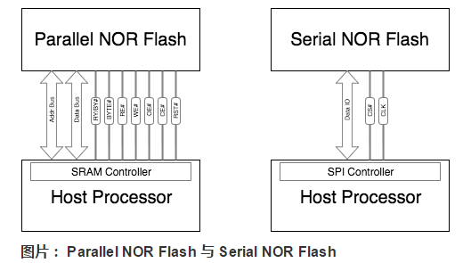
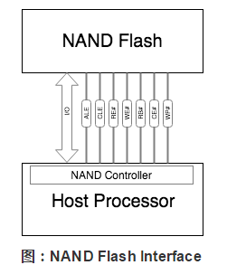
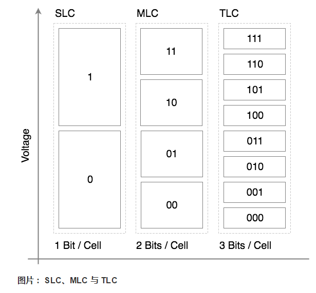
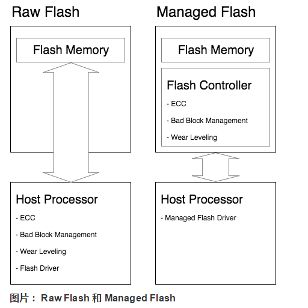
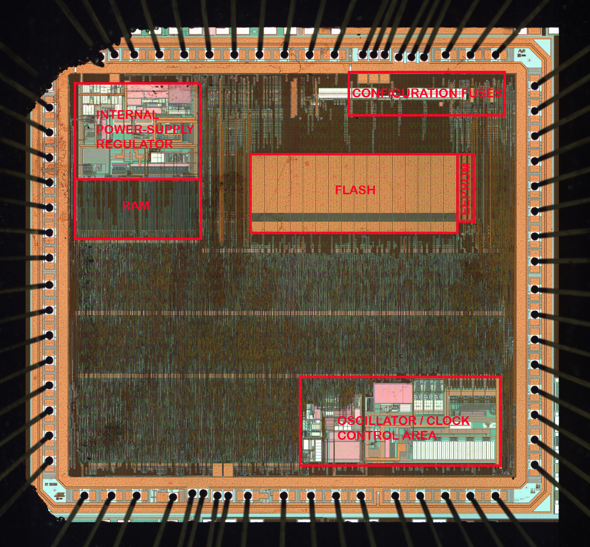
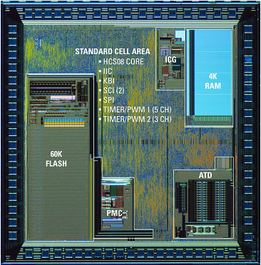

嵌入式Flash和SPI Flash深入理解学习笔记。

<!-- more -->

**一、Flash Memory简介**

Flash Memory 是一种非易失性的存储器。在嵌入式系统中通常用于存放系统、应用和数据等。在 PC 系统中，则主要用在固态硬盘以及主板 BIOS 中。

另外，绝大部分的 U 盘、SDCard 等移动存储设备也都是使用 Flash Memory 作为存储介质。

**二、Flash Memory的主要特性**

与传统的硬盘存储器相比，Flash Memory 具有质量轻、能耗低、体积小、抗震能力强等的优点，但也有不少局限性，主要如下：

1. **需要先擦除再写入**
   Flash Memory 写入数据时有一定的限制。它只能将当前为 1 的比特改写为 0，而无法将已经为 0 的比特改写为 1，只有在擦除的操作中，才能把整块的比特改写为 1。
2. **块擦除次数有限**
   Flash Memory 的每个数据块都有擦除次数的限制（十万到百万次不等），擦写超过一定次数后，该数据块将无法可靠存储数据，成为坏块。
   为了最大化的延长 Flash Memory 的寿命，在软件上需要做擦写均衡（Wear Leveling），通过分散写入、动态映射等手段均衡使用各个数据块。同时，软件还需要进行坏块管理（Bad Block Management，BBM），标识坏块，不让坏块参与数据存储。（注：除了擦写导致的坏块外，Flash Memory 在生产过程也会产生坏块，即固有坏块。）
3. **读写干扰**
   由于硬件实现上的物理特性，Flash Memory 在进行读写操作时，有可能会导致邻近的其他比特发生位翻转，导致数据异常。这种异常可以通过重新擦除来恢复。Flash Memory 应用中通常会使用 ECC 等算法进行错误检测和数据修正。
4. **电荷泄漏**
   存储在 Flash Memory 存储单元的电荷，如果长期没有使用，会发生电荷泄漏，导致数据错误。不过这个时间比较长，一般十年左右。此种异常是非永久性的，重新擦除可以恢复。

**三、NOR Flash 和 NAND Flash**

根据硬件上存储原理的不同，Flash Memory 主要可以分为 NOR Flash 和 NAND Flash 两类。主要的差异如下所示：

- NAND Flash 读取速度与 NOR Flash 相近，根据接口的不同有所差异；
- NAND Flash 的写入速度比 NOR Flash 快很多；
- NAND Flash 的擦除速度比 NOR Flash 快很多；
- NAND Flash 最大擦次数比 NOR Flash 多；
- NOR Flash 支持片上执行，可以在上面直接运行代码；
- NOR Flash 软件驱动比 NAND Flash 简单；
- NOR Flash 可以随机按字节读取数据，NAND Flash 需要按块进行读取。
- 大容量下 NAND Flash 比 NOR Flash 成本要低很多，体积也更小；

（注：NOR Flash 和 NAND Flash 的擦除都是按块块进行的，执行一个擦除或者写入操作时，NOR Flash 大约需要 5s，而 NAND Flash 通常不超过 4ms。）

**1、NOR Flash**

NOR Flash 根据与 CPU 端接口的不同，可以分为 Parallel NOR Flash 和 Serial NOR Flash 两类。

Parallel NOR Flash 可以接入到 Host 的 SRAM/DRAM Controller 上，所存储的内容可以直接映射到 CPU 地址空间，不需要拷贝到 RAM 中即可被 CPU 访问，因而支持片上执行。Serial NOR Flash 的成本比 Parallel NOR Flash 低，主要通过 SPI 接口与 Host 连接。

鉴于 NOR Flash 擦写速度慢，成本高等特性，NOR Flash 主要应用于小容量、内容更新少的场景，例如 PC 主板 BIOS、路由器系统存储等。

**2、NAND Flash**

NAND Flash 需要通过专门的 NFI（NAND Flash Interface）与 Host 端进行通信，如下图所示：

NAND Flash 根据每个存储单元内存储比特个数的不同，可以分为 SLC（Single-Level Cell）、MLC（Multi-Level Cell） 和 TLC（Triple-Level Cell） 三类。其中，在一个存储单元中，SLC 可以存储 1 个比特，MLC 可以存储 2 个比特，TLC 则可以存储 3 个比特。

NAND Flash 的一个存储单元内部，是通过不同的电压等级，来表示其所存储的信息的。在 SLC 中，存储单元的电压被分为两个等级，分别表示 0 和 1 两个状态，即 1 个比特。在 MLC 中，存储单元的电压则被分为 4 个等级，分别表示 00 01 10 11 四个状态，即 2 个比特位。同理，在 TLC 中，存储单元的电压被分为 8 个等级，存储 3 个比特信息。

NAND Flash 的单个存储单元存储的比特位越多，读写性能会越差，寿命也越短，但是成本会更低。Table 1 中，给出了特定工艺和技术水平下的成本和寿命数据。

|          |        SLC         |       MLC       |       TLC        |
| -------- | :----------------: | :-------------: | :--------------: |
| 制造成本 | 30-35 doller/32 GB | 17 doller/32 GB | 9-12 doller/32GB |
| 擦写次数 |    10万次或更高    |   1万次或更高   |  5000次甚至更高  |
| 存储单元 |     1bit/cell      |    2bit/cell    |    3bit /cell    |

相比于 NOR Flash，NAND Flash 写入性能好，大容量下成本低。目前，绝大部分手机和平板等移动设备中所使用的 eMMC 内部的 Flash Memory 都属于 NAND Flash。PC 中的固态硬盘中也是使用 NAND Flash。

**ROW flash 和 managed flash**

由于 Flash Memory 存在按块擦写、擦写次数的限制、读写干扰、电荷泄露等的局限，为了最大程度的发挥 Flash Memory 的价值，通常需要有一个特殊的软件层次，实现坏块管理、擦写均衡、ECC、垃圾回收等的功能，这一个软件层次称为 FTL（Flash Translation Layer）。

在具体实现中，根据 FTL 所在的位置的不同，可以把 Flash Memory 分为 Raw Flash 和 Managed Flash 两类。

**1、Raw Flash**

在此类应用中，在 Host 端通常有专门的 FTL 或者 Flash 文件系统来实现坏块管理、擦写均衡等的功能。Host 端的软件复杂度较高，但是整体方案的成本较低，常用于价格敏感的嵌入式产品中。

通常我们所说的 NOR Flash 和 NAND Flash 都属于这类型。

**2、Managed Flash**

Managed Flash 在其内部集成了 Flash Controller，用于完成擦写均衡、坏块管理、ECC校验等功能。相比于直接将 Flash 接入到 Host 端，Managed Flash 屏蔽了 Flash 的物理特性，对 Host 提供标准化的接口，可以减少 Host 端软件的复杂度，让 Host 端专注于上层业务，省去对 Flash 进行特殊的处理。

# SPI Flash和嵌入式Flash优劣势	

国外大型半导体企业的MCU/SoC的代码存储多采用Embedded Flash IP。国内外有许多供应商或者代工厂都可提供验证好的IP。但是国内的三高芯片(主频高，RAM容量高，Flash容量高)却倾向于使用第三方SPI Flash，配合额外的Cache，存在一系列问题：功耗、可用主频、不确定的Latency，调试，加密，RAM占用高导致可用RAM大幅降低。

实际最根本的原因还是成本限制，嵌入式Flash在实际MCU中占用面积很大，甚至可以说MCU实际上就是卖Flash送MCU，从这里可以看出嵌入式Flash在MCU中的占比。

另外一个原因就是采用了SPI Flash之后，MCU的工艺选择范围就会拓宽很多，可以通过采用更为先进的工艺实现更强劲的功能。而SPI Flash本身也很成熟，成本也比较低，所以采用外置SPI Flash算是取二者所长。

至于功耗、可用主频、不确定的Latency，调试，加密这些，对于实际使用来说，重要性还是没有成本高。对于加密部分可以采用合封等方式，甚至用OTFAD等专用加解密模块来保证，即使加了这些模块，对于MCU来讲还是有成本优势的。

先说运行原理，CPU不管代码是从哪儿来的，只要能通过总线直接寻址就可以。所以无论是啥接口啥规格的存储器，只要能在连接到总线后做到可直接寻址，那么CPU都可以执行上面的代码，无非就是快慢的区别。通常情况下常见的接口就是并口和SPI，存储器类型也基本限定为NOR Flash和SRAM（或SDRAM）。

通常说的内置Flash或者说叫片上Flash。是把Flash视为一个片内的外设，和其他的模块（CPU、SRAM等）做在同一片晶圆上，而且通常直接挂接在内部高速总线上。这种工艺成本最高，性能最好。

还有一种内置Flash就是简单的把一颗SPI或者其他接口的Flash芯片通过SIP工艺和MCU封装在一起。这种MCU如果你用强酸把封装融化会看到2片硅晶片，其中一片是MCU，另一片就是Flash芯片。两者之间一般通过SPI或者SPI的多线版本（QSPI，OSPI，HexSPI等等）进行连接。

这种的如果直接从SPI Flash执行当然会非常慢。但是你看这种MCU的规格书，你大概率会看到一个所谓的“零等待Flash”区，尤其是Flash比较大的型号上更为常见。实际上，这种方案为了速度牺牲了一部分内部的SRAM，在上电的时候把Flash中的一部分数据拷贝到内部SRAM里，这部分区域就是所谓的零等待区了。而SRAM做大了成本也很高，所以缓存不了全部，所以零等待区以外的数据在访问起来就会特别的慢。当然还有其他加速访问Flash的技术手段（如Cache），Cache又可分为Icache和Dcache，后面将会写一篇文章来专门讲解Cache和Flash搭配，以及对应DMA，指令跳转，备份域读写访问等的影响。

