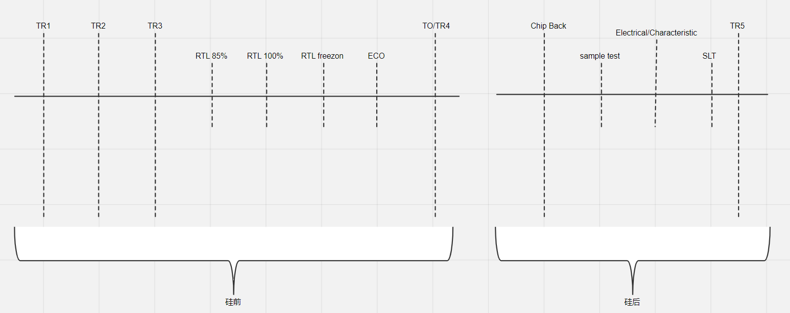

FPGA芯片硅后验证。

<!-- more -->

在芯片项目的验证阶段中，主要分为硅前以及硅后两个大的阶段，在不同的阶段，各个团队的验证侧重点略有不同，但是同样的需要保证验证的质量，而验证的质量从验证的完备性去衡量；

而实际操作过程中，会根据芯片自研程度、模块规模、商用化目的、人力投入、职责划分等情况，验证策略会跟随着做出一些适时的调整，最终以在现有条件下达成芯片验证的目的；

在目前大部分芯片项目中，真正核心自研的东西其实并不太多，大部分情况下，更多的是三方集成+自研的模式，所以根据这种情况，项目应该以什么样的策略去应对，这个也是本文想要总结思考的；

验证流程
在一般的芯片公司，负责芯片验证的主要有几个相关的团队：

[前端设计] ---> 前端验证 ---> [原型验证] ---> 底软解决方案

前端设计会部分参与到前端验证的质量活动中，比如类似于代码review，覆盖率分析，波形检视等；

前端验证在硅前阶段的时候，是芯片signoff的主要责任团队，从意义上来说，硅前阶段，只有前端验证可以从RTL代码层面上，进行白盒验证，保证验证的完备性；在硅后阶段，前端验证基本不参与验证；

原型验证在有些公司不一定存在，原型验证主要的工作在硅前是在FPGA以及Emulation平台上面进行软硬件的原型验证，更加偏向于系统级别的场景验证、压力验证、性能验证以及各个模块配合的集成验证；硅后阶段，针对工程样片负责功能、压力、性能等验证，针对下游做功能的出口；因此这部分工作在有些公司或者小芯片项目中，被底软团队以及前端验证团队覆盖；

底软解决方案在芯片开发验证过程中，主要是针对交付的SDK进行开发，在对SDK进行软件验证的同时，也能兼顾部分芯片功能的验证，但是更多偏向软件功能的交付，并且主要参与硅后阶段，硅前大部分情况下，只是进行软硬件方案的开发；

在海思、平头哥、Intel等大型芯片公司，都有类似的原型验证团队，可能在工作细节上面有些出入，但是大体上都差不多；

芯片开发验证的大致流程以及阶段如下：

芯片开发验证流程

TR1/TR2 阶段：这个阶段基本上原型验证不会参与，属于立项以及需求收集分析、架构设计阶段，

TR3 阶段：这个阶段前端验证/原型验证开始大量投入：

85%阶段：前端验证团队开始根据交付特性进行验证，原型团队开始做验证前的质量活动，验证方案开发、驱动代码开发，用例开发，模块冒烟等等；
100%阶段：前端验证基本大部分功能已经完成验证，原型团队也可以针对全量用例进行第一次整体测试，压力、性能等验证也相应启动；
Freezon阶段：RTL代码冻结，前端验证开始做覆盖率等质量活动，原型团队重点投入在性能Validation、压力验证等活动，部分质量活动也相应开启；
ECO阶段：前端验证质量活动基本完成，开始进行更细致的corner验证或者联合原型进行前后端验证增补、网表仿真启动等；原型启动TO前的用例全量回归，大部份质量活动完成
TO/TR4阶段：前端验证任务基本完成，原型验证开始准备CB点亮以及样片验证相关工作；
CB阶段（chip back）: 这个阶段芯片点亮以及验证的主力是原型验证团队以及底软解决方案团队，前者需要完成样片的点亮以及全量用例的测试，长时间大压力的测试也需要在这个阶段完成；芯片相关的性能数据的validation也需要完成输出以及优化；原型团队同时需要联合硬件团队完成电气特性测试以及SLT软件开发；底软团队开始针对样片的产品环境进行底软的调试，以及完成底软SDK的开发发布测试等流程活动，

TR5阶段：标识芯片正式可以量产，相应测试以及质量、成本等达到设计预期，开始正式上市；

如上可知，原型团队主要在硅前做好前端验证的质量守门员，硅后芯片质量的交付团队；

项目验证策略
在实际项目的过程中，芯片开发大部分的情况下，芯片内部模块可能分成几类：

A.完全自研的模块，并且首次使用
B.完全自研的模块，但是已经在多颗量产芯片上应用，修改量较小
C.第三方采购模块，但是首次应用项目
D.第三方采购模块，模块规模较小，并且已经多个量产芯片应用，修改量较小或无修改
E.第三方采购模块，设计规模较大，并且已经多个量产芯片应用，修改量较小或无修改
按照验证的功能细致程度或者验证需求来分类，也可以根据上述模块，分成以下几类：

全量验证，做好完备的测试点，甚至在原型阶段尽量做到白盒化验证；（比如上述A类型模块）
增量验证，做好集成验证，主要包含性能、压力、增量特性以及自动化测试套；（比如上述B/C/E类型模块）
以用代验，通过验证系统，其它模块配合验证，以用代验的方式，完成验证；(比如上述D类型模块)
在原型验证的不同阶段，职责也会有相应的区分，因此在侧重点上也有一定的倾向，这里会对原型验证的自动化程度有比较高的要求，只有在高度自动化的情况下，可以实现以最小的人力，最快的速度完成对于相应验证工作的快速闭环以及人力的节省；
